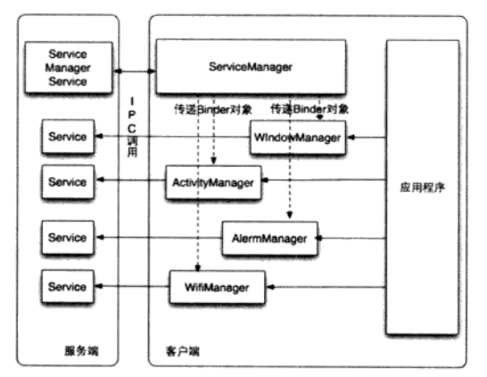
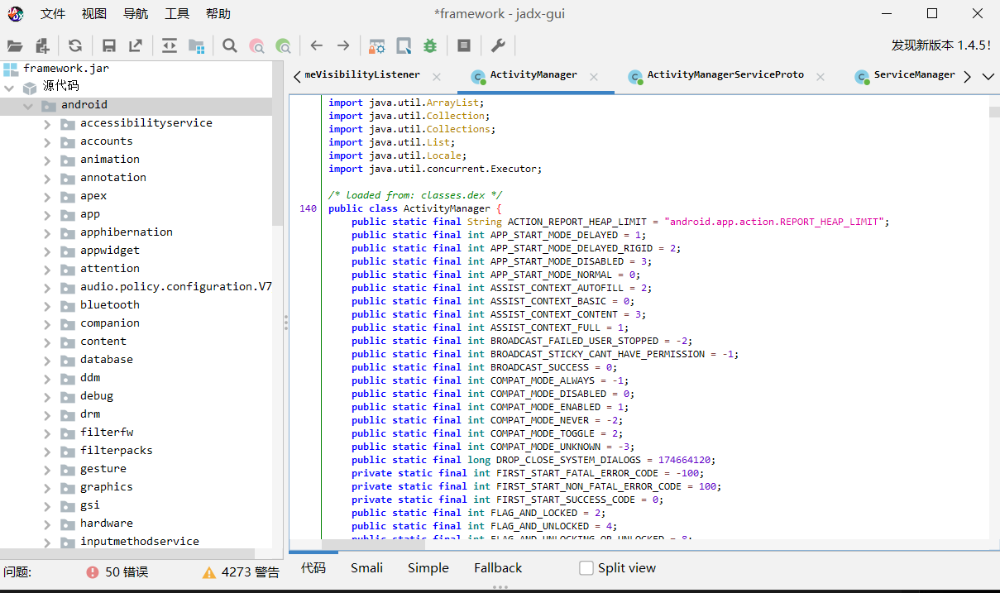

# 第1章 引言

​	**Android系统是一款开源的移动设备操作系统**，任何个人与组织都能轻易从网络上获取它的源码，编译修改并刷写到自己的设备上。这种独特魅力吸引了众多商业公司和开源社区以及来自全球的开发、测试与玩机人员不断修正、添加和测试系统功能。

经过数十载发展，如今的Android不仅应用于手机市场，还广泛应用于其他智能设备中。例如智能电视、机顶盒、车载娱乐系统、智能手表和智能家居等等。由于Android系统具有灵活性和开放性，使得其可定制性在各类设备中得到充分利用。开发者可以根据自身业务需求对Android进行自由改造。

本书将围绕着`Android`系统实际开发定制过程中的技巧，在编译修改、美化和安全分析增强等众多应用场景进行讲解。考虑到国内用户常称为"安卓"而非"Android"，本书后面部分将使用两者互换描述同一个概念。

在这一章中，我们将简单介绍`Android`系统和定制，并通过学习帮助读者对于`Android`系统中常见名词有基本了解。


## 1.1 AOSP是什么

​	**Android操作系统是如今最流行、使用最广泛的智能手机操作系统**。它得到了广大手机厂商和用户的支持，而且由于其开源性质，任何人都可以进行定制化以满足不同厂商和用户的需求。

AOSP全称为"Android Open Source Project"，即安卓开源项目。这是由谷歌发起的移动设备操作系统开源项目，任何人都可以自由获取完整的项目源码，并提交更新来完善该项目。同时，谷歌也会不断进行迭代更新版本。

由于Android的开源性质，各大手机厂商能够自由地定制系统的源码来适配他们自己的硬件，并因此衍生出各种产品。常见国产安卓设备基本上都是厂商开发团队基于AOSP源码不断改造和优化而成。例如小米MIUI系统、华为HarmonyOS系统、一加H2OS等等，绝大多数都是基于AOSP进行修改而来。如今的Android之所以百花齐放并在手机市场中占据重要地位主要归功于AOSP的开放性。

考虑到AOSP项目过于庞大和复杂，在学习过程中需要善用查询官方提供的说明文档。你可以在[https://source.android.com](https://source.android.com)找到Android官方文档。

下图是官方文档中关于AOSP的框架结构图：


### 1.1.1 Android框架

​	对于新手来说，刚开始接触安卓源码时，很多基础理论性的知识可能会感到困惑。但实际上，并不需要完全记住这些基础知识，只需要有个大概的概念，并了解它们之间的依赖关系就可以了。等你熟悉了Android源码后，许多理论知识部分会豁然开朗。

我们先简单介绍一下"框架"的概念。框架是一种软件开发的基础结构，它提供了一组标准化、可重用的代码和工具，帮助开发者更高效地开发应用程序。通常情况下，框架包括约定、规则和指南，并且提供可插入模块以供开发者扩展使用。

框架设计旨在简化开发过程、提高代码可维护性和可扩展性，并促进开发人员之间的合作。通过使用框架，开发人员可以专注于业务逻辑而无需处理底层实现细节，从而减少开发时间和成本，并降低错误率和风险。常见的框架包括Web框架、移动应用框架、游戏引擎框架等。

下面简单介绍一下Android框架的结构：

- **应用层**：这是用户直接与之交互的部分，包括各种应用程序和系统界面。它们通过调用底层框架提供的API来实现功能。
- **Java API框架层**：这一层是Android框架中最重要也最大的部分，它提供了许多核心组件和服务，例如活动（Activity）、服务（Service）、内容提供器（Content Provider）等。开发人员可以利用这些组件来构建复杂而强大的Android应用程序。
- **C/C++本地库**：在某些情况下，需要使用C或C++编写性能敏感或底层操作相关的代码。Android允许将本地库与Java代码进行混合使用以获取更好的性能。
- **运行时库**：提供安卓运行的基础环境。比如系统运行的一些核心库与ART虚拟机。
- **硬件抽象层（HAL）**：该层允许上述软件与设备硬件进行通信，并在不同设备间保持平台兼容性。
- **Linux内核及驱动程序**：作为整个系统基础，Linux内核负责管理系统资源、提供进程管理和设备驱动等功能。

这就是Android框架的大致结构，通过理解和熟悉这些组成部分，你将能够更好地理解和开发Android应用程序。


### 1.1.2 应用层

`Apps`是日常开发的应用层，用户安装的应用与游戏等等都属于这一层。普通应用基本都在手机的目录`/data/app`中。包括`AOSP`提供的系统`APP`也属于应用层，例如相机、短信、图库，在`/system/app`目录下的应用。应用层直接对接用户的输入操作和输出展示。

这里所指的输入是指对手机进行的操作，例如点击屏幕或按键等所有对手机进行操作行为统称为一种输入。而输出则是指手机接收到输入行为后产生的反馈，例如亮起屏幕、震动或页面刷新等所有通过手机展示给你看到的内容都算作手机输出。


### 1.1.3 Java API框架层

​	`Framework`框架指的是包含了大量系统级服务和`API`的软件层。它位于操作系统内核（Linux）和应用程序之间，提供了一组通用的、可重用的软件组件，以方便开发者构建各种类型的应用程序。下面简单列举几个框架层中的关键组件。

​	`Framework`框架被设计成一个分层架构，包含多个组件，如`Activity Manager、Window Manager`等。这些组件与应用程序和硬件之间进行交互，并提供了许多通用功能，如界面管理、数据存储、网络通信等。

​	通过使用`Framework`框架，开发人员可以快速地编写复杂的应用程序，并在不同设备上运行，同时也能够轻松地处理常见的`Android`应用程序逻辑。此外，由于`Framework`框架的广泛使用，它还为第三方开发者提供了良好的兼容性和稳定性。下面简单列举几个`Framework`中的组件。

1. **Activity Manager**负责了系统中四大组件的启动、调度、管理。所有的`Activity`的生命周期都是在它的范畴。
2. **Location Manager**位置信息和定位的管理组件
3. **Telephony Manager**电话管理组件，可以获取`sim`卡相关信息以及网络信息
4. **Window Manager**窗口程序管理组件

​	当应用层调用管理组件后，管理组件会进而调用对应的`Service`来执行相应的函数。简单来说就是`XXX Manager`基本是提供给应用层调用，真正的处理逻辑是在`XXX Service`中处理。如下图所示：



​	也可以更直观的去看`framework`的实现，连接手机。将`jar`文件传到电脑

```
adb shell
cp /system/framework/framework.jar /sdcard/
adb pull /sdcard/framework.jar ./
```

​	然后使用反编译工具`jadx`打开系统框架文件`framework.jar`。反编译后的程序代码会在程序的主窗口显示，左侧显示的包名与类列表，则是`AOSP`框架不同的组件的实现部分。如下图所示：




### 1.1.4 C/C++本地库

​	`C/C++`的常用库的支持，比如比较典型的`libc、ssl、OpenGL、WebKit`等等。为开发大大的提高了效率和性能。避免每次用到都需要自己去找工具库。


### 1.1.5 运行时库

安卓运行时缩写为`ART`，是`Android`系统5.0使用的新技术，取代了以前的`Dalvik`虚拟机运行环境。尽管`Android`开发常常使用的是`Java`编程语言，但是应用程序并不是在传统的 `JVM` 虚拟机中运行，而是类似于针对`dex`结构设计的虚拟机——即`Dalvik`虚拟机或者现在更普遍使用的`ART`虚拟机。

从Android 4.4开始测试引入了 ART 功能，并逐渐将其作为Dalvik虚拟机的全面替代品。与Dalvik不同，ART使用一种更高效的代码编译技术称为"Ahead-of-Time"（AOT）编译。这意味着在安装应用程序时，它会将程序代码预先编译成可执行的机器码，在运行时就无需再进行实时编译。这样提高了应用程序的运行效率，并大幅度改善用户体验。


### 1.1.6 HAL硬件抽象层

​	主要作用于系统内核与硬件之间的接口，是`Android`系统底层的部分，具有提供给硬件供应商实现的标准接口，`Android`系统通过接口访问硬件设备，也就是硬件的驱动程序开发，因此`Android`操作系统能够与各类硬件设备进行交互，不用关心底层硬件的处理。也有个说法是因为硬件供应商不愿意自身的驱动放在内核中被一起开源。所以单独抽出了`HAL`层来对接硬件驱动。


### 1.1.7 Linux内核及驱动程序

系统的核心部分是内核，它负责与设备底层硬件进行交互。这包括显示驱动、音频驱动、WIFI驱动、电源驱动、内存管理、进程管理和网络通信等功能。可以说，内核是操作系统的灵魂。

目前，国内大多数手机厂商都会开源其配套的内核源代码。从安卓11开始，引入了GKI（Generic Kernel Image）内核的概念，旨在实现手机内核接口的统一化，减少碎片化，并使通用内核能够启动不同型号的设备。例如，在某些小米手机上使用GKI内核进行刷机替换后成功启动设备时，并无需编译厂商开源的特定版本内核代码。

对于Linux 内核来说，修改需要非常谨慎，因为错误的修改可能导致设备无法正常启动。相较于系统组件代码而言，在调试过程中处理内核代码更加困难。本书将在后面讨论有关修改和编译 Linux 内核代码方面的内容。


## 1.2 系统开发，定制，刷机，改机分别是什么

系统开发是指开发新的操作系统或对现有操作系统进行修改和优化的过程。这通常需要具备专业的编程技能和深入的计算机系统知识。

定制是指根据自身应用场景和功能需求，对软件或硬件进行修改，以满足特定需求。这可以包括添加新功能、修改现有功能或更改用户界面等。

刷机是指在手机或其他电子设备上安装或替换操作系统的过程。这通常需要进行一些技术性操作，例如解锁设备的引导加载程序，或使用特殊的刷机工具进行刷写。

改机是指对手机或其他电子设备进行硬件或软件方面的修改，以增强其性能或添加新功能。对软件方面的修改称为软改，而对硬件方面的修改称为硬改。在软件安全领域中，软改通常指一种更改设备指纹信息以隐藏设备信息检测或绕过风控系统等行为；而硬改则涉及更换处理器、增加内存、添加新传感器或修改设备固件等。需要注意的是，错误地进行此类修改可能会导致设备失去保修资格甚至无法正常使用。此外，请谨慎运用改机技术，并理解它代表了给设备增加“伪装”的行为。在网络安全领域中，改机过的设备常被视为计算机信息犯罪工具或黑灰产业的代名词。不合法使用改机技术存在极高的法律风险。


### 1.2.1 系统开发

人们口中常说的`Android`开发，通常指的是App应用层开发。在开发应用程序时，会接触到大量的安卓SDK提供的`API`，为获取权限、跨进程通信、网络请求等功能提供了便利。而运行的 App 整个生存周期都是寄托于 Android 框架中。

作为开发人员，往往最多面对的问题就是，系统给你提供了哪些功能，系统允许你获取哪些权限。但是并不代表着能满足所有群体的所有需求。SDK中提供了通用统一的编程接口，而一些定制化的需求则需要依赖系统没有导出或者隐藏起来的API。这个时候就需要了解Android系统架构与代码修改方法，并根据自己的需求去添加功能提供接口（API）给应用层开发者使用。

AOSP是谷歌开源并由谷歌官方定制和出品的操作系统，并不一定完全符合当前国家用户习惯。因此，在本地化定制和需求旺盛之下，国内手机厂商纷纷进行系统修改和扩展。考虑到不同国家用户使用体验时，界面布局、样式呈现、操作方式以及服务本地化等都成为了系统定制关注的重点。在现代化物联网时代，网络硬件适配和功能融合也成为了系统定制的一个重要方向。

这些内容的实现都离不开对Android系统底层原有代码进行修改和定制化，调整部分框架和核心代码以实现新功能。例如，硬件驱动支持、优化系统性能以及实现本地化功能的系统ROM。


### 1.2.2 定制

​系统定制是系统开发的一种形式，属于轻量级的二次开发。在这个过程中，通常不会对系统核心进行大规模改动。例如，在安全领域的App逆向分析场景中，将系统比作一个分析沙箱，应用程序在该沙箱中运行。当需要对应用程序进行分析和观测时，可以通过修改小盒子的运行流程，在相关系统接口和与系统相关的调用上注入分析代码来监测应用程序执行时的各种状态。只要对Android系统有足够了解，就能像拥有上帝视角一样对普通应用程序进行跨维度分析。

掌握了系统框架结构并了解其运作原理后，可以对预装应用进行修改、优化桌面结构、预装特权应用、替换默认应用、修改配置等操作都变得轻而易举。

在实际定制过程中，厂商和大团队多人协同开发ROM功能，并按照层次和模块划分工作内容，在整个源码范围内完成针对系统UI、性能优化以及驱动支持等方面的全面改造。这可以被视为系统开发。而个人或小团队则可能只关注自身需求而进行ROM修改，并不考虑代码兼容性、多设备适配、用户安全和隐私保护等因素，这种行为可以称为专属定制。


### 1.2.3 刷机

早期的Android版本界面非常简陋，而且功能也没有十分完善。随着各大第三方团队的加入，非官方ROM越来越多。长时间使用官方原版ROM后会感觉到卡顿。因此，喜欢折腾手机的用户开始尝试使用功能相对完善、界面漂亮且性能更好的第三方ROM。切换ROM的过程被称为刷机，通常有两种方式：线刷和卡刷。

线刷是指在刷机时需要通过数据线将电脑与设备连接起来，并将线刷包通过数据线传输至设备中进行安装。这里所说的线刷包是指用于系统镜像安装的文件，一般以.img作为后缀名。首先执行`adb reboot bootloader`命令进入设备的刷机模式，然后再执行`fastboot flash`命令将对应分区的镜像写入设备中。而AOSP编译完成后，默认输出结果就是分区镜像。

卡刷则是指在不需要使用数据线连接电脑的情况下进行恢复模式启动，并直接将存放在设备上的"卡刷包"安装到设备中去。常见第三方ROM如魔趣、LineageOS和PixelExperience等，在编译完成后，默认输出结果就是可用于刷机的卡刷包。而"卡刷包"通常是一个zip格式的压缩文件，内部集成了更新脚本以及相应需要更新的内容模块，通过Recovery模式提供的刷机功能来完成整个刷机过程。目前比较流行的第三方设备Recovery模式工具是TWRP。刷机流程首先在设备上使用fastboot命令将TWRP镜像写入设备中，然后启动设备进入TWRP工作模式，在其中选择存放在手机sdcard中的刷机包，并导入该包以完成整个刷机过程。


### 1.2.4 改机

​每个设备都有独特的标识和对应的指纹信息。这里所说的指纹信息并不是指手指上的指纹，而是一个概念。举例来说，每个人的手指纹路都是不同的，因为它们由许多微小细节组成。当所有这些细节结合在一起时，就形成了每个人独特的手指纹。设备也类似，在其各种设备信息组合之后，可以作为该设备唯一标识的指纹特征。

在风险控制对抗中，某些应用会收集设备各种信息以创建设备指纹并进行记录。其中一些设备信息可能被视为高风险设备，并接受特殊处理。例如自定义编译的AOSP系统或谷歌原生支持（Pixel）手机很容易被判定为高风险设备。因此，在自己编译ROM时常常会遇到检测情况。如果被检测出属于风险设备，则可能导致应用崩溃、无法正常运行或服务器将用户标记为风险用户等情况发生。
在这种情况下，需要修改获取设备信息相关接口或直接修改与之相关联文件来伪装成普通手机。

有时候应用程序并不是通过系统接口来获取设备指纹，而是直接访问系统目录或将系统文件结构作为设备信息。另外，它们可能会绕过您的修改，通过底层内联汇编执行系统调用以读取文件来获取您的设备信息。因此，在不同情况下需要进行分析和持续对抗。


## 1.3 安卓系统发展史

​	2003年由安迪.鲁宾、克里斯.怀特等人开发制作。最初方向只是创建一个数字相机的操作系统，后来由于数码相机市场的萎缩，智能手机的快速发展，最后重新将安卓定位为开发一款智能手机操作系统。于2005年7月11日被`Google`收购。

​	2007年11月，`Google`牵头联合了硬件制造商，软件开发商，通讯运营商成立了“开放手机联盟”，共同研发`Android`，随后开放了`Android`源码。11月5日，`Android1.0`公测版面世

​	2008年9月，发布了第一款安卓智能机：`HTC Dream`，这个时候还是诺基亚塞班系统的天下，这是时候并没有多少人看好`Android`系统。

​	2010年末，刚出世两年的`Android`操作系统在市场占有率上打败了塞班系统。这时的`Android2.3`版本

​	2011年10月，`Android4.0`发布，首次支持通过使用照相机拍摄用户的脸部来解锁手机

​	2014年，`Android5.0`发布，这是第一个使用`Google`全新`Material Design`语言的版本，用户操作界面和`UI`的外挂得到了升级。同时加上了对双`SIM`卡的支持。

​	2016年，`Android7.0`发布，改用新的`JIT`编译器加快应用的运行速度。

​	2017年，`Android`全球网络流量和设备超越微软的`Windows`，正式成为全球第一大操作系统。


## 1.4 其他常见的第三方定制系统

​	`AOSP`并不是唯一可以定制的`ROM`，同样有很多优秀的第三方团队研发的定制系统。由于`AOSP`基本只对`Google`系的机型适配，所以国内普通用户一般会选择使用第三方的定制`ROM`，这些第三方开源`ROM`都有着各自的优点，有很多人会直接选择在这些已经修改过`ROM`上二次开发，对于学习来说，选择哪个`ROM`的区别并不会太大，因为底层使用的`AOSP`这一套，只要摸透一款，开发的功能也可以迁移到其他的系统上。

### 1.4.1 Mokee

​	官网：https://www.mokeedev.com/

​	中文名魔趣，发起于2012年12月12日，是国内最大的第三方非盈利性开源`ROM`，适配了大量国内主流机型，高达近300种。魔趣是由一群热爱`Android`开源社区的热心志愿者维护，他们致力于为用户提供最新、最安全、最稳定的定制`Android`系统，主要针对的用户群体也是国内用户，所以在功能和操作方面非常贴切国人的使用习惯，同时简单纯净，性能出众，因此有着不少用户使用魔趣`ROM`作为日常用的手机。下面是魔趣支持的手机厂商，

| ARK  | 华硕 | Essential | 谷歌 |
| :--: | :--: | :-------: | :--: |
| HTC  | 华为 | 乐视 | 联想 |
| LG   | 魅族 | 摩托罗拉 | Nextbit |
| 努比亚 | 一加 | OPPO | Realme |
| 红米 | 三星 | 锤子 | 索尼 |
| Wileyfox | 小米 | YU   | 中兴 |
| ZUK  |      |      |      |

​	魔趣系统自发起以来，一直深受国内玩机用户的青睐。但遗憾的是经过十年的发展，该系统于2022年下半年关闭了，不得不说是一个遗憾。


### 1.4.2 PixelExperience

​	官网：https://download.pixelexperience.org/

​	这是最接近原生`Android`系统的第三方`ROM`,它是在`Google Pixel`系列设备发布的，拥有着`Pixel`系列设备的原生外观和功能，并且添加了更多可定制的功能，它还预装了谷歌插件，并且还提供了大量可定制的主题，以及强大的安全性功能。而正常编译出来的`AOSP`刷入后是没有谷歌插件，并且界面`UI`都是非常简陋的。如果你想要打造一个和原生`Android`非常相似的`ROM`，那么完全可以选择它，原生`Android`的界面风格以及自带谷歌套装，以及适配了更多的手机厂商。下面是它所支持的各大厂商。

|  ASUS  | Google  |  Lenovo  | Motorola |
| :----: | :-----: | :------: | :------: |
| Nokia  |  Nubia  | OnePlus  |  Razer   |
| Realme | Samsung | Teracube |  Xiaomi  |


### 1.4.3 LineageOS

​	官网：https://www.lineageos.org/

​	`LineageOS`的前身是大名鼎鼎的`CyanogenMod`，简称`CM`，这个开发团队是全球最大的`Android`第三方编译团队。早在`Android1.6`版本时，就为很多手机厂商定制出稳定的`ROM`。2016年12月`Cyanogen`公司宣布停止开发并关闭项目，随后复刻后更名为`LineageOS`由原团队继续研发。 `LineageOS`的风格同样是类似原生`Android`的，但是相比起`PixelExperience`要更加的精简，运行起来也是非常流畅，同样也是非常纯净不会携带任何第三方应用，并且具有高度的安全性，可以在经过认证的设备上使用，能防止恶意软件攻击或病毒感染，也有着定制功能，允许用户自己定制操作系统，适配各大厂商机型。下面是它所支持的各大厂商。

|   ASUS    |   BQ    | Dynalink | Essential |
| :-------: | :-----: | :------: | :-------: |
| Fairphone |  FxTec  |  Google  |   LeEco   |
|  Lenovo   |   LG    | Motorola |  Nextbit  |
|   Nokia   |  Nubia  |  Nvidia  |  OnePlus  |
|   Razer   | Samsung |  SHIFT   |   Sony    |
|  Xiaomi   |   Zuk   |  Extras  |           |

## 1.5 初识系统定制

​	除了各大知名团队的开源`ROM`，也有一些深入了解安卓原理的开发人员会自己修改`ROM`定制自己的专属工具，亦或者为团队定制专用的功能。不过定制并不是能解决所有问题，要了解定制的优点和缺点，在各种需求场景采用更合适的方案。

### 1.5.1 系统定制的优点

​学习定制系统的好处非常多，以下是简要列举几点：

1. 深入了解Android设计原理：通过阅读源代码，可以深入了解Android系统的工作原理。这对于异常错误排查、性能优化以及应用提权等开发应用层程序非常有帮助。

2. 逆向分析与修改：在系统级别上运行的应用程序可以通过修改ROM来轻松获取执行过程中使用的数据。类似于游戏外挂一样，这种方式能够降低复杂度。

3. 自定义个人设备：定制化系统允许你打造自己喜欢的日常使用设备。你可以为自己DIY一些方便实用的小功能，或者创建专门用于特定目的的工具手机。

4. 控制操作系统体积和提升性能效率：通过定制化系统，可以有效地控制操作系统体积，并更好地改进产品性能和效率水平。


### 1.5.2 系统定制的缺点

​定制系统的优势有时也代表着缺点，可以形象地说成"杀鸡用牛刀"。因为很多情况下，并不需要修改ROM来实现一些需求，其他方案可能更加简单易行。以下是对几个缺点的简要总结：

1. 学习难度大：初学者在开始阶段搭建编译ROM环境会比较繁琐，再加上源代码庞大且结构复杂，容易让一些初学者望而却步。

2. 开发成本高：每次修改代码后都需要重新刷机，即使只是做一个小功能，在测试过程中也要反复编译和刷机。此外，还需要熟悉源码结构，并深入理解Android系统以便充分利用系统提供的API来制定合理的定制方案。

3. 维护成本高：即使产品开发完成后仍然需要进行优化和更新，并且难免会出现BUG。对于个人开发者而言，在更新时只能选择全部重新刷机，并且每次新版本发布都需重新定制和迁移，这将消耗大量时间和精力。

4. 安全性低：基于AOSP（Android Open Source Project）定制的系统安全性相对较低，因此定制系统可能存在安全漏洞，使得其比原生系统更容易受到攻击。


### 1.5.3 系统定制的发展趋势

技术本身会随着市场需求不断变化。安卓系统定制的发展趋势主要取决于不同领域中第三方ROM在相应市场中的发展情况。我认为可以从以下几个方面进行讨论：

1. 安全性：随着社会的发展，个人隐私和数据安全也变得越来越重要。目前，国内手机厂商在开发新功能时除了跟随同步厂家安全补丁外，还需要考虑一些增强安全性的功能。例如加强数据加密、权限管理以及应用程序的安全性等。国内已经有一些设备已经加入了App行为记录功能，可以记录运行过的App以及敏感行为等信息。这种功能非常贴心。而在国外，有一个名为`GrapheneOS`的第三方ROM专注于用户隐私与安全，并且该项目是作为非营利性开源项目开发的移动操作系统，它具备Android 应用程序兼容性并提供了多项安全特性如权限管理、WIFI 隐私、密码长度、指纹解锁增强、浏览器增强、安全缓解增强以及加密备份等细节上打磨工作。安全问题非常重要，对于第三方开发者来说，这个市场在短时间内不会消亡。

2. 用户体验：用户体验是安卓系统定制的另一个重要方面。随着用户对移动设备的需求不断提高，安卓系统定制需要更加注重用户体验的设计和实现。例如优化系统响应速度、提高应用程序稳定性以及增强系统易用性等。谷歌官方的安卓UI一直在更新迭代，但由于众口难调，在满足所有用户需求上存在一定困难。然而，通过自定义ROM可以很大程度上满足用户个性化需求，比如提供更多主题、字体和壁纸等选项以打造独特个人风格。此外，在我之前介绍过的第三方ROM - `PixelExperience` 中也为使用者提供了最接近谷歌官方`Pixel`手机Android体验，并附带了所有Google 应用程序、Pixel桌面、壁纸、图标和启动动画等元素使设备看起来像一部真正的`Pixel`手机 。总之，在满足个性化需求领域中，系统定制仍属小众市场且目前没有明显发展趋势。

3. 高性能：通过对系统的优化和修改，可以让一些老旧设备体验到最新的谷歌官方系统。这方面需求一直很大，也是`LineageOS` 这个第三方ROM长期存在的主要原因之一。`LineageOS`专注于高性能和广泛适用性，并且大多数其他第三方ROM都是基于它进行二次开发。在市场上，该领域具有较大玩机市场，在Mokee 退出市场后，无论是做安全增强、用户体验还是安全系统定制，`LineageOS` 都将成为首选。

4. 环境定制：某些与安卓系统相关联的业务环境离不开对安卓系统的定制。例如传统医疗设备行业中, 有些设备的控制程序运行在经过定制的安卓设备上；而在安全分析领域中, 动态沙箱需要根据实际情况来设置App运行时所需的分析环境；脱壳机则需要针对特定需求来实现系统层面上解密应用等功能。这个市场相对稳定且变化不大。

5. 移植性：另一个与安卓系统定制相关的领域就是系统移植，即将安卓系统移植到主要的开发板、电视盒子等硬件设备上。这个领域中，一部分移植工作由开发板厂商完成。目前，大多数主要的ARM芯片SOC出厂都提供了对安卓系统的支持, 这使得在开发板上使用安卓系统变得非常普遍。另一方面, 一些名气较大的开发板（如树莓派）虽然没有官方提供相应定制ROM ，但仍有第三方开发人员为其适配安卓系统。同样地，电视盒子也是如此，它们的更新与否主要取决于芯片SOC相关驱动程序是否完善以及硬件在市场上是否热销。无论如何，在相比其他领域而言，该市场规模较小众且不会消亡或有太大进展。

总体而言，在未来很长时间内，安卓系统定制技术不会消亡，并将随着系统本身的更新而不断进化。从业者需要不断更新知识储备以应对新应用场景中所面临的挑战。


## 1.6 小结

本节主要介绍了安卓系统的基础架构、系统定制的基本概念，以及常见的第三方定制ROM的功能和设备支持情况。同时还讲解了系统定制在不同领域中的发展趋势。

系统定制涉及到广泛而丰富的前置知识，但并不需要完全掌握这些知识才能开始学习本书后面的内容。读者在阅读完本章后应该清楚地明确了系统定制的目标，并找准了自己感兴趣或专注于研究的领域，然后再深入学习相关内容。这种以目标为导向、有针对性地学习方法是非常有效和可行的，希望读者能够好好体会其中蕴含着的价值。

从下一章开始，将正式进入安卓系统定制之旅，在实践中亲手完成安卓系统定制所带来的成就感。期待你能享受这个过程！
