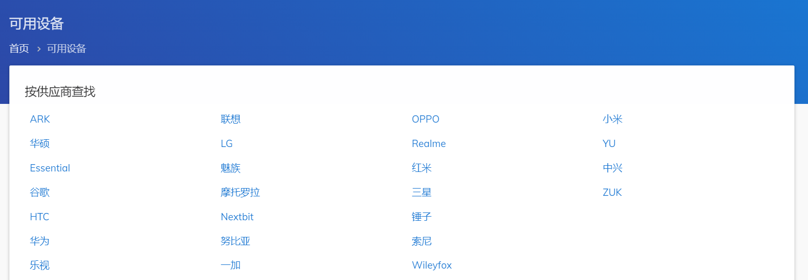
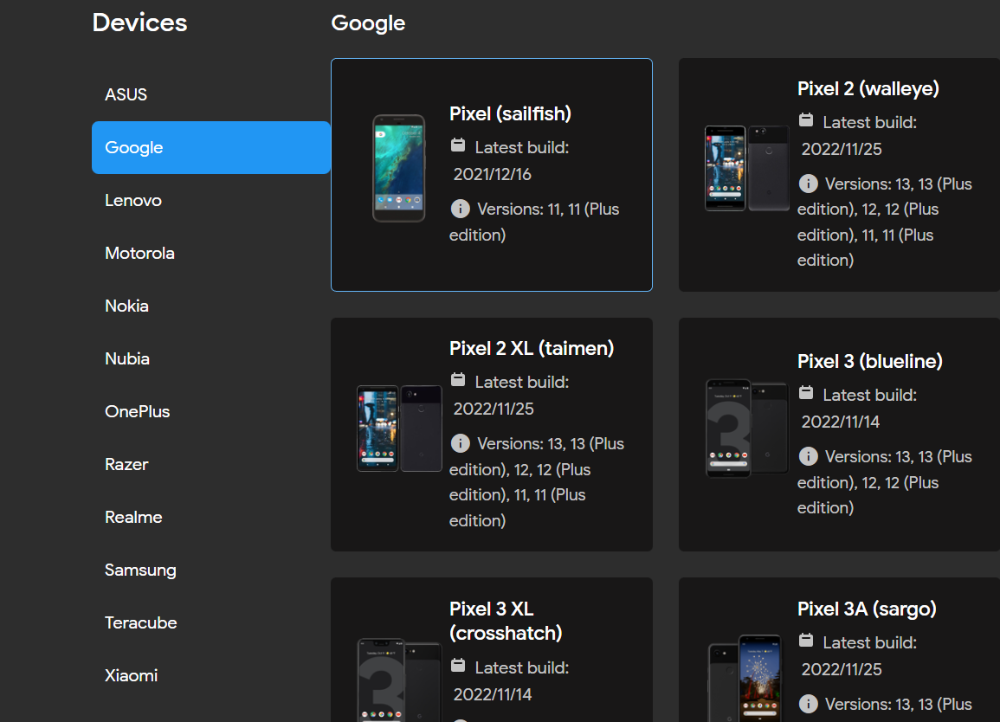

# 第一章 引言

## 1.1 AOSP是什么

​	AOSP的全称是“Android Open Source Project”，也就是安卓开源项目。由谷歌发起的移动设备的系统源码。任何人都可以自由的获取到完整的项目源码，以及提交修复项目，同时谷歌也会不断的迭代更新版本。

​	由于Android的开源，各大手机厂商能有自由的调整系统源码，适配自己的硬件，由此衍生出了各种产品。我们常见的安卓系统基本都是一些团队基于AOSP源码不断进行改造和优化的结果，例如小米MIUI系统，华为Harmony的系统，一加的H2OS系统等等，大多数都是基于AOSP的源码修改而来。如今的Android能够百花齐放，占据手机市场的半壁江山，也是主要也是得益于AOSP的开源。

​	由于AOSP项目过于庞大和复杂，所以我们在了解和学习的过程中，要善于查询官方文档。

​   Android官方文档地址: [https://source.android.com](https://source.android.com)

​下图是官方文档中的AOSP的堆栈结构图


​	最顶层的Apps就是我们日常开发的应用层，包括AOSP提供的系统APP也是属于应用层的例如相机、短信、图库等等在`/system/app`目录下的应用。应用层直接对接用户的输入操作和输出展示。

​	Framework框架层，为我们提供在开发应用时所用到的API和组件支持。也是我们在日常开发中接触最多的部分。下面简单列举几个框架层中的关键组件。

​1. **Activity Manager**是Android最核心的部分，它负责了系统中四大组件的启动、调度、管理。所有的Activity的生命周期都是在它的范畴。

2. **Location Manager**位置信息和定位的管理组件

3. **Telephony Manager**电话管理组件，可以获取sim卡相关信息以及网络信息

4. **Window Manager**窗口程序管理组件

​	当应用层调用管理组件后，管理组件会进而调用对应的Service来执行相应的函数。如下图


​	同时我们也可以更直观的去看framework的实现，连接手机。将jar文件传到电脑

```
adb shell
cp /system/framework/framework.jar /sdcard/
adb pull /sdcard/framework.jar ./
```

​	然后使用jadx打开将`framework.jar`文件


​	Native Libraries层就是字面意思，c++库的支持，比如比较典型的libc、ssl、opengl等等。

​	Android Runtime是安卓运行时库，安卓中最核心的ART虚拟机就是在这个部分。虽然我开android开发常常使用的是java，但是android开发的应用并不是运行在JVM虚拟机中，而是类似的针对dex结构的Dalvik虚拟机和ART虚拟机。在android4.4之后，逐渐使用ART虚拟机全面替代了Dalvik虚拟机。

​		HAL硬件抽象层，主要作用于系统内核与硬件之间的接口，具有提供给硬件供应商实现的标准接口。往往用来做硬件的驱动程序开发。也有个说法是因为硬件供应商不愿意自身的驱动放在内核中被一起开源。所以单独抽出了HAL层来对接硬件驱动。

​		Linux Kernel内核，系统的最重要的核心部分，内核负责与设备底层的硬件进行交互。比如显示驱动、音频驱动、WIFI驱动、电源驱动、内存管理、进程管理等等。


## 1.2 系统开发，定制，刷机，改机分别是什么

### 1.2.1 系统开发

​		我们常规的android开发，属于应用层开发。而在开发应用层时，会接触到大量的系统提供的api，为我们获取权限，跨进程通信，网络请求等功能提供了便利。并且我们运行的app整个生存周期都是寄托于系统环境中。作为开发人员，我们往往最多面对的问题就是，系统给你提供了哪些功能，系统允许了你哪些权限范围。但是并不代表着，系统能满足所有群体的所有需求。这个时候就需要了解android系统架构，根据我们自己的需求，去添加功能提供接口给我们应用层开发的app使用。

​		非常常见的一个场景就是，AOSP是谷歌开源的系统，而谷歌的开发者并不一定了解其他国家的国情，用户的习惯。那么国内的厂商进行系统开发扩展功能，就需要考虑到国内用户体验，对界面，操作方式，系统服务等一些功能进行开发。

### 1.2.2 系统定制

​		系统定制也是属于系统开发的一种，属于轻量级的改动。往往不会对系统进行太大的变动。比如下面的场景。系统就像是一个沙箱，而我们开发的应用是在沙箱中运作的小盒子。而我们需要对应用进行分析和观测时，可以通过修改小盒子运行流程时对系统相关的调用，来分析应用执行的各种状态。只要我们对android系统有足够的了解，就可以像开了上帝视角一般，对普通应用进行跨维度的分析。

### 1.2.3 刷机

​		当系统修改完成，编译成镜像后，我们就需要将镜像刷入测试设备中，测试我们修改的系统功能是否正常运转。常见的刷机流程是卡刷和线刷。

​		线刷包一般都是分区镜像img后缀的文件。常常通过adb reboot bootloader进入刷机模式后，fastboot flash刷入对应分区的镜像。而AOSP编译完成后在输出目录拿到的就是分区镜像。

​		卡刷包一般是一个zip的压缩文件。一般是先刷入twrp，然后将卡刷包传入手机sdcard中。再用twrp刷入。一般使用魔趣、lineageOS、PixelExperience这些rom编译完成后，输出目录的就是卡刷包。

### 1.2.4 改机

​		每个设备都有各自的唯一标识和对应的指纹信息。这里的指纹信息，并不是指手指的指纹，而是一个概念的意思。比如每个人指纹不同，是因为手指有很多细微的纹路，纹路都组合在一起时，就会每个人的都不同了。设备也是如此，有很多种设备信息，当这些设备信息组合在一起时，就可以当作是这台设备唯一标识的指纹特征。

​		在风控对抗中，应用会收集设备的各种信息组合为设备指纹，记录起来。有些设备信息是属于风险设备，就会被特殊处理。而我们自己定制的AOSP，以及谷歌天然支持的Pixel手机，就很容易被判定为高风险设备。所以我们常常会碰到ROM检测的情况。这时我们就需要对获取设备信息的各个接口进行修改，或者直接将设备信息相关的文件修改，伪装成一台正常的手机。有时应用并不会通过系统接口来获取设备指纹，而是直接通过系统目录，或者将系统文件结构作为设备信息，这种情况就需要分析和持续的对抗了。

## 1.3 安卓系统发展史

​		2003年由安迪.鲁宾、克里斯.怀特等人开发制作。最初方向只是创建一个数字相机的操作系统，后来由于数码相机市场的萎缩，智能手机的快速发展，最后重新将安卓定位为开发一款智能手机操作系统。于2005年7月11日被Google收购。

​		2007年11月，Google牵头联合了硬件制造商，软件开发商，通讯运营商成立了“开放手机联盟”，共同研发Android，随后开放了Android源码。11月5日，Android1.0公测版面世

​		2008年9月，发布了第一款安卓智能机：HTC Dream，这个时候还是诺基亚塞班系统的天下，这是时候并没有多少人看好Android系统。

​		2010年末，刚出世两年的Android操作系统在市场占有率上打败了塞班系统。这时的Android2.3版本

​		2011年10月，Android4.0发布，首次支持通过使用照相机拍摄用户的脸部来解锁手机

​		2014年，Android5.0发布，这是第一个使用Google全新Material Design语言的版本，用户操作界面和UI的外挂得到了升级。同时加上了对双SIM卡的支持。

​		2016年，Android7.0发布，改用新的JIT编译器加快应用的运行速度。

​		2017年，Android全球网络流量和设备超越微软的Window，正式成为全球第一大操作系统。

​

## 1.4 其他常见的第三方定制系统

### 1.4.1 Mokee

​		中文名魔趣，官网：https://www.mokeedev.com/。发起于2012年12月12日，是国内最大的第三方非盈利性开源ROM，适配了大量国内主流机型。主要针对的用户群体也是国内群众，所以在功能和操作方面非常贴切国人的使用习惯，同时简单纯净，性能出众，所以有些人会使用魔趣作为日常用的手机。

​		下图是魔趣支持的手机厂商，




​		如果想要进一步了解，可以看看魔趣为AOSP扩展的功能 https://www.mokeedev.com/guide/feature.html


### 1.4.2 PixelExperience

​		这是最接近原生Android系统的第三方ROM,官网https://download.pixelexperience.org/，我们正常编译出来的AOSP刷入后是没有谷歌插件，并且界面UI都是非常简陋的。如果你想要打造一个和原生Android非常相似的ROM，那么完全可以选择它，原生Android的界面风格以及自带谷歌套装，以及适配了更多的手机厂商。下图是它所支持的各大厂商。




### 1.4.3 LineageOS

​		LineageOS的前身是大名鼎鼎的CyanogenMod，简称CM，这个开发团队是全球最大的Android第三方编译团队。早在Android1.6版本时，就为很多手机厂商定制出稳定的ROM。2016年12月Cyanogen公司宣布停止开发并关闭项目，随后复刻后更名为LineageOS由原团队继续研发。 LineageOS的风格同样是类似原生Android的，但是相比起PixelExperience要更加的精简，运行起来也是非常流畅，同样适配各大厂商机型。感兴趣可以在官网详细了解支持机型https://download.lineageos.org/

## 1.5 初识系统定制

### 1.5.1 系统定制的优点

​		学习系统定制的好处是非常多的，我们可以通过源码的阅读，深入了解Android设计的原理，对异常错误排查，性能优化，以及应用提权等等开发应用层的程序也会得心应手。从逆向的角度看，依托在系统下运行的应用，我们可以直接通过对ROM的修改，就能轻松获取到任何执行环节所使用的数据。如同游戏开外挂一般的降维打击。同时我们也可以自己打造喜欢的日常用机。为自己DIY一些提供便利的小功能，或者打造自己专用的工具手机。

### 1.5.2 系统定制的缺点

​		定制的优势有的时候同样也代表着缺点，杀鸡用牛刀可以非常形象的形容我们定制ROM来干的事情。因为有很多时候，一些需求并不需要修改ROM，就能用其他方案轻松做到的。而编译一个完整的Android，再刷到手机，这个过程是较为漫长的，特别是刚开始的阶段，所以定制系统的起始就能劝退很多人了。再加上测试麻烦，每次修改完代码都需要重新刷机，很多时候哪怕做一个小小的功能，你在测试的过程都在无限的重复编译刷机，也就导致开发的成本过大，这就是重量级的烦恼。


### 1.5.3 系统定制的发展趋势


### 1.6 初识系统刷机

## 1.7 小结

