# 第二章 系统开发环境与工具

​	经过第一章的学习，对`AOSP`定制进行简略的介绍后，大家应该对系统定制开发的基础有了大致的理解。所谓的系统定制，实际相当于在一款成熟的产品上进行二次开发。二次开发最耳熟能详的要属开发板二次开发领域了，比如知名经典的ARM架构开发板树莓派，厂家在出厂时提供了一些基础的系统与工具套件，开发人员可以扩展这个板子的玩法，实现玩具车、智能家居、电视盒子、路由器、小型内容服务器等多种功能的开发，这里面涉及到的二次开发知识也是相当的丰富。

当然，本书不讨论功能庞大复杂的系统定制，而是以安全领域为面，技术功能为切入点的形式来讨论系统二次定制的一般方法。和常见的软件项目的二次开发的学习步骤类似，不会有太大的出入，细节的区别就在于，`Android`源码相比其他软件项目要更加庞大复杂，需要做一些基础知识的储备，另外，修改编译以及测试系统是一个反复执行的动作，它占用了定制开发中所耗费的大多数时间。

​	尽管`Android`源码结构非常庞大，但对于初学者，并不需要完整的吃透所有代码。关键在于，掌握`Android`源码跟踪分析的思路，阅读理解工程的整体结构，了解`Android`系统框架的运行原理，结合思考与实践，实现自定义定制的功能。

​	学习的流程需要循序渐进，有的放矢，以免迷失在纷繁复杂的代码海洋中。通常，第一步需要了解如何将整个系统项目成功编译并刷机。这一章将详细讲解在各种不同的环境下，应该如何编译`Android`源码，并将其刷入手机中。


## 2.1 环境准备

​	安卓系统在版本`10`之前，是支持`macOS`系统上编译`AOSP`代码的。在新版本系统的演进过程中，安卓官方已经放弃在`macOS`系统平台上做`AOSP`开发的支持，官方开发指导环境采用了`Linux`上比较流行的`Ubuntu`发行版本。在`Mac m1/m2`下可采用`docker+orbstack`的方案进行编译，`Mac Inter`下可使用`vmware`或`Parallels Desktop`虚拟机准备编译环境。

​	`Windows`系统下可使用`WSL2`或`Docker`来构建一个`Ubuntu`系统运行环境，同样可以完成`AOSP`编译与开发工作。这一节将会介绍在`Windows`系统与`Linux`系统上，如何完成环境准备工作。

### 2.1.1 Windows

​	由于在`Windows`中缺少了各种底层编译器与开发库的支持，一般情况下，开发人员不会直接在`Windows`环境中编译，而是选择在`Windows`中创建一个`Linux`的虚拟环境，然后在虚拟环境中安装编译所需要用到的底层依赖。在`Windows`系统上部署`Ubuntu`作为`Linux`虚拟环境有多种可选方案，例如`Docker、WSL（Windows Subsystem for Linux）、Vmware`虚拟机，`QEMU、HyperV`虚拟机平台等等。

​	几种方案经过编译对比测试，发现`Docker`在`Windows`系统上的体验并不怎么好，在编译这类大型项目时，需要较大的磁盘存储空间，选择外挂磁盘映射时，编译时`IO`性能较弱，而选择创建虚拟磁盘时，对宿主机的开机耗时明显变高。这里不太建议在`Windows`下采用`Docker`来编译源码。

​	`WSL`是`Windows`下内置的`Linux`子系统，最新的版本号为`2`，通常将其称为`WSL2`。它是一个非常轻量化的`Linux`系统，让那些想在`Windows`中编译与运行`Linux`程序的开发人员爱不释手。安装好`WSL2`后，只要在终端中输入一个`wsl`命令就可以启动环境。使用起来的感觉就好似直接使用命令行一样。并且编译性能相比`Vmware`这类虚拟机要更加高效。同一台机器编译测试后得到对比记录，`WSL2`完整编译的耗时为130分钟，而`Vmware`虚拟机的耗时是170分钟，这是因为`WSL2`采用直通计算机硬件，`IO`性能有着较为显著的提升。

​	如果你的系统是`Windows10`，那么你需要先查询当前系统版本，`Win10`下必须是18917或更高的版本才支持`WSL2`。在`cmd`命令行中输入`winver`命令查看当前系统版本号。

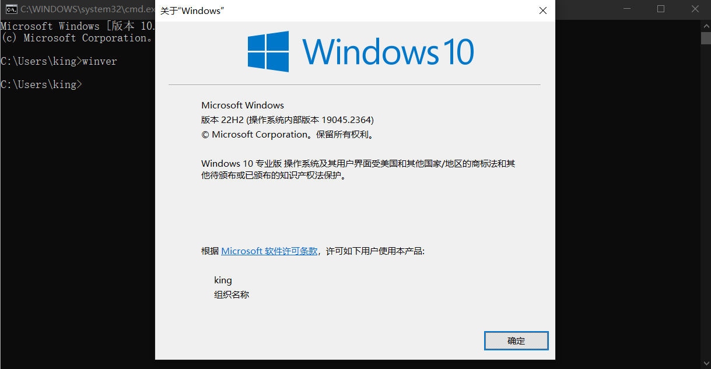

​	由于是系统自带的，所以安装起来非常方便，可以直接在控制面版->程序->启动或关闭`Window`功能中开启支持即可，如下图

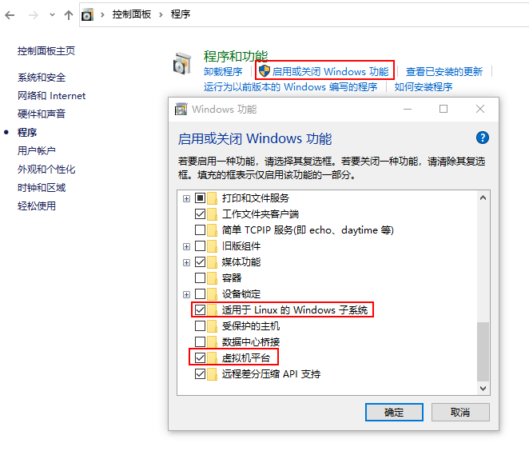

​	或者是采用命令的方式开启虚拟机平台和`Linux`子系统，使用管理员权限启动。

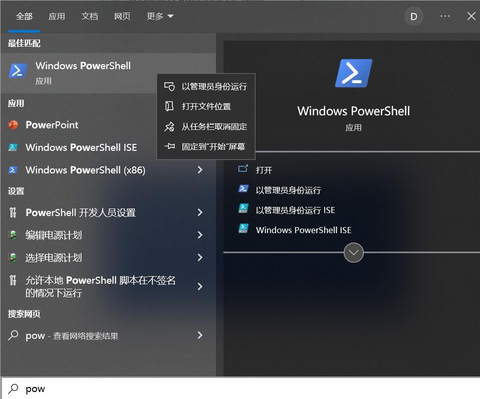

​	打开Powershell，执行下面的命令开启功能。

```
//启用虚拟机平台
Enable-WindowsOptionalFeature -Online -FeatureName VirtualMachinePlatform
//启用Linux子系统
Enable-WindowsOptionalFeature -Online -FeatureName Microsoft-Windows-Subsystem-Linux
```

​	启动完成这些特性后，重新启动计算机，就可以开始安装一个`Ubuntu`系统了。打开`Microsoft Store`应用商店输入关键字`Ubuntu`进行搜索，然后选择自己需要的版本即可，例如这里安装的是22.04版本，如下图。

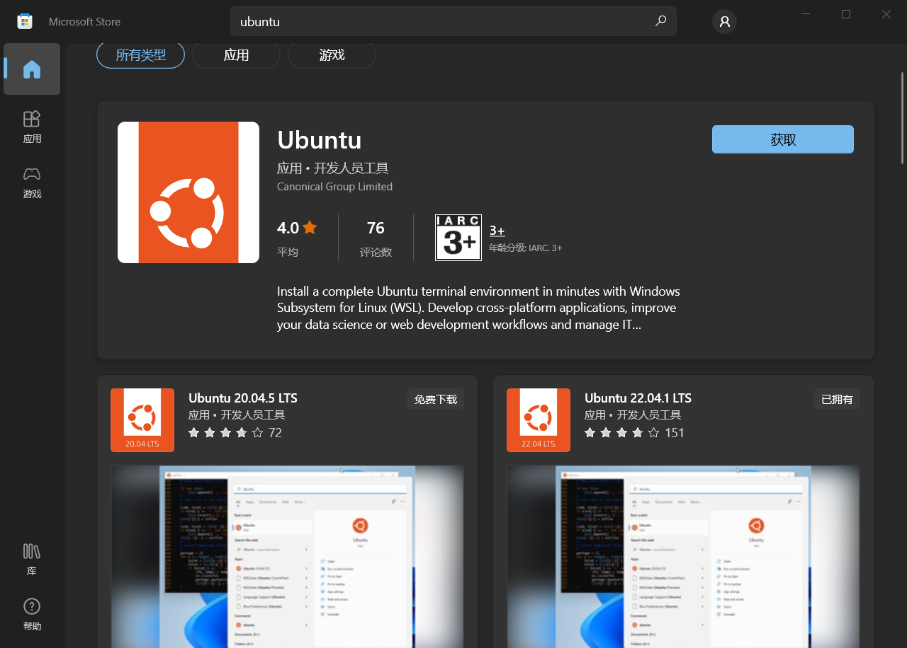

​	成功获取`Ubuntu`系统后，从应用中启动系统即开始正式安装。安装过程只需要设置好用户名与密码即可。完成后会进行一个`shell`环境供用户输入。第一次启动时，需要设置用户名与密码来完成初始化配置。以后，只需要在终端工具的界面上，选择Ubuntu就可以启动了，整个启动过程中非常的快，只要数秒就会在窗口中给出一个Shell提示符，供用户输入操作。

​	需要注意的是，应用商店默认会将`WSL`安装在`C`盘中，而编译系统会占用相当大的空间，如果你的系统盘空间不够，需要做一个迁移操作，将子系统迁移到其他硬盘中。操作方法是：桌面任意位置右键选择终端，在打开的终端环境中自毁长城下面的命令，查询当前的子系统名称。

```
wsl -l -v

  NAME        STATE           VERSION
* ubuntu22    Running         2
```

然后，执行`wsl --export`命令，将子系统导出到其它较大空间的分区中；接着，执行`wsl --unregister`将其注销，最后，执行`wsl --import `再重新导入放在其他分区或磁盘上的子系统。如下所示。

```
//导出子系统
wsl --export ubuntu22 E:\wsl2\ubuntu22.tar
//注销之前的虚拟机
wsl --unregister ubuntu22
//重新导入虚拟机,并且指定新的虚拟机存放位置
wsl --import ubuntu22 E:\wsl2\ubuntu22_wsl E:\wsl2\ubuntu22.tar
```

​	现在，再次执行`wsl`命令，即可进入子系统的`shell`环境。

​	使用`WSL2`主要是在于轻量级和更优的高性能，一般都是命令模式的`Linux`，图形界面的程序可以通过安装一些依赖来解决，但这不是`WSL2`的强项。使用`WSL2`搭建开发环境时，使用远程开发模式不失为一种优雅的技术方案，典型的有使用`vscode`配合`wsl`插件，可以快速的远程访问`WSL2`环境上的代码与程序，另外，`WSL2`安装`ssh`服务后，`vscode`配合使用`remote ssh`插件也可以进行开发环境的搭建。

​	如果需要完整的`Linux`系统环境，使用`VMware`虚拟机会更加的合适。步骤也非常简单，流程如下。

1. 下载并安装`VMware`虚拟机，然后下载`Ubuntu22.04`系统`ISO`镜像文件。
2. `VWware`创建虚拟机，选择指定镜像

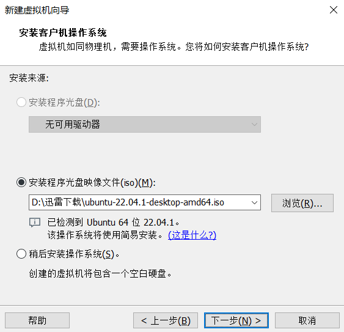

3. 设置初始账号密码

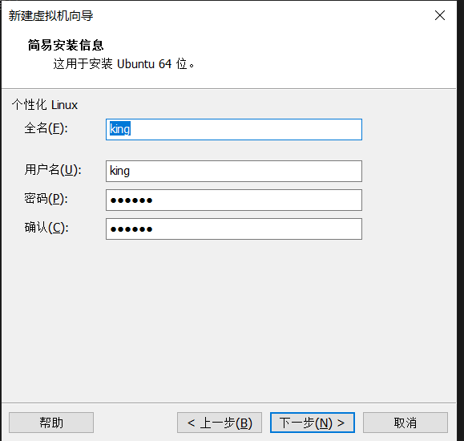

4. 选择虚拟机保存位置，这里不要保存在`C`盘，记得磁盘要有至少`300G`的空间

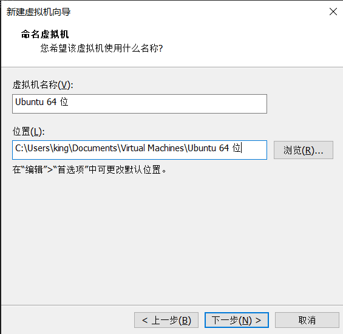

5. 虚拟硬件`CPU`核心根据你的电脑配置进行调整，尽量多分点给虚拟机。

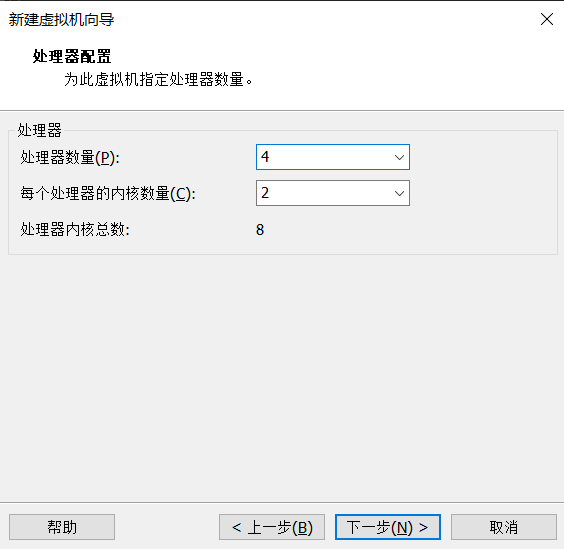

6. 虚拟内存分配，至少保证`16G`以上的内存，否则可能会碰到内存不足编译失败的情况。

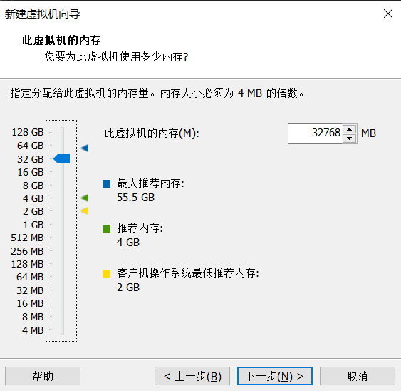

7. 虚拟硬盘分配，这里至少分配`500G`的空间，考虑到性能，我选择的是单文件吗，这里如果选择立即分配所有磁盘空间，能提高一定的性能。如果你的电脑配置不是很高，建议你选择立即分配。

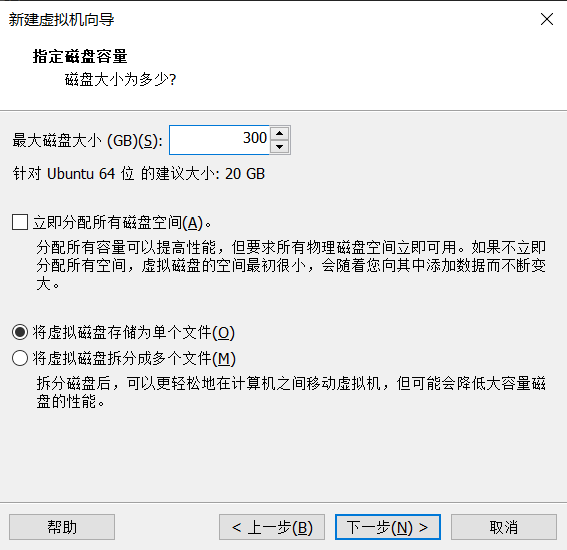

​	虚拟机开机后，将默认进入`Ubuntu`安装界面，按照提示进行选择语言，区域等待安装完成即可。

### 2.1.2 Linux

​	`Linux`系统的选择非常多，本书中选择`Ubuntu 22.04 LTS`稳定版。这里假定读者已经在自己的硬件上安装好了系统环境（安装方法与`Vmware`安装系统的操作流程类似）。

首先，安装必备的开发工具。

1. `Android Studio`下载并安装，下载地址：`https://developer.android.google.cn/studio/`
2. `Clion`下载并安装，下载地址：`https://www.jetbrains.com/zh-cn/clion/`
3. `vscode`下载并安装，下载地址：`https://code.visualstudio.com/`

​	然后，执行下面的命令配置好`python`与`pip`。

```
// 更新软件列表
sudo apt update -y && sudo apt upgrade -y

// 安装python和apt-utils
sudo apt-get install -y apt-utils python3 python3-pip python2

// 安装pip
pip install -U pip

// 设置pip使用国内源
python -m pip install --upgrade pip
pip config set global.index-url https://pypi.tuna.tsinghua.edu.cn/simple
pip install pytest

```

​	到这里，`Ubuntu`系统上的`AOSP`编译开发环境就初步准备好了。


### 2.2 源码拉取与同步

​	在开始拉取代码前，首选需要了解自己需要编译的`AOSP`分支版本，可以参考官网的说明来选择适合自己的分支，源码拉取的过程是非常缓慢的，速度取决于网速，拉取源码尽量使用国内源下载源码来提高速度，由于初始化仓库时，默认会使用官方的源下载`REPO`工具仓库，所以不使用科学上网来初始化仓库的话，就需要手动指定环境变量`REPO_URL`来设置该仓库的国内源路径。

#### 2.2.1 repo配置

​	`AOSP`官方使用`repo`管理项目。`repo`是一个以`git`为基础包装的代码版本管理工具，内部是由`python`脚本构成的，对`git`命令进行包装，方便管理大型的项目。

​	`repo`配置前，需要先安装与配置好`git`。执行如下命令：

```
// 安装git
sudo apt-get install git

//设置git身份
git config --global user.email "xxxx@qq.com"
git config --global user.name "xxxx"
```

​	然后下载`repo`，并配置初始化仓库时的`REPO`工具的仓库地址。执行如下命令：

```
// 创建bin目录，并加入PATH
mkdir ~/bin
PATH=~/bin:$PATH

// 安装curl
sudo apt-get install curl

// 下载repo，并设置权限
curl https://mirrors.tuna.tsinghua.edu.cn/git/git-repo > ~/bin/repo
chmod a+x ~/bin/repo

// 设置使用国内源拉取代码
export REPO_URL='https://mirrors.tuna.tsinghua.edu.cn/git/git-repo/'
```

#### 2.2.2 分支选择策略

​	根据自己的需求来选择合适的版本，比如想要在`Android`12的基础上进行二次开发，参考官方文档：https://source.android.com/docs/setup/about/build-numbers?hl=zh-cn ，找到对应的版本描述，例如下图，可以看到各个版本号关联的代码分支，各分支版本支持哪些设备。

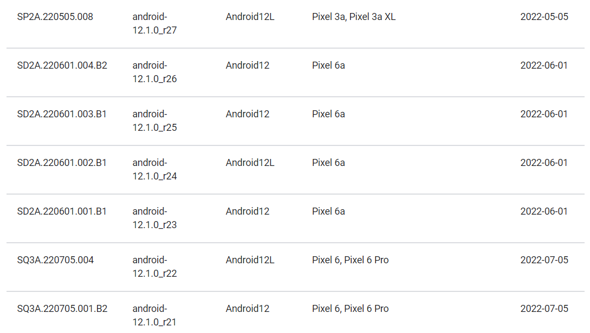

​	这么多版本，要根据自身的需求选一个适合的版本，例如我的选择策略如下:

1. 优先选择支持`Pixel`3测试机的版本。
2. 除了支持你的这个设备外，还支持更多设备的版本。
3. 满足上面两个条件的最高分支版本，即优先最新的代码分支。

​	如果该`ROM`主要在虚拟机中刷机测试的，那么选择支持版本最多的分支即可。这里我的测试设备是`pixel`3，根据上文中的选择策略找到了版本`SP1A.210812.016.A1`，对应的分支代码是`android-12.0.0_r3`，如下图。


#### 2.2.3 源码拉取与同步

​	通过前文锁定了要编译的目标分支，接下来的步骤是拉取源码。执行如下命令：

```
// 创建源码存放的目录
mkdir aosp_12 && cd aosp_12

// 指定分支版本
repo init -u https://mirrors.tuna.tsinghua.edu.cn/git/AOSP/platform/manifest -b android-12.0.0_r3

// 同步代码
repo sync -c -j8
```

​	同步代码使用`repo sync -c -j8`的命令，其中，`-c`表示只同步当前分支代码，可以提高同步速度，而`-j`是设置同步使用的线程数，这里我使用了8个线程，并不是线程越多速度越快，而是根据`cpu`的核心数，使用最合理的线程数才能达到最佳的并发效果。

```
// 查看可用cpu数量，我的环境显示为16
nproc --all

// 直接使用最佳线程数
repo sync -c -j16

//也可以直接省略成一句
repo sync -c -j$(nproc --all)
```

​	代码同步完成后，会提示`Success`，如果失败了，就重新拉取即可，多拉取几次后，基本都能同步成功。


### 2.3 Android系统编译

​	系统的编译过程中使用到很多依赖库，执行下面的命令，安装Ubuntu22.04系统上编译系统所需要的相关依赖库：

```
// AOSP编译的相关依赖安装
sudo apt-get install -y git-core gnupg flex bison build-essential \
	zip curl zlib1g-dev gcc-multilib g++-multilib libc6-dev-i386 lib32ncurses5-dev \
	x11proto-core-dev libx11-dev lib32z1-dev libgl1-mesa-dev libxml2-utils xsltproc unzip \
	fontconfig libncurses5 procps rsync libsqlite3-0
```

​	注意：编译`AOSP`需要大量的磁盘空间，通常`300G`的空间足够存放代码与编译输出的结果。如果你希望将输出的结果存放在其它目录。这一点通过设置`OUT_DIR`环境变量来调整编译结果的输出目录。如下所示，

```
vim ./build/envsetup.sh
// 在底部加上环境变量设置为和源码同一级的目录，我当前源码路径为~/android_src/aosp12
export OUT_DIR=~/android_src/aosp12_out
```

​	在开始编译前，还需要准备对应设备的驱动，根据前面选择的版本号`SP1A.210812.016.A1`,在官网地址：`https://developers.google.com/android/drivers`中找到对应的版本号。


​	第一个文件`Vendor`是用来存储厂商特定的文件，比如设备驱动程序。`Android`驱动会根据提供的这些设备驱动来正确的加载硬件。这个文件通常由设备厂商提供。如果你成功编译`Android`后，输出目录缺少`vendor.img`文件，那么你就需要检查下是否忘记导入对应型号的设备驱动了。

​	第二个文件是高通提供的相关设备驱动程序，比如`GPS`，摄像头，传感器等设备的闭源二进制文件。

​	点击`Link`下载，然后将下载的文件拷贝到`Android`源码根目录下。然后解压，并导出相关驱动文件。

```
// 解压驱动文件
tar -xvf qcom-blueline-sp1a.210812.016.a1-33e668b9.tgz
tar -xvf google_devices-blueline-sp1a.210812.016.a1-d10754e0.tgz

// 解压会得到两个文件extract-google_devices-blueline.sh和extract-qcom-blueline.sh
// 依次运行两个文件，运行后会提示许可说明，按回车键，然后按q跳过，最后手动输入I ACCEPT后回车即可
./extract-google_devices-blueline.sh
./extract-qcom-blueline.sh
```

​	导入设备驱动完成后，准备工作基本完成，可以开始编译源码了。

```
// 初始化构建环境参数
source ./build/envsetup.sh

// 选择编译的版本
lunch

//下面是我这边显示的结果
Lunch menu... pick a combo:
     1. aosp_arm-eng
     2. aosp_arm64-eng
     3. aosp_barbet-userdebug
     4. aosp_blueline-userdebug
     5. aosp_blueline_car-userdebug
     6. aosp_bonito-userdebug
     7. aosp_bonito_car-userdebug
     8. aosp_bramble-userdebug
     9. aosp_bramble_car-userdebug
Which would you like? [aosp_arm-eng]

// 选择版本可以填写直接填写aosp_blueline-userdebug或者是填写编号4
// 同样可以省略成一句，直接lunch 4或者是lunch aosp_blueline-userdebug
4

// 直接使用当前cpu的核心数作为编译的并发线程
make -j$(nproc --all)
```

​	在上面版本选择中，可以看到`aosp_arm-eng`和`aosp_arm64-eng`的选项，这两个是模拟器使用的版本。而模拟器使用的版本是可以不需要导入设备驱动文件的。如果在`lunch`的菜单中没有看到你要编译的版本，并且直接`lunch aosp_blueline-userdebug `也提示错误，可能是没有成功导入设备配置文件，或者下载的驱动文件错误。

​	同一个代号的编译有三种编译版本选择。分别如下：

1. `aosp_blueline-user` 为用户版本，一般是默认的编译版本。主要用于发布版本，这种版本编译的环境会默认开启大多数的安全机制，比如`ro.secure`值为1，`ro.debuggable`值为0，需要自行用第三方工具获取`root`权限。厂商设备出厂时，设备通常会编译为user版本。

2. `aosp_blueline-userdebug` 为用户调试版本，通常用于测试和调试`Android`系统，会启动一些调试工具，例如默认开启`adb`调试，`ro.debuggable`值为1，系统自带`root`权限等。

3. `aosp_blueline-eng` 为工程版本，同样也是用于测试和调试的环境，但是系统限制比`userdebug`要更加少，会禁用一些安全机制，比如签名验证，关闭一些编译优化等。会关闭用于提供良好用户体验的各种优化。

​	第一次完整编译等待时间非常的漫长，笔者的电脑耗时约2个小时成功编译。编译成功后，检查一下输出的文件。

```
// 查看输出目录的所有镜像文件
ls /root/android_src/aosp12_out/target/product/blueline | grep img

// 输出结果如下
boot-debug.img
boot.img
bootloader.img
boot-test-harness.img
dtb.img
dtbo.img
persist.img
radio.img
ramdisk-debug.img
ramdisk.img
ramdisk-recovery.img
ramdisk-test-harness.img
super_empty.img
system_ext.img
system.img
system_other.img
userdata.img
vbmeta.img
vendor.img
```

​	确定有编译产出物：`vendor.img、system.img、boot.img`等镜像文件，就说明编译成功了。


### 2.4 模块编译

​	前文在编译的过程中介绍到，使用`source ./build/envsetup.sh`初始化环境的时候，导入了多个命令来辅助编译。接下来，先看看有哪些常用的命令。

通过命令`hmm`查看提供的命令帮助。

```
hmm

Run "m help" for help with the build system itself.

Invoke ". build/envsetup.sh" from your shell to add the following functions to your environment:
- lunch:      lunch <product_name>-<build_variant>
              Selects <product_name> as the product to build, and <build_variant> as the variant to
              build, and stores those selections in the environment to be read by subsequent
              invocations of 'm' etc.
- tapas:      tapas [<App1> <App2> ...] [arm|x86|arm64|x86_64] [eng|userdebug|user]
              Sets up the build environment for building unbundled apps (APKs).
- banchan:    banchan <module1> [<module2> ...] [arm|x86|arm64|x86_64] [eng|userdebug|user]
              Sets up the build environment for building unbundled modules (APEXes).
- croot:      Changes directory to the top of the tree, or a subdirectory thereof.
- m:          Makes from the top of the tree.
- mm:         Builds and installs all of the modules in the current directory, and their
              dependencies.
- mmm:        Builds and installs all of the modules in the supplied directories, and their
              dependencies.
              To limit the modules being built use the syntax: mmm
// 省略
......
```

​	`croot` 命令可以跳转根目录，或者是根目录下的任意子目录。

​	`m` 命令会直接在根目录运行编译，即使当前目录是在子目录也是相当于在根目录编译。也可以指定名称来编译单独的目标，例如`m droid`。

​	`mm ` 编译当前目录中的所有模块及依赖项。

​	`mmm` 编译指定目录中的所有模块及依赖项。

​	`clean` 清除编译的结果，相当于删掉out目录中的内容。

​	可以通过`m help`查看可以单独编译哪些选项。

```
m help

Common goals are:

    clean                   (aka clobber) equivalent to rm -rf out/
    checkbuild              Build every module defined in the source tree
    droid                   Default target
    nothing                 Do not build anything, just parse and validate the build structure

    java                    Build all the java code in the source tree
    native                  Build all the native code in the source tree

    host                    Build all the host code (not to be run on a device) in the source tree
    target                  Build all the target code (to be run on the device) in the source tree

    (java|native)-(host|target)
    (host|target)-(java|native)
                            Build the intersection of the two given arguments

    snod                    Quickly rebuild the system image from built packages
                            Stands for "System, NO Dependencies"
    vnod                    Quickly rebuild the vendor image from built packages
                            Stands for "Vendor, NO Dependencies"
    pnod                    Quickly rebuild the product image from built packages
                            Stands for "Product, NO Dependencies"
    senod                   Quickly rebuild the system_ext image from built packages
                            Stands for "SystemExt, NO Dependencies"
    onod                    Quickly rebuild the odm image from built packages
                            Stands for "Odm, NO Dependencies"
    vdnod                   Quickly rebuild the vendor_dlkm image from built packages
                            Stands for "VendorDlkm, NO Dependencies"
    odnod                   Quickly rebuild the odm_dlkm image from built packages
                            Stands for "OdmDlkm, NO Dependencies"
```

​	通过帮助命令的提示，可以看到`m snod`就是单独编译`system`模块,命令`m vnod`就是单独编译`Vendor`。大多数时候，修改的内容都是在`system`模块中。可以根据自己对系统的修改情况，执行不同的模块编译。


### 2.5 内核编译

​	系统编译完成后，可以在编译的镜像结果中看到文件`boot.img`，这个文件是内核镜像文件。但是这个内核默认采用`Android`源码树中预编译好的内核文件，没有使用源码编译出来的内核文件，如果想要为编译的系统纳入自编译的内核，需要拉取对应分支的内核代码参与编译，并将编译结果放入`Android`源码树中的指定路径，最后再重新编译打包`Android`镜像。这样，生成的系统刷入手机后，使用的内核就是自编译的版本了。

​	首先，找到对应当前手机的内核分支，官网提供了详细的说明文档：https://source.android.com/docs/setup/build/building-kernels 。根据下图可以看到，对应`Pixel`3测试机分支是`android-msm-crosshatch-4.9-android12`。

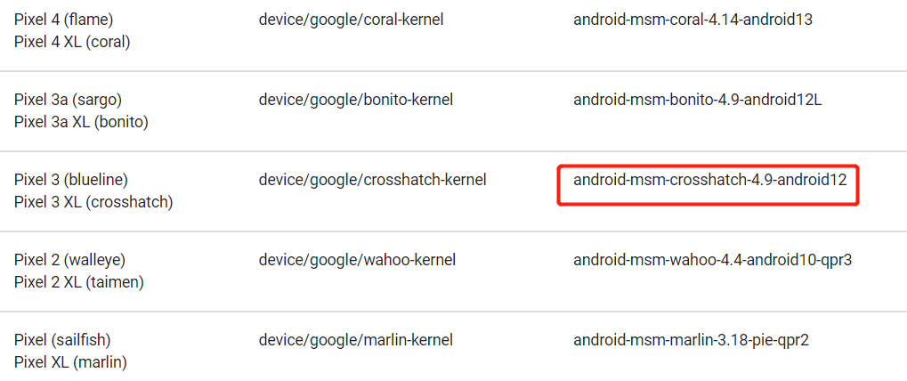

​	接下来，按照官网的说明拉取代码。

```
// 内核编译的相关依赖安装
sudo apt install p7zip-full wget curl git tree -y
sudo apt-get install dialog file python3 python3-pip python2 libelf-dev gpg gpg-agent tree flex bison libssl-dev zip unzip curl wget tree build-essential bc software-properties-common libstdc++6 libpulse0 libglu1-mesa locales lcov --no-install-recommends -y
sudo apt-get install pahole libreadline-dev kmod cpio -y

// 创建内核的源码目录，不用放在Android源码目录下
mkdir android-kernel && cd android-kernel

// 初始化指定分支
repo init -u https://android.googlesource.com/kernel/manifest -b android-msm-crosshatch-4.9-android12

// 同步分支代码
repo sync -j$(nproc --all)
```

​	成功拉取代码后，还需要将内核检出对应的`commit ID`，确保和官方镜像的内核分支一致。首先下载官方镜像，下载地址：https://developers.google.com/android/images ，找到`Pixel 3`下的版本`SP1A.210812.016.A1`的官方镜像下载。

​	解压官方镜像，然后手机进入`bootloader`引导模式，运行官方镜像包中的`flash-all.bat`刷入手机，操作如下。

```
adb reboot bootloader

./flash-all.bat
```

​	等待官方镜像刷机完成后，在开发者模式中开启`USB`调试，然后查看当前内核分支。

```
adb shell

uname -a

// 输出信息
Linux localhost 4.9.270-g862f51bac900-ab7613625 #0 SMP PREEMPT Thu Aug 5 07:04:42 UTC 2021 aarch64
```

​	根据输出信息知道了该分支版本的`Android`使用内核的`commit ID`为`862f51bac900`，然后来到内核源码目录中，检出该版本。命令如下。

```
cd android-kernel/private/msm-google
git checkout 862f51bac900
```

​	除了检查该版本外，还需要查看内核使用的配置文件是否对应目标测试机`Pixel`3。进入内核中的配置目录，查看有哪些设备的配置。

```
cd android-kernel/private/msm-google/arch/arm64/configs

ls

// 输出信息
b1c1_defconfig    cuttlefish_defconfig  ranchu64_defconfig  sdm670-perf_defconfig  sdm845-perf_defconfig
bonito_defconfig  defconfig             sdm670_defconfig    sdm845_defconfig       vendor
```

​	这些配置对应着不同的机型，其中`b1c1_defconfig`对应`Pixel`3和`Pixel`3XL，然后检查编译配置中是否确定是使用该配置进行编译的。编辑`build/build.config`，确定`DEFCONFIG`为`b1c1_defconfig`。如果这里不是正确的版本，则会出现无法正常进入系统的情况。

```
DEFCONFIG=b1c1_defconfig
```

​	配置没有问题后，则可以开始编译内核了。命令如下。

```
// 编译内核
build/build.sh

// 编译完成后，查看编译结果，最后输出显示Image.lz4文件就表示内核编译是成功的。
ls /root/android_src/android-kernel/out/android-msm-pixel-4.9/dist |grep Image
```

​	编译成功后，还需要指定`Android`源码编译时使用该内核文件。设置环境变量`TARGET_PREBUILT_KERNEL`，指定内核文件的完整路径即可。方式如下。

```
export TARGET_PREBUILT_KERNEL=/root/android_src/android-kernel/out/android-msm-pixel-4.9/dist/Image.lz4
```

​	为了以后方便，可以将路径相关的环境变量，写在`envsetup.sh`这个初始化导入环境命令的脚本中。如下所示：

```
vim ./build/envsetup.sh

// 在最底部添加
export TARGET_PREBUILT_KERNEL=/root/android_src/android-kernel/out/android-msm-pixel-4.9/dist/Image.lz4

// 保存配置后，重新加载一下
source ./build/envsetup.sh
```

​	配置生效后，执行下面的命令再次编译生成内核`boot.img`。

```
// 选择编译版本
lunch aosp_blueline-userdebug

// 单独编译内核镜像
make bootimage
```


### 2.6 刷机

​	大多数情况下，`Android`系统的玩机爱好者，通常会使用傻瓜式的一键刷机工具，例如刷机大师、刷机精灵、奇兔等工具来刷机。这种刷机方式属于软刷（软件刷机）；除此之外，还有第一章中介绍到的线刷和卡刷。不论刷机的方式是什么，他们最终都是对刷机包进行处理，然后将`ROM`文件写入对应的分区，替换掉原始文件。下面，将介绍如何进行线刷和卡刷。

#### 2.6.1 线刷

​	上面编译操作完成后，在目录`aosp12_out/target/product/blueline/`中能看到若干个后缀为`img`的镜像文件。笔者的输出路径`aosp12_out`是手动指定的输出目录，如果读者没有设置，这些文件默认存放在`aosp12/out/target/product/blueline/`目录下，目录中的`blueline`是对应编译的设备的代号，如果你是其他型号的机器，就需要在对应的其它代号目录下查看。

​	执行`adb reboot bootloader`进入刷机模式，然后设置环境变量`ANDROID_PRODUCT_OUT`指定系统镜像的路径，最后使用`fastboot`命令完成刷机。详细流程如下。

```
// 进入刷机模式
adb reboot bootloader

// 设置刷机包的路径到环境变量
export ANDROID_PRODUCT_OUT=~/android_src/out/target/product/blueline

// 查询fastboot是否能成功看到设备
fastboot devices

// 上面的查看命令显示的结果
8ARX0Y7EP	fastboot

// 完整刷机
fastboot flashall -w
```

​	等待刷机结束，会自动进入`Android`系统。如果只想刷单个分区镜像，流程如下。

```
// 进入刷机模式
adb reboot bootloader

// 进入编译结果的目录
cd ~/android_src/out/target/product/blueline

// 单独刷入内核
fastboot flash boot ./boot.img

// 单独刷入系统
fastboot flash system ./system.img

// 部分机型可能会出现如下错误提示
fastboot: error: The partition you are trying to flash is dynamic, and should be flashed via fastbootd. Please run:

    fastboot reboot fastboot

And try again. If you are intentionally trying to overwrite a fixed partition, use --force.

// 这种情况按照它的提示操作即可，执行下面的命令后，发现进入了fastbootd模式
fastboot reboot fastboot

// 重新刷入系统
fastboot flash system ./system.img

// 刷入共享系统
fastboot flash system_ext ./system_ext.img

// 刷入硬件驱动
fastboot flash vendor ./vendor.img

// 重启
fastboot reboot
```


#### 2.6.2 卡刷

​	前面步骤编译出来的是系统线刷包，如果需要卡刷包，就需要使用`make otapackage`命令来进行编译。注意这种方式需要预先编译好卡刷包。具体的编译方法如下。

```
// 下面是简单的编译卡刷包
cd aosp12
source ./build/envsetup.sh
lunch aosp_blueline-userdebug
make otapackage
```

​	编译完成后，可以在前面线刷包的同样路径下，看到`zip`格式的卡刷包文件，这里的文件名是`aosp_blueline-ota-eng.user.zip`。除了上面的方式，还可以执行`make dist`命令完整编译卡刷包，具体的编译方式如下。

```
//下面是完整编译卡刷包
cd aosp12
source ./build/envsetup.sh
lunch aosp_blueline-userdebug
mkdir dist_output
make dist DIST_DIR=dist_output
```

​	编译完成后，在目录`dist_output`中看到卡刷包结果。

​	接下来是如何刷入卡刷包，有两种刷入方式，一种是使用`adb sideload`命令刷入，另一种方式是使用第三方的`Recovery`工具`TWRP`刷入。下面演示两种不同方式的刷机流程。

1. `adb sideload`命令刷机

​	首选需要手机进入`recovery`模式，通过命令`adb reboot recovery`进入该模式，也可以通过`fastbootd`进入该模式

```
adb reboot bootloader
fastboot reboot fastboot
```

​	这时的界面如下图，使用音量键减，切换到`Enter recovery`，然后按电源键进入`recovery`模式。

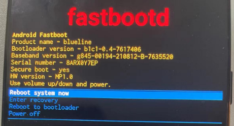

​	`recovery`模式的界面，选择`Apply update from ADB`

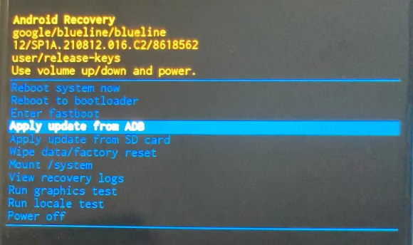

​	使用命令`adb devices`查看当前状态显示为`sideload`，即可直接通过命令`adb sideload ota.zip`进行刷机。

2. `TWRP`工具刷机

​	`TWRP（Team Win Recovery Project）`是一款流行的开源第三方恢复模式。它是一个基于触摸屏界面的自定义恢复模式，用于在`Android`设备上安装、备份、恢复和刷入操作系统等。可以在`TWRP`的官网：`https://twrp.me/`，下载对应当前设备的`TWRP`来刷入手机中。

```
adb reboot bootloader

// 刷入twrp
fastboot flash recovery twrp.img
```

​	有些手机并不能刷入`recovery`分区，这种情况可以让`TWRP`临时作为`boot`启动一次。

```
adb reboot bootloader

// 临时启动到TWRP
fastboot boot twrp.img
```

​	启动进入`twrp`后，将要刷入的卡刷包上传到手机的`sdcard`，最后在`TWRP`操作界面选择刷入该卡刷包即可。

### 2.7 源码开发环境搭建

谷歌一直积极的探索，在开发系统编辑与调试代码时，如何让开发人员拥有一个好的开发体验。在2020年之前，想要在IDE中开发系统代码，需要借助AOSP中带的`idegen`工具。但是，系统代码量日渐庞大，`idegen`工具提供的项目管理方式让配置工作变得复杂，也非常的耗时与吃内存，于是有了新的`aidegen`工具，2022年之后，`idegen`工具的代码也几乎不在维护了。到目前，谷歌的风向又发生了变化，官方决定直接基于`Android Studio`来做一个定制的IDE，集成系统代码的智能行语法提示、交叉引用代码跳转、编译与调试等功能于一体，截至本书出版，该工具命名为`Android Studio For platform`，并推出了一个Linux的deb安装包，还不支持macOS与Windows系统。

无论是`idegen`还是`aidegen`工具，它们生成的项目管理文件都只支持分开单独编辑处理Java与Native代码。1`Android Studio For platform`则统一支持，本小节主要讲`idegen`还是`aidegen`这两个工具的使用。

#### 2.7.1 idegen

​	`Android`系统是一个非常庞大的工程，需要采用合适的编辑器或`IDE`来阅读与修改代码。如果改动不多，使用`vscode`导入工作区即可开始修改代码。`vscode`的智能提示和跳转相对`IDE`较为简陋，如果想要更加友好的开发体验，可以选择将源码导入`Android Studio`中编辑`java`部分代码，导入`Clion`中编辑`native`部分代码。

下面介绍如何将源码导入`Android Studio`。

```
cd ~/aosp12
source build/envsetup.sh
lunch aosp_blueline-userdebug

// 编译生成idegen.jar
make idegen

// 在源码根目录生成android.ipr和android.iml
development/tools/idegen/idegen.sh

// 编辑iml文件，找到excludeFolder的属性位置，新增排除掉一些基本不怎么修改或者是native代码相关的部分
vim ./android.iml

// 例如新增下面这些部分
<excludeFolder url="file://$MODULE_DIR$/abi"/>
<excludeFolder url="file://$MODULE_DIR$/art"/>
<excludeFolder url="file://$MODULE_DIR$/bionic"/>
<excludeFolder url="file://$MODULE_DIR$/bootable"/>
<excludeFolder url="file://$MODULE_DIR$/build"/>
<excludeFolder url="file://$MODULE_DIR$/cts"/>
<excludeFolder url="file://$MODULE_DIR$/dalvik"/>
<excludeFolder url="file://$MODULE_DIR$/developers"/>
<excludeFolder url="file://$MODULE_DIR$/development"/>
<excludeFolder url="file://$MODULE_DIR$/device"/>
<excludeFolder url="file://$MODULE_DIR$/docs"/>
<excludeFolder url="file://$MODULE_DIR$/external"/>
<excludeFolder url="file://$MODULE_DIR$/hardware"/>
<excludeFolder url="file://$MODULE_DIR$/libcore"/>
<excludeFolder url="file://$MODULE_DIR$/libnativehelper"/>
<excludeFolder url="file://$MODULE_DIR$/ndk"/>
<excludeFolder url="file://$MODULE_DIR$/out"/>
<excludeFolder url="file://$MODULE_DIR$/pdk"/>
<excludeFolder url="file://$MODULE_DIR$/prebuilts"/>
<excludeFolder url="file://$MODULE_DIR$/sdk"/>
<excludeFolder url="file://$MODULE_DIR$/system"/>
<excludeFolder url="file://$MODULE_DIR$/tools"/>
<excludeFolder url="file://$MODULE_DIR$/kernel"/>
```

​	修改好配置后，使用`Android studio`打开`android.ipr`文件即可。

​	由于`Android studio`在开发时，对于`c++`相关的代码无法正常的跳转和提示，所以我们还需要将源码导入`Clion`。下面是导入`Clion`的详细步骤。

```
// 设置环境变量,在编译时生成CMakeLists.txt文件
export SOONG_GEN_CMAKEFILES=1
export SOONG_GEN_CMAKEFILES_DEBUG=1

// 正常编译一次
cd ~/aosp12
source build/envsetup.sh
lunch aosp_blueline-userdebug
make -j$(nproc --all)

// 查看clion目录下面生成了大量的CMakeLists.txt
tree out/development/ide/clion/

// 在clion目录下创建一个CMakeLists.txt来合并导入需要使用的各个模块
touch out/development/ide/clion/CMakeLists.txt

// 配置CMakeLists.txt导入模块
vim out/development/ide/clion/CMakeLists.txt

// CMakeLists.txt文件添加下面的内容，单独导入一个先
cmake_minimum_required(VERSION 3.6)
project(AOSP-Native)
// 添加子模块，导入了部分工程
add_subdirectory(frameworks/native)
add_subdirectory(art/dalvikvm/dalvikvm-arm64-android)
add_subdirectory(art/libdexfile/libdexfile-arm64-android)
add_subdirectory(art/runtime/libart-arm64-android)
add_subdirectory(bionic/libc/libc_bionic-arm64-android)
add_subdirectory(bionic/libc/libc_bionic_ndk-arm64-android)
add_subdirectory(bionic/libc/system_properties/libsystemproperties-arm64-android)
add_subdirectory(external/compiler-rt/lib/sanitizer_common/libsan-arm64-android)
add_subdirectory(frameworks/av/media/libaaudio/src/libaaudio-arm64-android)
add_subdirectory(frameworks/av/soundtrigger/libsoundtrigger-arm64-android)
add_subdirectory(frameworks/base/core/jni/libandroid_runtime-arm64-android)
add_subdirectory(frameworks/native/cmds/installd/installd-arm64-android)
add_subdirectory(frameworks/native/cmds/servicemanager/servicemanager-arm64-android)
add_subdirectory(frameworks/native/libs/binder/libbinder-arm64-android)
add_subdirectory(libcore/libjavacore-arm64-android)
add_subdirectory(libcore/libopenjdk-arm64-android)
add_subdirectory(libnativehelper/libnativehelper-arm64-android)
add_subdirectory(libnativehelper/libnativehelper_compat_libc++-arm64-android)
add_subdirectory(system/core/base/libbase-arm64-android)
add_subdirectory(system/core/init/libinit-arm64-android)
add_subdirectory(system/core/libziparchive/libziparchive-arm64-android)
add_subdirectory(system/core/liblog/liblog-arm64-android)
add_subdirectory(system/core/libcutils/libcutils-arm64-android)
add_subdirectory(system/core/libutils/libutils-arm64-android)
add_subdirectory(system/core/libprocessgroup/libprocessgroup-arm64-android)
add_subdirectory(system/core/logcat/logcatd-arm64-android)
add_subdirectory(system/core/logcat/liblogcat-arm64-android)
add_subdirectory(system/core/logd/logd-arm64-android)
add_subdirectory(system/core/logd/liblogd-arm64-android)
add_subdirectory(system/core/lmkd/liblmkd_utils-arm64-android)
add_subdirectory(system/core/lmkd/lmkd-arm64-android)
```

​	配置好`cmake`工程后，使用`clion`打开项目，选择上面的`CMakeLists.txt`文件所在的目录`out/development/ide/clion`。导入成功后，修改工程的根目录，`Tools->Cmake->Change Project Root`，然后选择源码根目录即可。


#### 2.7.2 aidegen

本节将介绍如何使用`aidegen`工具来生成Android Studio项目配置文件，以及如何生成供CLion编辑生成的native项目管理工程文件。以下是详细的步骤：

与使用`idegen`一样，需要先安装好IDE。`Android Studio`的安装可以使用`sudo snap install android-studio`，也可以到官方网站上下载deb文件后安装。`Clion`可以选择去该IDE的官方下载安装。这两个IDE安装完成后，接下来是准备好需要开发的AOSP代码。然后执行如下命令：

```
$ cd <path_to_aosp_source>
$ . build/envsetup.sh
$ lunch <target>
```

`path_to_aosp_source`为AOSP代码，注意，使用`aidegen`方式项目文件支持安卓11及以后版本的代码，低版本的代码可能使用`idegen`更合适。`lunch`命令后的`target`指明要开发的目标，比如`aosp_cf_x86_64_phone-userdebug`。只有在`lunch`命令执行完后，`aidegen`命令才处于可用状态，它是一个压缩的Python程序包，被赋予了可执行权限。执行下面命令查看它的用法：

```
$ which  aidegen
<path_to_aosp_source>/prebuilts/asuite/aidegen/linux-x86/aidegen

$ aidegen --help
usage: aidegen [module_name1 module_name2... project_path1 project_path2...]

AIDEgen

This CLI generates project files for using in IntelliJ, such as:
    - iml
    - .idea/compiler.xml
    - .idea/misc.xml
    - .idea/modules.xml
    - .idea/vcs.xml
    - .idea/.name
    - .idea/copyright/Apache_2.xml
    - .idea/copyright/progiles_settings.xml

- Sample usage:
    - Change directory to AOSP root first.
    $ cd /user/home/aosp/
    - Generating project files under packages/apps/Settings folder.
    $ aidegen packages/apps/Settings
    or
    $ aidegen Settings
    or
    $ cd packages/apps/Settings;aidegen

positional arguments:
  targets               Android module name or path.e.g. Settings or packages/apps/Settings

options:
  -h, --help            show this help message and exit
  -d {0,1,2,3,4,5,6,7,8,9}, --depth {0,1,2,3,4,5,6,7,8,9}
                        The depth of module referenced by source.
  -v, --verbose         Display DEBUG level logging.
  -i IDE, --ide IDE     Launch IDE type, j: IntelliJ, s: Android Studio, e: Eclipse, c: CLion, v: VS Code. The default value is 'u': undefined.
  -p IDE_INSTALLED_PATH, --ide-path IDE_INSTALLED_PATH
                        IDE installed path.
  -n, --no_launch       Do not launch IDE.
  -r, --config-reset    Reset all saved configurations, e.g., preferred IDE version.
  -s, --skip-build      Skip building jars or modules that create java files in build time, e.g. R/AIDL/Logtags.
  -a, --android-tree    Generate whole Android source tree project file for IDE.
  -e [EXCLUDE_PATHS ...], --exclude-paths [EXCLUDE_PATHS ...]
                        Exclude the directories in IDE.
  -V, --version         Print aidegen version string.
  -l LANGUAGE, --language LANGUAGE
                        Launch IDE with a specific language, j: Java, c: C/C++, r: Rust. The default value is 'u': undefined.

INFO: To report an AIDEGen tool problem, please use this link: https://goto.google.com/aidegen-bug
```

`options`部分列出了支持的参数，可以看到，它支持生成`j: IntelliJ, s: Android Studio, e: Eclipse, c: CLion, v: VS Code`等多种IDE。接下来就是使用了。

使用AIDEGen工具生成供Android Studio使用的项目配置文件。执行以下命令：

```
$ ./out/host/linux-x86/bin/aidegen -i <path_to_module> -p <path_to_android_studio_project>
```

其中，`<path_to_module>`是您要生成项目配置文件的模块的路径，`<path_to_android_studio_project>` 是您要将配置文件生成到的Android Studio项目的路径。你也可以不指定`-p`参数，这样会在终端窗口输出生成的项目路径。如执行下命令的命令，会生成供`Android Studio`使用的项目文件，里面包含了`Settings`与`framework`模块：

```
$ aidegen Settings framework -s
```

接下来，打开生成的Android Studio项目，并配置您的调试环境。您可以使用Android Studio的调试功能来调试Java代码，生成的项目自动包括了AOSP里集成的JDK，并配置好了代码依赖，支持代码跳转与智能提示，由于不需要一次性打开所有的项目，启动加载速度会快上很多，开发体验一下就上去了。

生成C项目工程的方法类似，使用`aidegen`工具生成供CLion使用的C项目工程。执行以下命令：

```
$ ./out/host/linux-x86/bin/aidegen -c -i <path_to_module> -p <path_to_clion_project>
```

其中，`<path_to_module>`是您要生成项目工程的模块的路径，`<path_to_clion_project>`是您要将工程生成到的CLion项目的路径。

打开生成的CLion项目，并配置您的编辑环境。您可以使用CLion的功能来编辑和调试C代码。更多实践与说明，可以参看AOSP代码tools/asuite/aidegen目录下的README.md文档。


## 2.8 gitlab配合repo管理源码

​	将源码导入`idea`中后，已经可以正常的开始修改源码了。在日常的项目开中，需要考虑到源码的管理，便于随时能够查看自己的修改，切换不同的分支进行开发。这样一个巨大的项目，一个月后，再想要查找当时修改的逻辑，就非常困难了。

`gitlab`配置不算复杂，但也繁琐，一般管理大型项目会用到，尤其是私有ROM的管理。**如果你是个人开发，并且修改的逻辑不是特别复杂，或者是刚开始学习，那么可以选择跳过这部分内容。**

​	首先，需要对`repo`进行一定的了解，在前文中，有简单的介绍到，`repo`是`python`脚本实现的，是对`git`命令的封装，用来管理大型项目关联多个子项目的。重新回顾一下下载`Android`代码的过程。前文中，使用`repo`进行初始化指定分支，在完成初始化后，会在当前目录生成一个`.repo`的目录，查看目录中的`manifest.xml`文件，内容如下。

```
<?xml version="1.0" encoding="UTF-8"?>
<manifest>
  <include name="default.xml" />
</manifest>
```

可以看到内部其实导入了一个`default.xml`文件。查看这个配置文件。

```
<manifest>
  <remote  name="aosp"
           fetch=".."
           review="https://android-review.googlesource.com/" />
  <default revision="refs/tags/android-12.0.0_r3"
           remote="aosp"
           sync-j="4" />

  <superproject name="platform/superproject" remote="aosp" revision="android-12.0.0_r3" />
  <contactinfo bugurl="go/repo-bug" />

  <project path="build/make" name="platform/build" groups="pdk" >
    <copyfile src="core/root.mk" dest="Makefile" />
    <linkfile src="CleanSpec.mk" dest="build/CleanSpec.mk" />
    <linkfile src="buildspec.mk.default" dest="build/buildspec.mk.default" />
    <linkfile src="core" dest="build/core" />
    <linkfile src="envsetup.sh" dest="build/envsetup.sh" />
    <linkfile src="target" dest="build/target" />
    <linkfile src="tools" dest="build/tools" />
  </project>
  <project path="build/bazel" name="platform/build/bazel" groups="pdk" >
    <linkfile src="bazel.WORKSPACE" dest="WORKSPACE" />
    <linkfile src="bazel.sh" dest="tools/bazel" />
    <linkfile src="bazel.BUILD" dest="BUILD" />
  </project>
  <project path="build/blueprint" name="platform/build/blueprint" groups="pdk,tradefed" />
  <project path="build/pesto" name="platform/build/pesto" groups="pdk" />
  <project path="build/soong" name="platform/build/soong" groups="pdk,tradefed" >
    <linkfile src="root.bp" dest="Android.bp" />
    <linkfile src="bootstrap.bash" dest="bootstrap.bash" />
  </project>
  <project path="art" name="platform/art" groups="pdk" />
  <project path="bionic" name="platform/bionic" groups="pdk" />
  .....
</manifest>
```

​	这个文件的内容实际上是一份`git`仓库清单，`repo init`初始化的过程就是下载`git`仓库清单文件，以及下载`repo`工具的仓库也就是`git-repo`项目，使用国内网络进行初始化时的速度非常慢的主要原因，在于`git-repo`项目较大且必须通过外网访问，很多读者使用国内源进行`repo init`前，需要通过设置环境变量`REPO_URL`修改`git-repo`的拉取地址。而`repo sync`步骤就是就是将清单文件中对应的子模块全部拉取下来。

`default.xml`中的元素主要为以下几种。

1. `manifest`：根元素，所有元素都要定义再根元素中。
2. `remote`：`git`仓库的地址以及名称。
3. `default`：仓库默认的属性，比如路径、分支、远程仓库名称。
4. `project`：子模块仓库的名称、路径、默认分支等信息。
5. `remove-project`：需要从清单中删除的仓库。
6. `copyfile`：同步代码时，要复制的文件和目录。
7. `include`：导入另外一个清单文件，比如觉得一个清单看起来太复杂，可以根据目录分类存放。
8. `linkfile`：定义对应的文件或目录的软连接。

​	在配置文件中，有大量的`project`元素，在这里先记住，`project`元素中的`path`指的是项目拉取到本地之后存放的路径，`name`才是指在`git`仓库中存放的路径。

​	清楚了使用`repo`同步代码的原理，以及`git`清单中元素的作用后，就可以开始搭建自己的`Android`源码远程仓库了。项目较大，可以在本地搭建一个`gitlab`服务，然后将项目上传至`gitlab`中进行管理，如下是搭建`gitlab`服务的步骤。

```
// 安装gitlab服务的依赖
sudo apt-get update
sudo apt-get install -y curl openssh-server ca-certificates
sudo apt-get install -y postfix

// 信任gitlab的GPG公钥
curl https://packages.gitlab.com/gpg.key 2> /dev/null | sudo apt-key add - &>/dev/null

// 添加gitlab的源
vim /etc/apt/sources.list.d/gitlab-ce.list
// 加入下面的代码后保存
deb https://mirrors.tuna.tsinghua.edu.cn/gitlab-ce/ubuntu xenial main

// 安装gitlab-ce
sudo apt-get update
sudo apt-get install gitlab-ce

// 执行配置
sudo gitlab-ctl reconfigure

// 启动gitlab
sudo gitlab-ctl start
```

​	接下来在浏览器中输入局域网ip地址来访问`gitlab`页面，比如`http://192.168.2.189/`。然后注册一个账号。在登录的时候出现了下面这个错误

```
Your account has been blocked. Please contact your GitLab administrator if you think this is an error.
```

​	这是因为注册的账号需要审批激活后才能使用。回到终端上通过下面的命令激活账号

```
// 进入gitlab的控制台
gitlab-rails console

// 查找刚刚注册的账号
user = User.find_by_email("myuser@example.com")

// 将状态设为激活
user.state = "active"

// 保存修改并退出
user.save
exit
```

​	`gitlab`服务准备就绪，登录账号后就可以创建`AOSP`的子模块仓库了。

​	根据前面`repo`的介绍，知道了源码一共是三个部分：`git-repo.git`的工具仓库、`manifests.git`的子模块清单仓库、`AOSP`源码子模块仓库。接下来，将代码同步的流程分割为下面几个步骤。

1. 参考`.repo/manifests/default.xml`配置修改为自己的`gitlab`地址并创建一个`manifests.git`仓库。

2. 使用脚本批量创建子模块仓库。

3. 使用脚本批量同步子模块代码。

4. 使用自己的`gitlab`地址同步代码测试。

​	后面需要创建大量的子模块仓库，不可能在`web`页面上手动一个个的创建，下面使用命令来创建一个`manifests.git`仓库。这种方式需要`gitlab`账号的`Access Token`。可以在`web`中登录账号，点击右上角的用户图标，选择`Preferences`来到用户设置页面，然后进入`Access Tokens`栏目，填写`token`名称以及勾选权限，最后点击生成，例如生成的`token`为`27zctxyWZP9Txksenkxb`。流程见下图。

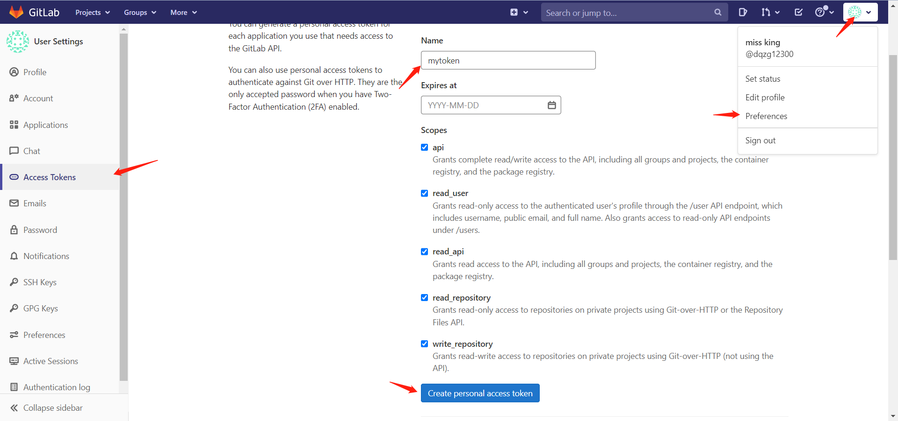

​	首先，在`gitlab`中手动创建一个根目录的`group`，这里创建了一个`android12_r3`的组，所有的子模块仓库都将在这个分组下。在`gitlab`页面中点击左上角`Groups->your Groups`。点击`New group`创建分组。成功创建后，记录下这个分组的`id`，比如我的根目录组`id`是6.

然后就可以使用`curl`命令通过`token`访问`gitlab`的`API`，创建一个空白的仓库。

```
// 创建一个名称为manifests的空白仓库，namespace_id是根目录的分组id
curl --header "PRIVATE-TOKEN: 27zctxyWZP9Txksenkxb" \
     --data "name=manifest&namespace_id=6" \
     --request POST "http://192.168.2.189/api/v4/projects"
```

​	接下来修改配置，并且将清单项目上传到`gitlab`中

```
// 创建项目目录
mkdir manifest && cd manifest

// 拷贝安卓源码中的git子模块清单文件
cp ~/android_src/aosp12/.repo/manifests/default.xml ./

//编辑清单
vim default.xml

//修改内容如下
<manifest>

  // 修改name为orgin，修改review为自己的服务器地址
  <remote  name="origin"
           fetch=".."
           review="http://192.168.2.189/" />
  // 修改remote为上面定义的name
  <default revision="master"
           remote="origin"
           sync-j="4" />
  // 修改remote为上面定义的name
  <superproject name="platform/superproject" remote="origin" revision="master" />
  <contactinfo bugurl="go/repo-bug" />
  .....
</manifest>

// 保存上面的修改,然后提交到仓库
git init
git remote add origin git@192.168.2.189:android12_r3/manifest.git
git add . && git commit -m "init"
git push
```

​	准备好清单文件后，接下来创建所有子模块仓库了。首先，需要了解有哪些子模块需要上传，而这个通过`default.xml`中的`project`元素，很容易查找到。编写一个`python`脚本来匹配出所有`project`中的`path`属性，然后创建`group`和仓库。下面是一份读取`default.xml`文件，自动创建所有仓库的代码。

```python
#!/usr/bin/python3

import gitlab
import os
import re
import time
// 读取的配置文件
MANIFEST_XML = "default.xml"
ROOT = os.getcwd()
# gitlab中自己手动创建这个group
ROOT_GROUP = "android12_r3"
MANIFEST_XML_PATH_NAME_RE = re.compile(r"<project\s+path=\"(?P<path>[^\"]+)\"\s+name=\"(?P<name>[^\"]+)\"",
                                       re.DOTALL)
# 修改成自己的gitlab服务地址，以及账号的token
gl = gitlab.Gitlab('http://192.168.2.189/', private_token='27zctxyWZP9Txksenkxb')

manifest_xml_project_paths = []

# 加载default.xml。取出所有需要创建的子仓库，需要验证一下这里的数量和你的project是否一致。
def parse_repo_manifest():
    with open(os.path.join(ROOT, MANIFEST_XML), "rb") as strReader:
        for line in strReader:
            if line is not None and len(line) != 0:
                this_temp_line = line.decode()
                if line.find("path".encode(encoding="utf-8")):

                    s = MANIFEST_XML_PATH_NAME_RE.search(this_temp_line)

                    if s is not None:
                        manifest_xml_project_paths.append(s.group("name"))

    print("manifest_xml_project_paths=" + str(manifest_xml_project_paths))
    print("manifest_xml_project_paths len=" + str(len(manifest_xml_project_paths)))

# 创建组以及对应的子模块仓库
def create_group_and_project():
    all_groups = gl.groups.list(all=True)
    print("all_groups=" + str(all_groups))
    group_parent = None
	# 遍历所有组，查找根组android12_r3是否存在
    for g in all_groups:
        if g.name == ROOT_GROUP:
            group_parent = g
            break
    print("group parent=" + str(group_parent))
	# 遍历所有子仓库路径
    for path in manifest_xml_project_paths:
        print("path=" + path)
        paths = path.split("/")
        print("paths=" + str(paths))

        last_path_index = len(paths) - 1

        group = group_parent
        for index in range(0, last_path_index):
            p = paths[index]
            print("p=" + p)
            # is the group exist
            print("parent group=" + group.name)
            try:
                all_groups = group.subgroups.list(all=True)
            except AttributeError:
                all_groups = []
                print("AttributeError: clear all subgroups")
			# 遍历所有组，找当前子模块的组是否存在
            is_group_exist = False
            for g in all_groups:
                if g.name == p:
                    is_group_exist = True
                    group = g
                    print("group exist=" + g.name)
                    break
            if is_group_exist:
                continue
            # create subgroup
            data = {
                "name": p,
                "path": p,
                "parent_id": group.id
            }
			# 不存在则创建子模块所属的组
            try:
                group = gl.groups.create(data)
                print("group create success name=" + p)
                time.sleep(1)
            except gitlab.exceptions.GitlabCreateError as e:
                if e.response_code == 400:
                    print("group:" + p + " has already been created")

                    query_groups = gl.groups.list(all=True)
                    print("query_groups:" + str(query_groups))
                    for query_group in query_groups:
                        if query_group.name == p and query_group.parent_id == group.id:
                            group = query_group
                            print("update exit group:" + group.name)
                            break
		# 创建子模块仓库，创建前先遍历是否仓库已存在
        project = paths[last_path_index]
        print("group project list group=" + group.name)
        real_group = gl.groups.get(group.id, lazy=True)
        all_projects = real_group.projects.list(all=True)
        print("group all projects=" + str(all_projects))
        is_project_exist = False
        for p in all_projects:
            if p.name == project:
                is_project_exist = True
                print("project exist=" + p.name)
                break
        if not is_project_exist:
            print("create project=" + project)
            gl.projects.create({'name': project, 'path': project, 'namespace_id': group.id})
            print("project create success name=" + project)
            time.sleep(1)

# 测试是否能成功创建
def test_create_project_with_dot_name():
    # need use path field, if don't use path, GitLab url will replace "." to "_"
    res=gl.projects.create({'name': "xxx.yy.xy", 'path': "xxx.yy.xy"})
    print(res)

if __name__ == '__main__':
    parse_repo_manifest()
    create_group_and_project()
    # test_create_project_with_dot_name()

```

​	子模块仓库建立完成，最后，还需要将代码上传到对应的仓库中。下面的代码可以完成这个工作。要注意的是`default.xml`文件中，`project`元素的属性`path`的是本地路径，而`name`才是指的`git`仓库的路径，代码如下。

```python
#!/usr/bin/python3

import os
import re,time
# 代码放在之前准备好的清单仓库中，然后指定default.xml路径
MANIFEST_XML = "./manifests/default.xml"
ROOT = os.getcwd()
LOG_FILE_PATH = os.path.join(ROOT, "push.log")
# 匹配path
MANIFEST_XML_PATH_NAME_RE = re.compile(r"<project\s+path=\"(?P<path>[^\"]+)\"\s+name=\"(?P<name>[^\"]+)\"\s+",
                                       re.DOTALL)
# 设置源码路径
SOURCE_CODE_ROOT = "~/android_src/android12_r3/"
# 设置gitlab仓库的根目录分组
REMOTE = "git@192.168.2.189:android12_r3/"
manifest_xml_project_paths = []

# 读取配置文件中的所有子模块路径
def parse_repo_manifest():
    with open(os.path.join(ROOT, MANIFEST_XML), "rb") as strReader:
        for line in strReader:
            if line is not None and len(line) != 0:
                this_temp_line = line.decode()
                if line.find("path".encode(encoding="utf-8")):

                    s = MANIFEST_XML_PATH_NAME_RE.search(this_temp_line)

                    if s is not None:
                        manifest_xml_project_paths.append({"path":s.group("path"),"name":s.group("name")})

    print("manifest_xml_project_paths=" + str(manifest_xml_project_paths))
    print("manifest_xml_project_paths len=" + str(len(manifest_xml_project_paths)))

# 上传源码
def push_source_code_by_folder(str_writer):
    # 遍历所有路径
    for path in manifest_xml_project_paths:
        print("path=" + path["path"])
        abs_path = SOURCE_CODE_ROOT + path["path"]
        # 路径存在则进行上传
        if os.path.exists(abs_path):
            # change current work dir
            os.chdir(abs_path + "/")
            # 1\. delete .git & .gitignore folder
            rm_git_cmd = "rm -rf .git"
            rm_gitignore_cmd = "rm -rf .gitignore"
            os.system(rm_git_cmd)
            os.system(rm_gitignore_cmd)

            # 2\. list dir
            dir_data = os.listdir(os.getcwd())

            cmd_list = []

            print("changed cwd=" + os.getcwd())

            if len(dir_data) == 0:
                echo_cmd = "echo \"This is a empty repository.\" > ReadMe.md"
                str_writer.write(f"empty repository:{abs_path}".encode() )
                str_writer.write("\r\n".encode())
                cmd_list.append(echo_cmd)
			# 将所有上传命令组装好
            git_init_cmd = "git init"
            cmd_list.append(git_init_cmd)

            git_remote_cmd = "git remote add origin " + REMOTE + path["name"] + ".git"
            cmd_list.append(git_remote_cmd)

            git_add_dot_cmd = "git add ."
            cmd_list.append(git_add_dot_cmd)

            git_commit_cmd = "git commit -m \"Initial commit\""
            cmd_list.append(git_commit_cmd)

            git_push_cmd = "git push -u origin master"
            cmd_list.append(git_push_cmd)
			# 执行上传命令
            for cmd in cmd_list:
                print("begin exec cmd=" + cmd)
                os.system(cmd)
                print("end exec cmd=" + cmd)
        else:
            print("abs_path=" + abs_path + " is not exist.")
            str_writer.write(f"folder not exist:{abs_path}".encode() )
            str_writer.write("\r\n".encode())

def wrapper_push_source_code_write_log():
    with open(LOG_FILE_PATH, 'wb+') as strWriter:
        push_source_code_by_folder(strWriter)
        strWriter.close()


if __name__ == '__main__':
    parse_repo_manifest()
    wrapper_push_source_code_write_log()

```

​	上传过程较慢，等待所有仓库上传完成，最后将`git-repo`工具子模块上传到仓库。首先在`gitlab`中创建一个分组`android-tools`。在分组中创建一个仓库`git-repo`。然后从`github`下载一份`git-repo`的工具源码传到`gitlab`。过程如下。

```
// 从github下载git-repo源码并上传到gitlab仓库
git clone https://github.com/GerritCodeReview/git-repo.git && cd git-repo
rm .git -rf
git init
git remote add origin git@192.2.189:android-tools/git-repo.git
git add .
git commit -m "init"
git push -u origin master

// 可以将这里的repo拿来使用
cp ./repo ~/bin/
PATH=~/bin:$PATH
```

​	终于一切准备就绪，那么开始拉取代码吧。

```
// 创建存放源码的目录
mkdir myandroid12 && cd myandroid12

// 指定使用自己的git-repo
repo init -u git@192.168.2.189:android12_r3/manifest.git --repo-url=git@192.168.2.189:android-tools/git-repo.git --no-repo-verify

// 出现了下面的错误
repo: error: unable to resolve "stable"
fatal: double check your --repo-rev setting.
fatal: cloning the git-repo repository failed, will remove '.repo/repo'

// 修改使用master分支，再重新执行上面的repo init命令
export REPO_REV=refs/heads/master

repo init -u git@192.168.2.189:android12_r3/manifest.git --repo-url=git@192.168.2.189:android-tools/git-repo.git --no-repo-verify

//同步代码
repo sync -j8
```

​	在同步的过程中，可能出现以下两个问题。首先第一个是出现如下错误。

```
remote:
remote: ========================================================================
remote:
remote: The project you were looking for could not be found or you don't have permission to view it.
remote:
remote: ========================================================================
remote:
fatal: 无法读取远程仓库。

请确认您有正确的访问权限并且仓库存在。

platform/build/bazel:
```

​	检测代码后，发现`bazel`仓库在路径`build`中不存在，这个仓库被建立在了`platform`下。导致这个问题的原因是，前面的创建`git`的脚本中，发现`build`被指定为`project`，所以创建为仓库，而`bazel`必须是在一个`group`下，路径才会成立。而`build`的仓库已经存在，创建这个`group`失败后，就默认使用了更上一层的`group`。而解决办法也非常简单，直接将`default`中的几个`build`路径下的几个`project`重新命名，不要放在`build`的`group`下即可。下面是解决后的`default.xml`配置。

```
<project path="build/make" name="platform/build" groups="pdk" >
    <copyfile src="core/root.mk" dest="Makefile" />
    <linkfile src="CleanSpec.mk" dest="build/CleanSpec.mk" />
    <linkfile src="buildspec.mk.default" dest="build/buildspec.mk.default" />
    <linkfile src="core" dest="build/core" />
    <linkfile src="envsetup.sh" dest="build/envsetup.sh" />
    <linkfile src="target" dest="build/target" />
    <linkfile src="tools" dest="build/tools" />
</project>
<project path="build/bazel" name="platform/build_bazel" groups="pdk" >
	<linkfile src="bazel.WORKSPACE" dest="WORKSPACE" />
	<linkfile src="bazel.sh" dest="tools/bazel" />
	<linkfile src="bazel.BUILD" dest="BUILD" />
</project>
<project path="build/blueprint" name="platform/build_blueprint" groups="pdk,tradefed" />
<project path="build/pesto" name="platform/build_pesto" groups="pdk" />
<project path="build/soong" name="platform/build_soong" groups="pdk,tradefed" >
    <linkfile src="root.bp" dest="Android.bp" />
    <linkfile src="bootstrap.bash" dest="bootstrap.bash" />
</project>
```

​	另外一个问题也非常类似。错误如下。

```
请确认您有正确的访问权限并且仓库存在。
device/mediatek/wembley-sepolicy: sleeping 4.0 seconds before retrying
```

​	报错的仓库在`default.xml`中的配置如下

```
<project name="device/mediatek/wembley-sepolicy" path="device/mediatek/wembley-sepolicy" groups="device"/>
```

​	看了创建仓库和批量提交代码的逻辑就明白了，是的，`name`和`path`的顺序反了，导致正则表达式未能成功匹配到这个仓库，调整一下`name`和`path`的顺序即可。

​	成功拉取完成后，如果在编译时碰到找不到文件的问题，这是由于有些子模块仓库下的子目录中有`.gitignore`文件，将一些应该提交的文件给过滤掉了。回到同步代码的目录中，找到指定的`git`仓库，使用下面的方式重新提交一下。回到同步下来的代码处，重新拉取更新的代码。

```
// 进入缺少文件的子模块仓库目录
cd ~/external/angle/
git add . -f
git commit -m "init"
git push -u origin master
cd ~/android_src/myandroid12/
repo sync -j8
```

​	到这里就完成了`gitlab`源码管理AOSP源码开发了，当修改代码后，就可以使用`repo`来提交修改了。在根目录执行下面的命令提交修改代码。

```
repo forall -c 'git add .'

repo forall -c 'git commit -m "change my update" '

repo forall -c 'git push'
```

​	在上面的命令中`repo forall -c`表示对清单中的所有`git`执行后面的命令。也可以选择直接在当前修改的`git`仓库中进行提交。


## 2.9 小结

​	本章主要讲述了如何从零开始，在`Windows`系统与`Ubuntu`系统中，搭建一个编译`Android`源码的环境。在环境搭建好后，讲解了如何选择合适的需要开发修改的`AOSP`版本，在系统版本确定后，讲解了拉取代码并编译的流程；接着，讲解了为系统集成自己编译的内核代码，然后将编译好的系统镜像，尝试多种方式刷入测试手机设备中。

​	在编译与刷机完成后，为后续开发和阅览代码做准备。讲述了如何使用`Android Studio`和`Clion`导入源码的完整流程，对于边开发边调试代码的人员来说，这个步骤必不可少。

​	最后，为了便于工程的长期维护和持续性的开发，讲解了搭建`gitlab`配合`repo`管理`Android`源码，配置过程不算轻松，但完成后方便管理，一劳永逸。

​	本章的内容操作性强，不同步骤之间由于各种原因可能会出现错误，出现操作流程被打断的情况下，不要急躁，冷静分析原因，结合网络上的搜索结果，发现定位并解决问题后，重复操作，直到编译刷机完成，配置好环境，为后面的课程做好准备。
