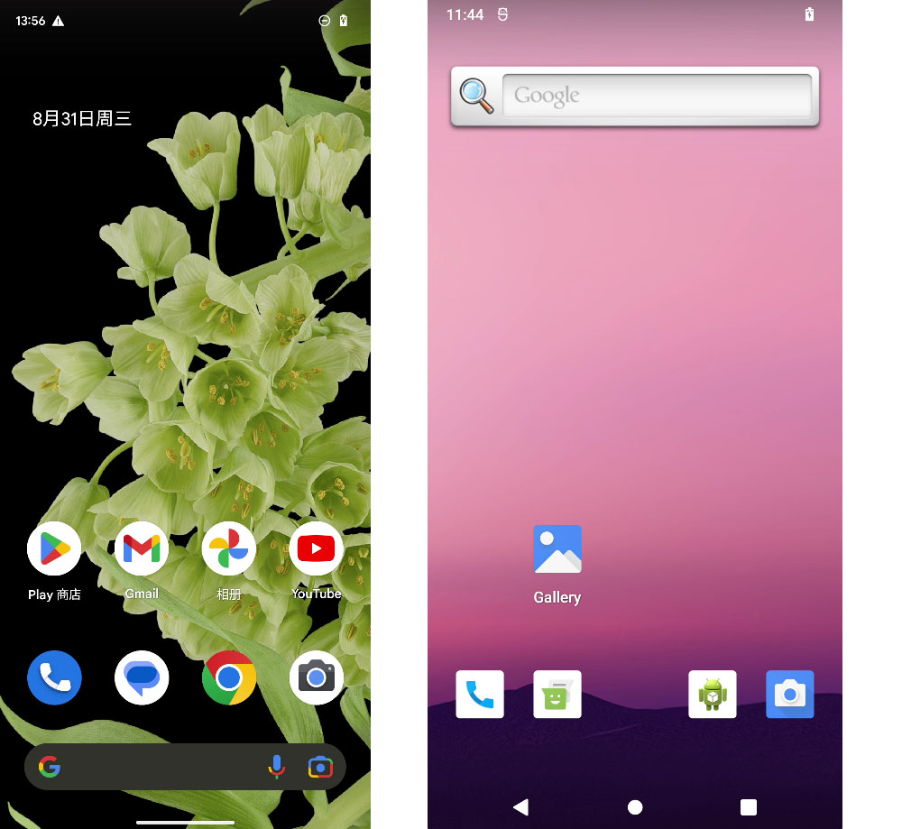
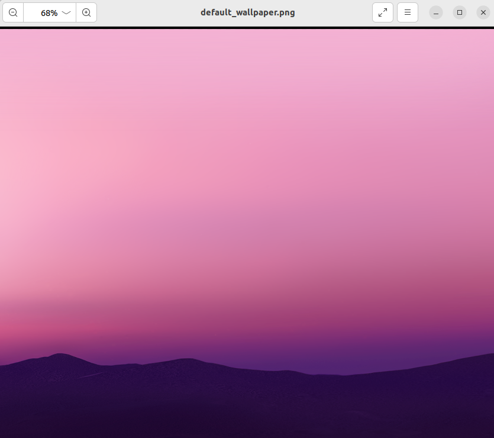
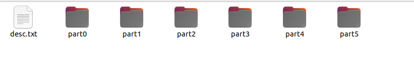
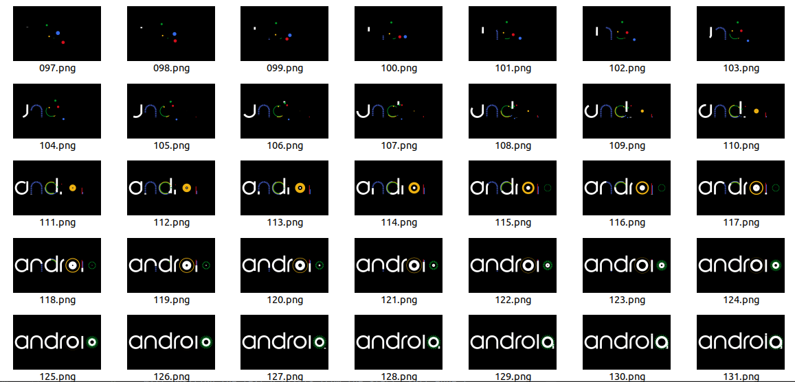

# 第四章 系统美化

​	在我们日常生活中，看到的任何一款商业化的定制`Android`系统中，都是有着其独特的系统`UI`，以及各种炫酷的操作界面。而`Android`系统官方开源的`AOSP`系统`UI`界面是非常简洁的，本章简单讲解如何个性化的系统`UI`定制，完整的美化整个系统是一个非常繁琐的工作，如果对于系统`UI`美化有着非常高的要求，可以选择第三方美化开源的系统进行二次开发。


## 4.1 系统美化简介

​`AOSP`的UI界面非常简洁，缺少良好的本地化用户体验，而且系统也不是为了提供优美外观而设计的，这给厂商提供了很大的二次开发空间。常见的对`UI`界面进行美化大致分为如下几项：

* 更换主题：下载主题软件，来定制主屏幕和菜单，使`Android`的用户界面变得更加个性化。

* 自定义图标：使用图标包来替换默认的应用图标，为应用程序打造更加独特的外观。

* 动态壁纸：将`Android`设备的背景设置为动态图片或视频，并可以使其与其他美化应用程序相互配合。

* 安装定制字体：可以下载和安装自己喜欢的字体，使`Android`系统上的应用程序和菜单更加丰富多彩。

* 修改开机动画：几乎所有的设备厂商，都有着各自特色的开机动画，以增强品牌产品的辨识度。


​`Android` UI美化是为了提高用户体验、突出品牌形象、展示产品价值和增加营销价值。设计美观、符合使用习惯、便于操作的用户界面，对于`Android`设备的吸引力和实用性尤为重要。下面介绍一下常见对美化系统的需求。

* 个性化：许多用户希望能够个性化自己的手机界面，让它看起来更加独特和有趣。可以通过更改主题、图标、壁纸、字体等实现。

* 提高用户体验：美化`UI`还有一个目的是为了提高用户体验。优秀的用户界面可以提高用户的舒适度、使用效率和满意度，从而吸引更多的用户。

* 提高产品价值：一个好看的`UI`更容易吸引用户，从而提高产品的价值。这对于`Android`应用开发商或者手机厂商来说尤为重要。

* 突出品牌形象：对于企业，使其品牌形象在`Android`界面中得到突出展示也是有一定需要的，通过`UI`美化营造品牌形象。

* 凸显功能 : 突出重要功能，提高用户感知度和使用体验，可以通过`UI`设计实现。

* 改善可用性: 使用条件恶劣的环境下设计`UI`，如夜间、低光、震动等，来提高系统的可用性。

* 用户群体区分：美化`UI`还可以通过设计不同款式的主题来适应不同群体的需求，例如儿童、青少年、年轻人、老年人等。

​	下图展示的是`Google`官方的`Android`系统桌面图，以及自己编译`AOSP`的桌面图。



​	从上图中可以看到明显差异，`Google`官方的`ROM`相较于`AOSP` ROM多了一些功能和应用，例如谷歌应用套件：`Google Mobile Services（GMS）`包含了各种谷歌应用，如`Gmail、Google Maps、Play`商店等等。这些应用在`AOSP` ROM中是没有的。

​	由于许多`Android`应用程序和服务都是由`Google`提供的，并且需要授权才能使用，因此在某些情况下，如果设备没有预装`Google`应用程序和服务，则无法获得它们。因此，一些`Android`爱好者和开发者创建了`GApps`包，通过安装这些包，可以在自己的设备上获得`Google`应用程序和服务。包括谷歌商店、谷歌地图、谷歌浏览器、谷歌日历、`Gmail`等等，如果想要的是一个界面类似官方的`ROM`，直接从官网：`https://opengapps.org/`下载`GApps`刷入即可。`GApps`的设备版本支持相对`AOSP`发布版本滞后，目前暂不支持`AOSP` 12，这里不再详细展开。


## 4.2 常见系统美化方式

​	最简单的美化方式，就是直接使用一些管理主题壁纸图标的`App`来管理`UI`界面资源，这种方式无需对美化过程进行了解，只需要挑选喜欢的资源进行替换就能完成对部分`UI`界面进行变动。缺点就是较为被动，`App`提供的功能并不能完全满足一些人的定制需求。这种方式通常适用于普通`Android`用户。

​	其次是使用`ROM`编辑类的工具，将编译好的镜像导入，然后由工具进行解析后，再修改主题，图标等。最后替换资源生成新的镜像，这种方式同样不需要深入了解具体美化的原理，但是和上一种相同的问题，提供的功能有限，并且类似的工具非常少见。并且还需要有一定的刷机经验。这种方式适用于一些`Android`发烧友。

​	最后就是从原理层面了解资源所在位置，如何修改`Android`源码替换资源。实现对系统`UI`的定制化，从根本上了解美化系统过程，编译出来的镜像直接刷机后就能获得美化后的界面。这种定制方式的难度最高，同时也是最根源的办法。当掌握原理后，那么以上两种方式是如何做到美化的同样也会了如指掌。


## 4.3 美化UI的原理

​	有多种方式可以修改`UI`，例如通过修改`Android`源码中对资源的配置，达到修改系统`UI`的目的，大多数的系统`UI`相关的资源和配置都存放在目录`frameworks/base/core/res/`。通过修改这些资源文件来实现改变系统`UI`的外观样式，而图标相关的素材一般在这个目录下的`drawable-*`的子目录中。可以直接替换图标素材来实现修改图标，或者是替换`framework-res.apk`实现切换主题。

​	在源码编译刷入手机后，在手机中会有默认自带文件`/system/framework/framework-res.apk`，这是存放`Android`系统`UI`界面的资源文件，图片、布局、颜色、字符串等。`framework-res.apk`和`SystemUI.apk` 都是`Android`操作系统的应用程序包，`SystemUI.apk`同样也是系统`UI`相关的，但是他们的主要功能不同。

* `framework-res.apk`包含了`Android`操作系统的核心`UI `组件（资源文件），例如系统主题、`UI `图标、颜色的定义、字体、过渡动画等等。。

* `SystemUI.apk`负责设备状态栏和通知管理，锁定屏幕上的日期和时间, 系统`UI`中的图标、通知中心等等。当用户接收到来自应用程序或系统的通知时，负责将通知以可视化的方式展示给用户，并允许用户控制通知和设备状态栏的设置。

​	由于`framework-res.apk`包含了`Android`操作系统的核心资源文件，因此它也被包括在`SystemUI.apk`中使用的资源文件中。这类系统应用程序包，通常不能被用户直接安装或卸载。不过，该应用程序包可以被理解为`Android`系统的一部分。`framework-res.apk` 文件的源码位于`frameworks/base/core/res/`目录下。


## 4.4  修改壁纸

​	在前文中和`Google`官方`ROM`对比的界面图，就是`Android`的`UI`界面中的壁纸了，壁纸是在手机主页面的背景图，壁纸可以在手机中进行切换修改，同样也可以直接修改默认的壁纸，默认壁纸的路径是`frameworks/base/core/res/res/drawable-nodpi/default_wallpaper.png`。下图是`AOSP`中的默认壁纸。



​	知道壁纸素材的路径后，可以通过对这个素材进行替换来达到修改的目的，同样也可以通过查找设置的地方，修改默认设置选项，将壁纸切换为另一张图片来完成壁纸修改，前者的好处在于简单快捷，替换素材即可。而后者在于稳妥，随时可以调整切换回原素材。替换的方式较为简单就不再细说，这里看看通过修改设置的实现。

​	首先，找到一个新的壁纸素材文件`new_wallpaper.png`，然后放到目录`frameworks/base/core/res/res/drawable-nodpi/`下，并且在`res`目录下的`values/symbols.xml`中添加相应的配置。

```
...
<!-- 在default_wallpaper下面添加一条新数据 -->
<java-symbol type="drawable" name="default_wallpaper" />
<java-symbol type="drawable" name="new_wallpaper" />
...
```

​	接下来，修改默认壁纸设置的源码，将默认壁纸设置为新的图片。

```java
public class WallpaperManager {
    ...
    private static final String PROP_WALLPAPER = "ro.config.wallpaper";
    private static final String PROP_LOCK_WALLPAPER = "ro.config.lock_wallpaper";
    private static final String WALLPAPER_CMF_PATH = "/wallpaper/image/";
	...
    public static InputStream openDefaultWallpaper(Context context, @SetWallpaperFlags int which) {
        final String whichProp;
        final int defaultResId;
        if (which == FLAG_LOCK) {
            return null;
        } else {
            whichProp = PROP_WALLPAPER;
            // 原本默认使用default_wallpaper，修改成最新的new_wallpaper
			// defaultResId = com.android.internal.R.drawable.default_wallpaper;
            defaultResId = com.android.internal.R.drawable.new_wallpaper;
        }
        // 优先从属性ro.config.wallpaper中获取一个默认的壁纸路径
        final String path = SystemProperties.get(whichProp);
        final InputStream wallpaperInputStream = getWallpaperInputStream(path);
        if (wallpaperInputStream != null) {
            return wallpaperInputStream;
        }
        // 属性路径获取失败后，尝试从cmf路径中获取默认壁纸
        final String cmfPath = getCmfWallpaperPath();
        final InputStream cmfWallpaperInputStream = getWallpaperInputStream(cmfPath);
        if (cmfWallpaperInputStream != null) {
            return cmfWallpaperInputStream;
        }
        // 前两个失败的情况，从默认资源文件中获取默认壁纸
        try {
            return context.getResources().openRawResource(defaultResId);
        } catch (NotFoundException e) {
            // no default defined for this device; this is not a failure
        }
        return null;
    }

    private static InputStream getWallpaperInputStream(String path) {
        if (!TextUtils.isEmpty(path)) {
            final File file = new File(path);
            if (file.exists()) {
                try {
                    return new FileInputStream(file);
                } catch (IOException e) {
                    // Ignored, fall back to platform default
                }
            }
        }
        return null;
    }

    private static String getCmfWallpaperPath() {
        return Environment.getProductDirectory() + WALLPAPER_CMF_PATH + "default_wallpaper_"
                + VALUE_CMF_COLOR;
    }
    ...
}
```

​	从源码中看到，可以从三个地方获取默认壁纸，同样想要修改的话，也能从这三个方式着手，比如添加一个属性设置默认壁纸路径，或者修改`cmfpath`的路径设置默认壁纸。修改后重新编译系统，刷入手机即可看到手机壁纸发生了变化。

```
source ./build/envsetup.sh
lunch aosp_blueline-userdebug
make update-api -j8
make -j$(nproc --all)
```


## 4.5 修改图标

​	修改图标前，首先需要对`res`的目录结构有个简单的认知。`Android`中有两种类型的资源文件：`drawable`和`mipmap`。`mipmap`主要用于存储应用程序图标资源，而`drawable`则用于存储应用程序图标资源以外的其他资源，例如按钮、菜单、列表等等。

​	在`Android`中资源文件是按屏幕的密度来进行分类的，屏幕密度是指在给定空间内包含多少个像素点，通常以`pixels per inch（ppi）`为单位来表示，`Android`将屏幕密度划分为以下几类：

- `ldpi`：低密度屏幕，大约`120ppi`。
- `mdpi`：中等密度屏幕，大约`160ppi`。
- `hdpi`：高密度屏幕，大约`240ppi`。
- `xhdpi`：超高密度屏幕，大约`320ppi`。
- `xxhdpi`：极高密度屏幕，大约 `480ppi`。
- `xxxhdpi`：超极高密度屏幕，大约`640ppi`。
- `night`：特殊的资源目录，用于存储夜间模式下使用的图像资源。
- `nodpi`：特殊的资源目录，用于存储不针对任何屏幕密度分类的图像资源。

​	通常情况下，`Android`应用程序需要为不同的屏幕密度提供不同版本的图像资源，以确保在不同的设备上以最佳方式显示。例如，在`drawable-mdpi`目录中存储基于中等密度屏幕（`mdpi`）的图像资源，而在`drawable-hdpi`目录中存储基于高密度屏幕（`hdpi`）的图像资源。

​	然而，有时候应用程序需要使用固定大小的图像资源，并且不希望这些图像被缩放或扩展以适应不同的屏幕密度。在这种情况下，就可以使用 `drawable-nodpi` 目录来存储这些图像资源。这些图像将忽略设备的屏幕密度，并显示为其原始大小。例如在前文看到的桌面壁纸，就是使用的`nodpi`目录存放的资源文件。

​	需要注意的是，使用 `drawable-nodpi` 目录要慎重考虑，并尽可能避免使用。因为它们不适用于不同屏幕密度的需求，可能会导致在某些设备上显示不正确。需要确保图像资源已经按照目标大小进行了生成，并且能够在所有设备上显示正确。

​	根据以上的信息，知道了图标是在`res`中`mipmap`开头的目录中。在这里以桌面的中的`Setting`应用为例子，找到目录`packages/apps/Settings/res/mipmap-hdpi/`看到了对应桌面中`Setting`的应用程序图标，文件名为`ic_launcher_settings.png`。而要替换该图标，直接使用新文件替换该图标即可。

​	当然，如果要全部手动替换，来将系统中的图标更换是非常费力的一件事情，所以在了解完替换图标的原理后，可以通过开发一个简单的脚本来完成，例如`Setting`的图标是`ic_launcher_settings.png`，`Contacts`的图标是`ic_contacts_launcher.png`，`Calendar`的图标为`ic_launcher_calendar.png`，将系统中的常用图标找齐对应的文件名后，通过脚本来搜索目录，找到对应路径，然后根据新的素材文件对其一一替换，即可完成批量的工作。replaceIcon程序实现代码如下。

```python
import os
import shutil
import subprocess

# 执行cmd命令
def exec(cmd):
    proc = subprocess.Popen(
        cmd,
        shell=True,
        stdout=subprocess.PIPE,
        stderr=subprocess.STDOUT,
        stdin=subprocess.PIPE  # 重定向输入值
    )
    proc.stdin.close()  # 既然没有命令行窗口，那就关闭输入
    result = proc.stdout.read()  # 读取cmd执行的输出结果（是byte类型，需要decode）
    proc.stdout.close()
    return result.decode(encoding="utf-8")

# 替换图标
def replacePng(target,appName):
    # 搜索该路径下的图标
    cmdRes = exec(f"find ~/android_src/rom_gitlab/packages/ -name {target}")
    filePathList = cmdRes.split("\n")
    curpath=os.getcwd()
	# 遍历所有搜到的结果
    for filepath in filePathList:
        if filepath=="":
            continue
        # 为了避免其他应用的同名素材图标，所以使用appName过滤一下
        if appName not in filepath:
            continue
        print('Found file: ' + filepath)
        # 先将文件进行备份
        shutil.copy(filepath,filepath+".bak")
        # 然后将当前目录准备好的替换文件复制进去
        replacePath=curpath+"/images/"+target
        # 如果新文件不存在，则结束该文件的替换
        if os.path.exists(replacePath)==False:
            print("not found replace file:",replacePath)
            break
        shutil.copy(replacePath, filepath)

# 使用备份的文件还原该图标
def unReplacePng(target):
    # 查找目标文件
    cmdRes = exec(f"find ~/android_src/rom_gitlab/frameworks/base/packages/ -name {target}")
    filePathList = cmdRes.split("\n")
    # 遍历所有结果
    for filepath in filePathList:
        if filepath=="":
            continue
        print('Found file: ' + filepath)
        # 备份文件如果存在，则将其还原
        bakfile=filepath + ".bak"
        if os.path.exists(bakfile):
            shutil.copy(bakfile, filepath)
            print("unReplace file:",bakfile)

def main():
    # 替换为新素材
    replacePng('ic_launcher_settings.png',"Setting")
    replacePng('ic_contacts_launcher.png',"Contacts")
    replacePng('ic_launcher_calendar.png',"Calendar")

    # 还原素材
    # unReplacePng('ic_launcher_settings.png')
    # unReplacePng('ic_contacts_launcher.png')
    # unReplacePng('ic_launcher_calendar.png')

if __name__ == '__main__':
    main()
```


### 4.6 修改开机动画

​	`Android`中的开机动画并不是一个视频文件，也不是一个`gif`文件，而是一个名为`bootanimation.zip`的压缩包文件。在这个压缩包文件中，有着若干`png`格式的图片，以及一个`desc`的描述文件，在开机时，系统会按照描述文件依次播放图片，关于该压缩文件的说明文档可以查看源码中的文件，它的路径是`frameworks/base/cmds/bootanimation/FORMAT.md`。下面是开机动画压缩包中的文件结构。

```
    desc.txt - 播放的规则
    part0  \
    part1   \  存放着png图片的目录
    ...     /
    partN  /
```

解压开机动画压缩包后的文件如下图。



`desc.txt`文件内容如下。

```
832 520 30
c 1 30 part0
c 1 0 part1
c 0 0 part2
c 1 30 part3
c 1 0 part4
c 1 0 part5
```

​	第一行的`832 520`是图片的分辨率，`30`是播放帧率，每秒播放`30`张图片。

​	第二行中，`c` 表示该部分将播放到完成，不管其他部分是否已经播放完毕。与此相反，如果第一个参数是`p` 表示该部分将一直播放，直到被新的部分替换或整个动画结束。第二个参数`1`代表播放`1`次。第三个参数表示播放的间隔，第四个参数表示对哪个目录的图片生效。

​	查看其中一个目录下的文件如下图。



对这些了解后，接着开始对其进行替换，为了便于简单演示，就不找新的素材进行替换了，直接将`androidtv`的开机动画替换为当前开机动画，找到文件`device/google/atv/products/bootanimations/bootanimation.zip`，将其复制到自定义的任意目录，例如新建目录`packages/bootstart/`，将启动动画拷贝到该目录中。然后在文件`build/make/target/product/generic_system.mk`添加配置，将其拷贝到`system/media/`目录下。相关修改如下。

```
PRODUCT_COPY_FILES += \
    packages/bootstart/bootanimation.zip:system/media/bootanimation.zip \
```

如果是自己制作的开机动画压缩包，可以在`desc.txt`所在的目录中执行命令`zip -0 -r ../bootanimation.zip ./*`，则会在上一级目录生成新的开机动画压缩文件。

最后编译后，重新刷机。在开机时，即可看到开机动画发生了变动。在开机进入系统后，如果想要重新播放开机动画，可以执行下面的命令。

```
adb shell
setprop ctl.start bootanim #执行开机动画
getprop ctl.start bootanim #停止开机动画
```

## 4.7 本章小结

本章主要讲解了`AOSP`系统美化的一些知识，介绍了了图标、壁纸、开机动画等系统资源的修改方法。这些内容只是系统美化很少的一部分，想要完整的实现整个系统的美化，需要深入了解`framework-res.apk`文件的结构与内容，这些内容就交给读者朋友们自己来探索了。

