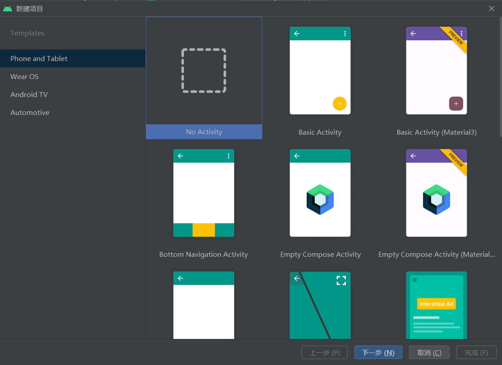
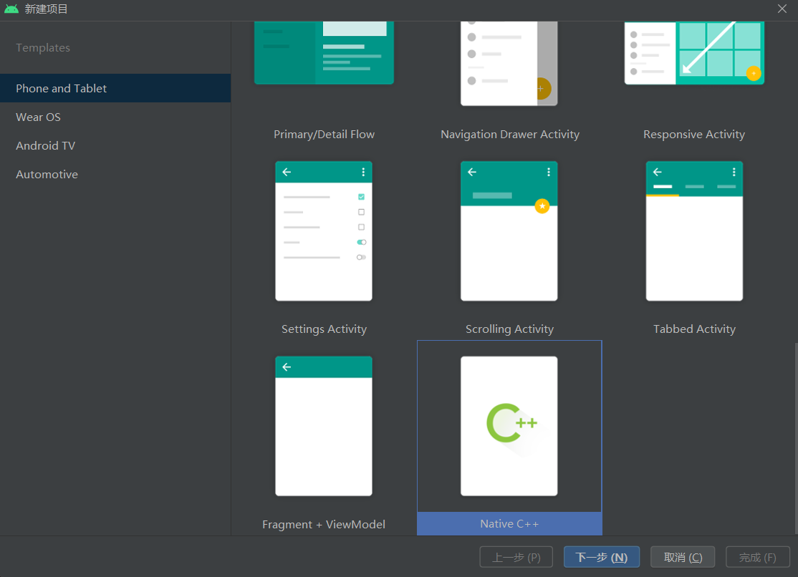

# 第五章 系统内置功能

​	`AOSP`系统默认提供一些基础的功能，例如短信、电话、联系人、浏览器等，在定制过程中，可以根据自身的需求，将一些开发好的`APP`应用内置到系统中，作为系统的基础配套应用，也可以开发特定业务的系统服务提供支持。几乎所有的手机厂商出厂的设备中，都内置了厂商开发的专属应用，有一些还会内置一些推广的第三方应用。

经过前几章对源码理论的学习，在这一章将小牛试刀修改源码，学习如何对系统进行简单的改造，为其添加模块和系统应用。


## 5.1 什么是系统内置

简单来说，系统内置指的是手机出厂后，在启动完成后用户可以看到的那些自带功能。例如，Android内置了一些系统应用程序如 Launcher、Phone、Email 和``Setting`等。同样地，开发者也可以制作一个应用程序，并将其内置在系统中作为系统应用。

在前几章中，我们学习了``Android`系统启动流程和打开应用程序时的执行细节，并介绍了修改替换系统资源文件的方法。现在我们需要学习更多关于`AOSP`（Android Open Source Project）项目的二次开发，以及如何基于该项目扩展并将更便捷功能内置到系统中。

内置应用可以是对具有系统级权限应用功能进行扩展，也可以是业务型`App`的集成，这取决于所需求与目标。由于`Android`系统非常庞大且编译刷机操作耗时较长，在实践过程中需要结合自身需求，在经历一段时间的开发之后，总结出提高效率和形成完整定制方法论所需采取的策略。一个典型而常见问题是，针对某些基础类代码进行增改，导致重新编译大量依赖库，每次微小修改直至测试完成可能需要数小时以上。解决这种问题可通过抽象接口为独立类并生成库文件来引用，将所有功能封装后导入基础类代码中，避免直接在`AOSP`源码中编写。这样一次添加引入修改会耗费时间，但以后的代码修改只需操作库文件而无需修改`AOSP`本身代码，从而大大提升编译速度，并避免浪费大量时间在等待编译上。


## 5.2 系统内置App

`Android`系统自身内置`App`的所在目录为系统源码的`packages/apps`目录，系统中内置的大多数`App`源码都存放在此处。打开任意一个系统内`App`的目录进去后，能看到这里的目录层次结构和使用`Android Studio`开发的`Android`程序没有什么区别。

当然，需要内置的`App`代码并不是一定要放在这个目录下，可以选择将编译后的成品`apk`文件内置进去，这也是厂商集成第三方软件App到自身系统的主要方法。

```
cd ./packages/apps
ls

BasicSmsReceiver       DevCamera              ManagedProvisioning    QuickSearchBox             Test
Bluetooth              Dialer                 Messaging              RemoteProvisioner          ThemePicker
Browser2               DocumentsUI            Music                  SafetyRegulatoryInfo       TimeZoneData
Calendar               EmergencyInfo          MusicFX                SampleLocationAttribution  TimeZoneUpdater
Camera2                Gallery                Nfc                    SecureElement              Traceur
Car                    Gallery2               OnDeviceAppPrediction  Settings                   TV
CarrierConfig          HTMLViewer             OneTimeInitializer     SettingsIntelligence       TvSettings
CellBroadcastReceiver  ImsServiceEntitlement  PhoneCommon            SpareParts                 UniversalMediaPlayer
CertInstaller          KeyChain               Protips                Stk                        WallpaperPicker
Contacts               Launcher3              Provision              StorageManager             WallpaperPicker2
DeskClock              LegacyCamera           QuickAccessWallet      Tag

cd WallpaperPicker
ls

Android.bp  AndroidManifest.xml  build.gradle  CleanSpec.mk  LibraryManifest.xml  OWNERS  res  src
```

​	接下来，开发一个简单的案例。然后将这个`App`应用内置到系统中，编译后刷入手机，案例的实现代码使用默认的即可。

```java
public class MainActivity extends AppCompatActivity {
    @Override
    protected void onCreate(Bundle savedInstanceState) {
        super.onCreate(savedInstanceState);
        setContentView(R.layout.activity_main);
    }
}
```

​	`android:shareUserId`是`AndroidManifest.xml`文件中的一个属性，用于应用程序之间的共享用户`ID`。共用用户`ID`可以让应用程序之间更好的进行相互访问和操作。当一个应用程序定义了`android:shareUserId`属性时，另一个相互信任的应用程序，可以设置相同的`android:shareUserId`属性，从而实现应用程序的数据共享和交互。

​	在安装和运行应用程序之前，设备会将具有相同共享用户`ID`的应用程序，视为同一用户。因此，可以访问对方的数据，比如，`SharedPreferences`和文件等。如果应用程序没有设置`android:shareUserId`属性，则其默认值是该应用程序的包名。以下是`AndroidManifest.xml`文件中的配置 ，设置`android:shareUserId`为`android.uid.system`。

```
<?xml version="1.0" encoding="utf-8"?>
<manifest xmlns:android="http://schemas.android.com/apk/res/android"
    xmlns:tools="http://schemas.android.com/tools"
    android:sharedUserId="android.uid.system"
    package="cn.rom.systemappdemo">
    ...
</manifest>
```

​	如果直接设置了该属性，再使用常规的方式安装就提示下面的错误。

```
Installation did not succeed.
The application could not be installed: INSTALL_FAILED_SHARED_USER_INCOMPATIBLE

List of apks:
[0] 'C:\Users\android\AndroidStudioProjects\SystemAppDemo\app\build\intermediates\apk\debug\app-debug.apk'
Installation failed due to: 'INSTALL_FAILED_SHARED_USER_INCOMPATIBLE: Package cn.rom.systemappdemo tried to change user null'
```

​	测试用例准备就绪后就可以来到源码的目录`packages/apps`，创建一个新的目录`SystemAppDemo`，将刚刚编译的样例`App`改名为`SystemAppDemo`放入这个目录，在这个新目录中，添加一个编译的配置文件`Android.mk`。

```
cd ./packages/apps/
mkdir SystemAppDemo && cd SystemAppDemo
touch Android.mk
gedit Android.mk

//添加下面的内容
LOCAL_PATH := $(call my-dir)
#清除环境变量
include $(CLEAR_VARS)
#模块文件名
LOCAL_SRC_FILES := SystemAppDemo.apk
#模块名称
LOCAL_MODULE := SystemAppDemo
#定义模块的类型
LOCAL_MODULE_CLASS := APPS
#哪个版本进行编译，optional表示可选模块。可选字段： user 、 eng 、 tests
LOCAL_MODULE_TAGS := optional
#签名，platform表示系统签名，PRESIGNED表示保持原签名
LOCAL_CERTIFICATE := platform
#不进行odex优化
LOCAL_DEX_PREOPT := false
include $(BUILD_PREBUILT)
```

​	在`Android`系统编译过程中，`PRODUCT_PACKAGES`是一个重要的环境变量，它定义了系统所需构建的软件包列表。`PRODUCT_PACKAGES`环境变量定义的是本次构建需要编译打包的软件包，包括一些基础系统组件和应用程序模块，例如音频服务模块、媒体播放库、输入法、设置应用程序等。

​	在构建规则文件`./build/make/target/product/mainline_system.mk`文件中添加配置。

```
PRODUCT_PACKAGES += SystemAppDemo \
```

​	到这里就修改完毕了，重新编译系统，将其刷入手机中。手机成功进入系统后，打开应用查看进程身份即可。

```
source ./build/envsetup.sh
lunch aosp_blueline-userdebug
make -j$(nproc --all)
adb reboot bootloader
flashflash all -w

// 等待系统刷机完成后打开桌面上的SystemAppDemo
adb shell
ps -e|grep systemappdemo
// 发现进程身份已经变成system的了。
system        5033  1058 14718076 89256 0                   0 S cn.rom.systemappdemo
```


## 5.3 构建系统

​	`Android`提供了两种构建系统方式，在`Android` 7.0之前都是使用基于`make`的构建系统，在源码中由`Android.mk`文件描述构建规则，这是`Android`开发历史中遗留的一种构建方式，由于`make`在`Android`中构建缓慢、容易出错、无法扩展难以测试。所以在7.0后引入了`soong`构建系统，在源码中由`Android.bp`文件描述`soong`的构建规则，在`soong`中采用了`kati GNU Make`克隆工具和`ninja`后端来加速对系统源码的构建。

​	`Soong`构建系统是一个由`Google`开发的，专门用于构建`Android`的构建系统。它是一个用`go`语言编写的构建系统，旨在解决早期版本的`Android`构建系统中存在的问题，所以，它现在是`Android`构建系统的首选。

​	`Soong`的主要特点和优势包括：

1. 速度快：`Soong`采用`Makefile-style`的语法并支持增量构建，使其比较快速。
2. 简洁易用：`Soong`的语法清晰，易于理解和使用。
3. 自动化代码生成：`Soong`可以自动化生成代码，减少手动输入的工作量。
4. 插件式：`Soong`采用插件式的结构，使其易于扩展以满足不同的构建要求。

​	尽管`Android.mk`使用的`make`构建系统已经被`soong`逐渐取代了，但是依然可以在开发中使用它，下面将对`Android.mk`和`Android.bp`的规则进行介绍。

​	`Android.mk`文件采用`makefile`格式，由一系列的`Target`配置和`Macro`定义组成，在`Android.mk`中可以定义整个应用或组件的编译过程，包括`Java`代码、`C/C++`代码、资源文件。以下是`Android.mk`的常见写法。

```
// 定义模块
module_name := mymodule
// 通常作为一个Android.mk文件中的第一行
// 就是把之前的所有的LOCAL_变量都清空，从而确保每个模块的变量之间互不干扰，避免变量混淆。
include $(CLEAR_VARS)

// 通常情况下，定义为“optional”的模块会在构建环境变量中被忽略，需要添加编译选项来编译它们。
// 通过向PRODUCT_PACKAGES中添加模块名称，我们可以确保这些模块能够被构建系统所识别，从而完成编译。
LOCAL_MODULE_TAGS := optional
LOCAL_MODULE := $(module_name)

// 定义模块依赖项，例如依赖其他模块库
LOCAL_STATIC_LIBRARIES := lib1 lib2
LOCAL_SHARED_LIBRARIES := lib3 lib4

// 定义源文件
LOCAL_SRC_FILES := test.cpp

// 定义源文件的头文件
LOCAL_C_INCLUDES := $(LOCAL_PATH)/include

// 定义编译选项
LOCAL_CFLAGS := -Wall
LOCAL_CPPFLAGS := -Wall

// 定义静态库
include $(CLEAR_VARS)
LOCAL_MODULE := my_static_lib
LOCAL_SRC_FILES := test1.c test2.c
LOCAL_CFLAGS := -Wall
include $(BUILD_STATIC_LIBRARY)

// 定义动态库
include $(CLEAR_VARS)
LOCAL_MODULE := my_shared_lib
LOCAL_SRC_FILES := test.c
LOCAL_CFLAGS := -Wall
include $(BUILD_SHARED_LIBRARY)

// 定义可执行文件
include $(CLEAR_VARS)
LOCAL_MODULE := my_binary
LOCAL_SRC_FILES := main.c
LOCAL_CFLAGS := -Wall
include $(BUILD_EXECUTABLE)

// 定义资源文件
include $(CLEAR_VARS)
LOCAL_MODULE := my_resources
LOCAL_SRC_FILES := test.xml

// 表示将该预先构建的文件添加到系统构建目标列表中。
include $(BUILD_PREBUILT)
```

​	接下来看看一个`Android.mk`的示例文件

```
// 使用当前目录
LOCAL_PATH := $(call my-dir)
// 清除之前设置的变量和规则
include $(CLEAR_VARS)
// 模块名
LOCAL_MODULE := libxmlrpc++
// 该变量定义模块所依赖的操作系统
LOCAL_MODULE_HOST_OS := linux
// 允许使用 RTTI 特性
LOCAL_RTTI_FLAG := -frtti
// 指定 C++ 标志选项
LOCAL_CPPFLAGS := -Wall -Werror -fexceptions
// 指定该库的头文件搜索路径
LOCAL_EXPORT_C_INCLUDES := $(LOCAL_PATH)/src
// 指定要编译的源文件的列表
LOCAL_SRC_FILES := $(call \
     all-cpp-files-under,src)
// 该指令指示编译器生成动态链接库文件。如果要生成静态库文件，则可以使用 $(BUILD_STATIC_LIBRARY) 指令。
include $(BUILD_SHARED_LIBRARY)
```

​	`Android.bp`文件使用的是一种名为`Blueprint`的语言来表示模块和它们的依赖关系。`Blueprint`是一种声明式语言，它描述了一个系统的构建规则和依赖关系，而无需描述如何构建代码本身。在`Android.bp`文件中，每个模块都表示为一个独立的蓝图，并且该蓝图包含有关模块的信息，例如名称、类型、源文件等。此外，蓝图还可以包含有关与该模块相关的依赖关系的信息，例如库、标头文件等。使用 `Android.bp`文件可以使`Android`模块的构建过程更加简单明了，并且易于实现自定义构建规则和自动化构建操作。同时，它还能提高编译效率，特别是在多核`CPU`系统上。下面是`Android.bp`文件的基本格式：

```
// Android.bp文件中的模块以模块类型开头，后跟一组 name: "value", 格式的属性
// 每个模块都必须具有 name 属性，并且相应值在所有 name 文件中必须是唯一的

//cc_binary指示需要构建的 C/C++ 二进制程序
cc_binary {
    name: "gzip",	// 二进制的名称
    srcs: ["src/test/minigzip.c"],		// 需要编译的源码
    shared_libs: ["libz"],		// 指定所需链接的共享库
    // 指定C++标准库的使用方式，"none" 表示不使用 C++ 标准库，因为模拟 C++ 标准库的子库可能在某些平台上都不可用。
    stl: "none",
}

// cc_binary指示需要构建的 C/C++ 静态库或者动态库
cc_library {
    ...
    srcs: ["generic.cpp"],
    // 可以指定不同平台使用的支持文件
    arch: {
        arm: {
            srcs: ["arm.cpp"],
        },
        x86: {
            srcs: ["x86.cpp"],
        },
    },
}

// cc_defaults是默认模块可用于在多个模块中重复使用相同的属性
cc_defaults {
    name: "gzip_defaults",
    shared_libs: ["libz"],
    stl: "none",
}
cc_binary {
    name: "gzip",
    defaults: ["gzip_defaults"],		// 使用上面的默认模块
    srcs: ["src/test/minigzip.c"],
}

// 定义一个Java库模块
java_library {
    name: "myjava",
    srcs: ["MyJava.java"],  // Java源代码文件列表
    libs: ["mylib"],  // 依赖的本地库列表
    static_libs: ["libz"], // 依赖的静态本地库列表
}

// 定义一个android模块
android_library {
    name: "myandroid",
    srcs: ["MyAndroid.java"],  // Java源代码文件列表
    libs: ["mylib"],  // 依赖的本地库列表
    static_libs: ["libz"],  // 依赖的静态本地库列表
    shared_libs: ["liblog"],  // 依赖的共享库列表
    manifest: "AndroidManifest.xml",  // AndroidManifest.xml路径
    resource_dirs: ["res"],  // 资源文件目录列表
}

//声明命名空间，可以让不同目录中的模块指定相同的名称，只要每个模块都在单独的命名空间中声明即可
soong_namespace {
    imports: ["path/to/otherNamespace1", "path/to/otherNamespace2"],
}
```

`androidmk`是`soong`中提供的一个工具，作用是在两个编译脚本格式上做转换工作。因为基于`make`的构建系统已经逐渐被`soong`替代了，但是依然有很多人习惯使用`Android.mk`的规则来配置构建条件，在这种情况下可以选择写完`Android.mk`后，再使用`androidmk`工具将其转换为`Android.bp`文件。在其源码中可以看到由`map`进行存放对应规则，左边是`Android.mk`的规则，右边则是对应`Android.bp`中对应的规则，在编写的过程中，如果对`Android.bp`不是很熟悉，可以借鉴转换工具的源码进行参考，或者直接使用工具进行转换。找到文件`./build/soong/androidmk/androidmk/android.go`

```go
var moduleTypes = map[string]string{
	"BUILD_SHARED_LIBRARY":        "cc_library_shared",
	"BUILD_STATIC_LIBRARY":        "cc_library_static",
	"BUILD_HOST_SHARED_LIBRARY":   "cc_library_host_shared",
	"BUILD_HOST_STATIC_LIBRARY":   "cc_library_host_static",
	"BUILD_HEADER_LIBRARY":        "cc_library_headers",
	"BUILD_EXECUTABLE":            "cc_binary",
	"BUILD_HOST_EXECUTABLE":       "cc_binary_host",
	"BUILD_NATIVE_TEST":           "cc_test",
	"BUILD_HOST_NATIVE_TEST":      "cc_test_host",
	"BUILD_NATIVE_BENCHMARK":      "cc_benchmark",
	"BUILD_HOST_NATIVE_BENCHMARK": "cc_benchmark_host",

	"BUILD_JAVA_LIBRARY":             "java_library_installable", // will be rewritten to java_library by bpfix
	"BUILD_STATIC_JAVA_LIBRARY":      "java_library",
	"BUILD_HOST_JAVA_LIBRARY":        "java_library_host",
	"BUILD_HOST_DALVIK_JAVA_LIBRARY": "java_library_host_dalvik",
	"BUILD_PACKAGE":                  "android_app",
	"BUILD_RRO_PACKAGE":              "runtime_resource_overlay",

	"BUILD_CTS_EXECUTABLE":          "cc_binary",               // will be further massaged by bpfix depending on the output path
	"BUILD_CTS_SUPPORT_PACKAGE":     "cts_support_package",     // will be rewritten to android_test by bpfix
	"BUILD_CTS_PACKAGE":             "cts_package",             // will be rewritten to android_test by bpfix
	"BUILD_CTS_TARGET_JAVA_LIBRARY": "cts_target_java_library", // will be rewritten to java_library by bpfix
	"BUILD_CTS_HOST_JAVA_LIBRARY":   "cts_host_java_library",   // will be rewritten to java_library_host by bpfix
}
var prebuiltTypes = map[string]string{
	"SHARED_LIBRARIES": "cc_prebuilt_library_shared",
	"STATIC_LIBRARIES": "cc_prebuilt_library_static",
	"EXECUTABLES":      "cc_prebuilt_binary",
	"JAVA_LIBRARIES":   "java_import",
	"APPS":             "android_app_import",
	"ETC":              "prebuilt_etc",
}
```

下面讲述如何编译`androidmk`工具，并使用其进行转换。

```
source ./build/envsetup.sh
lunch aosp_blueline-userdebug
make androidmk
cd ./out/soong/host/linux-x86/bin
./androidmk ./Android.mk > ./Android.bp
```

最后使用工具将上一节中内置`App`时使用的构建规则，`Android.mk`转换为`Android.bp`后的结果如下，看到对比起`mk`规则内容，看起来要更加简单清晰·。

```
android_app_import {
    name: "SystemAppDemo",

    certificate: "platform",
    dex_preopt: {
        enabled: false,
    },
    apk: "SystemAppDemo.apk",

}
```


## 5.4 系统内置jar包

​	`Android`系统默认携带了许多`jar`包（`Java Archive`文件），这些`jar`文件包含了许多提供`Android`系统调用的工具，以及用于开发应用程序的`API`。通过修改`Android`源码的方式，同样可以让开发人员将自己经常使用的`jar`包也内置到系统中，又或者将定制的业务功能包装在`jar`包中，在调整时就仅需要修改`jar`包的代码，最后更新到系统中即可。这种做法既能节省编译时间，又能更便捷地管理业务代码。

有多种方式可以实现内置`JAR`包功能。接下来将介绍两种方法来集成一个自己编写的JAR包到系统中。首先要创建一个没有Activity的Android项目，并命名为`MyJar` ，如下图所示：



​	接着简单的写两个测试函数。在最后内置成功后，将对这个函数进行调用测试是否内置成功。

```java
public class MyCommon {
    public String getMyJarVer(){
        return "v1.0";
    }
    public int add(int a,int b){
        return a+b;
    }
}
```

​	然后就可以编译这个项目。编译结束后得到`./build/output/debug/app-debug.apk`文件，需要内置的是一个`jar`文件，所以接下来解压`apk`文件，找到存储`java`代码的`classes.dex`文件，应用程序编译过程中，如果生成的`DEX`文件大小超过65536字节，则编译工具链将尝试在同一`APK`包中生成多个`classes.dex`文件以存储所有的字节码。为了方便内置，可以编译前在`build.gradle`中添加配置，声明不要生成多个`DEX`文件，相关配置如下。

```
plugins {
    id 'com.android.application'
}

android {
    compileSdk 33
    defaultConfig {
        applicationId "cn.rom.kframework"
        minSdk 29
        targetSdk 32
        versionCode 1
        versionName "1.0"
        multiDexEnabled false		// 禁止生成多个dex文件
        testInstrumentationRunner "androidx.test.runner.AndroidJUnitRunner"
    }
    ...
}
```

​	经过前面的流程拿到的`DEX`文件虽然都是存储着`java`指令，但是和`jar`文件是有一定区别的。他们的区别如下所示。

1. 目标平台不同：`jar` 文件是为`java`虚拟机（`JVM`）设计的，而`DEX`文件是为`Dalvik`虚拟机（`DVM`）和`ART`（`Android Run Time`）设计的。
2. 字节码格式不同：`jar`文件包含`Java`编译器生成的字节码，而`DEX`文件包含经过转换和优化的字节码，以适应`Android`平台的内存限制和设备特性。
3. 加载速度不同：由于`Dalvik`虚拟机使用预先处理的`DEX`文件，因此加载速度更快，而`JVM`在运行`JAR`文件时需要实时编译字节码，因此加载速度较慢。
4. 版本兼容性不同：`jar`文件可以在不同版本的`JVM`上运行，但`DEX`文件只能在支持`DVM`或`ART`的`Android`设备上运行。

​	综上所述，`DEX`文件需要先转换为`jar`，然后再将这个`jar`文件拷贝到`AOSP`源码中进行内置。以下是具体的实现步骤。

```
// 进入编译输出结果目录
cd ./app/build/outputs/apk/debug/

// APK的本质就是一个压缩文件，直接解压apk文件即可
unzip app-debug.apk -d ./app-debug

// 将解压目录的DEX文件拷贝到当前目录
cp ./app-debug/classes.dex ./

// 通过dx工具将DEX转换为JAR
dx --dex --min-sdk-version=26 --output=./kjar.jar ./classes.dex

// 创建一个目录来存放需要内置的JAR文件
mkdir /root/android_src/aosp12/frameworks/native/myjar

// 将转换后的JAR文件放入AOSP源码目录中
cp ./myjar.jar /root/android_src/aosp12/frameworks/native/myjar/kjar.jar

```

​	最后就可以修改编译时的规则，将这个`jar`文件拷贝到指定分区中。找到文件`build/target/product/base_system.mk`，在构建规则中添加如下配置，表示将源码路径下的文件拷贝到目标目录。

```
PRODUCT_COPY_FILES += \
      frameworks/native/myjar/kjar.jar:system/framework/kjar.jar \
```

​	`base_system.mk `定义了构建`Android`系统镜像时需要包含哪些模块和库，并指定了这些模块和库在系统镜像中的位置和顺序，以及它们之间的依赖关系。在`build`目录下的多个`mk`文件都能添加这个配置进行拷贝文件，并不是只能加在这个`base_system.mk`文件中，在不同的`mk`文件中定义的`PRODUCT_COPY_FILES`规则可能会相互覆盖，因此需要确保它们之间没有冲突，并且按照预期的顺序执行。通常情况下，建议将自己添加的所有的`PRODUCT_COPY_FILES`规则放在同一个文件中，以避免混乱和错误。

​	重新编译系统并刷入手机中，先来到刚刚指定的目录中查看`kjar`文件是否存在。

```
adb shell
cd /system/framework
ls -all |grep kjar

-rw-r--r--  1 root root  3705442 2023-03-08 21:55:46.000000000 +0800 kjar.jar
```

​	最后写一个普通的`App`来对`kjar`中的函数进行调用，有两种方式加载这个`jar`文件。`DexClassLoader`和`PathClassLoader`是 `Android`应用程序中常用的两种类加载器，它们之间的主要区别如下。

1. 加载路径不同：`DexClassLoader`可以从任意路径中加载 `dex`文件，包括应用程序中的私有目录和外部存储器等位置；而 `PathClassLoader`只能从预定义的系统路径中加载`dex`文件，如`/system/framework`、`/system/app`等。
2. 加载方式不同：`DexClassLoader`是通过指定`dex`文件的路径和输出目录，将该文件加载到内存中的；而`PathClassLoader`则是通过指定`Classpath`路径来加载`dex`文件，包括系统类库和应用程序类库等。
3. 安全性和隐私性不同：由于`DexClassLoader`可以加载任意路径中的`dex`文件，因此可能存在潜在的安全风险和隐私问题，特别是对于多个应用程序之间共享代码的场景；而`PathClassLoader`则更加安全可靠，因为只能加载预定义的路径中的文件，并且具有较高的权限限制。

​	下面是两种加载方式对函数进行调用的实现例子。

```java
protected void onCreate(Bundle savedInstanceState) {
        super.onCreate(savedInstanceState);
        setContentView(R.layout.activity_main);
    	// 使用PathClassLoader加载jar文件
        String jarPath = "/system/framework/kjar.jar";
        ClassLoader systemClassLoader=ClassLoader.getSystemClassLoader();
        String javaPath= System.getProperty("java.library.path");
        PathClassLoader pathClassLoader=new PathClassLoader(jarPath,javaPath,systemClassLoader);
        Class<?> clazz1 = null;
        try {
            // 通过反射调用函数
            clazz1 = pathClassLoader.loadClass("cn.rom.myjar.MyCommon");
            Method method = clazz1.getDeclaredMethod("getMyJarVer");
            Object result = method.invoke(null);
            Log.i("MainActivity","getMyJarVer:"+result);

        } catch (ClassNotFoundException e) {
            e.printStackTrace();
        } catch (InvocationTargetException e) {
            e.printStackTrace();
        } catch (NoSuchMethodException e) {
            e.printStackTrace();
        } catch (IllegalAccessException e) {
            e.printStackTrace();
        }
    	//================================================
		// 使用DexClassLoader加载jar文件
        String dexPath = "/system/framework/kjar.jar";
        String dexOutputDir = getApplicationInfo().dataDir;
        ClassLoader classLoader = new DexClassLoader(dexPath, dexOutputDir, null,
                getClass().getClassLoader());

        Class<?> clazz2 = null;
        try {
            // 通过反射调用函数
            clazz2 = classLoader.loadClass("cn.rom.myjar.MyCommon");
            Method addMethod = clazz2.getDeclaredMethod("add", int.class,int.class);
            Object result = addMethod.invoke(null, 12,25);
            Log.i("MainActivity","getMyJarVer:"+result);
        } catch (ClassNotFoundException e) {
            e.printStackTrace();
        } catch (InvocationTargetException e) {
            e.printStackTrace();
        } catch (NoSuchMethodException e) {
            e.printStackTrace();
        } catch (IllegalAccessException e) {
            e.printStackTrace();
        }
    }
```

## 5.5 系统内置so动态库

上一小节介绍了一种非常简单的内置方式，只需通过配置环境变量`PRODUCT_COPY_FILES`，将指定文件从源码复制到目标目录即可。除了`.jar`文件之外，其他文件也可以使用这种方式进行内置。为了内置`.so`文件，我们将采用另一种方式。此第二种方式同样适用于`.jar`文件。

第二种方式是在前文中所述的内置`.apk`的基础上，进一步描述构建规则的细节，并将指定的动态库（`.so`）内置到 `/system/lib`和`/system/lib64`目录中。同时，调用该动态库的 `.jar`文件也会被内置在`/system/framework`目录中。完成内置后，我们可以通过调用该`.jar`文件来访问动态库（`.so`)，或者直接调用动态库进行测试操作。

首先准备一个测试项目，创建Native C++的项目。见下图。



​	这个项目并不需要启动，所以直接删除`MainActivity`文件，添加一个类来加载动态库。并且修改`cpp`中对应的函数名称，相关修改如下。

```java
// 在这个类中进行加载动态库
public class NativeCommon {
    static {
        System.loadLibrary("mysodemo");
    }
    public native String stringFromJNI();
}

// native-lib.cpp文件中调整名称来对应新的类
extern "C" JNIEXPORT jstring JNICALL
Java_cn_rom_mysodemo_NativeCommon_stringFromJNI(
        JNIEnv* env,
        jobject /* this */) {
    std::string hello = "Hello from C++";
    return env->NewStringUTF(hello.c_str());
}

```

​	成功编译测试项目后的步骤和前文基本一致，唯一的区别就是在这里多拷贝了`apk`文件和`so`动态库文件，下面是具体流程。

```
// 进入编译输出结果目录
cd ./app/build/outputs/apk/debug/

// 解压apk文件
unzip app-debug.apk -d ./app-debug

// 创建目录存放要内置的文件
mkdir /root/android_src/aosp12_rom/frameworks/base/packages/apps/mysodemo

// 拷贝apk到需要内置的目录
cp ./app-debug.apk /root/android_src/aosp12/frameworks/base/packages/apps/mysodemo/mysodemo.apk

// 拷贝64位动态库到需要内置的目录
cp ./app-debug/lib/arm64-v8a/libmysodemo.so /root/android_src/aosp12/frameworks/base/packages/apps/mysodemo/libmysodemo_arm64.so

// 拷贝32位动态库到需要内置的目录
cp ./app-debug/lib/armeabi-v7a/libmysodemo.so /root/android_src/aosp12/frameworks/base/packages/apps/mysodemo/libmysodemo_arm.so
```

​	需要内置的文件准备就绪后，创建一个构建规则Android.mk文件，将相关依赖文件都内置进去。

```
cd ./frameworks/base/packages/apps/mysodemo
touch Android.mk
gedit Android.mk

// 添加下面的内容到文件

LOCAL_PATH := $(call my-dir)
include $(CLEAR_VARS)

LOCAL_SRC_FILES := mysodemo.apk
LOCAL_MODULE := mysodemo
LOCAL_MODULE_CLASS := APPS
LOCAL_MODULE_TAGS := optional
LOCAL_CERTIFICATE := PRESIGNED
LOCAL_MODULE_PATH := $(TARGET_OUT)/framework
// mysodemo.apk编译后将放在/system/framework/mysodemo/mysodemo.jar
LOCAL_INSTALLED_MODULE_STEM := mysodemo.jar
LOCAL_DEX_PREOPT := false
LOCAL_SHARED_LIBRARIES := liblog

include $(BUILD_PREBUILT)

#--------------------------------
include $(CLEAR_VARS)

LOCAL_MODULE := libmysodemo
LOCAL_SRC_FILES_arm := libmysodemo.so
LOCAL_SRC_FILES_arm64 := libmysodemo_arm64.so
LOCAL_MODULE_TARGET_ARCHS:= arm arm64
LOCAL_MULTILIB := both
LOCAL_MODULE_SUFFIX := .so
LOCAL_MODULE_CLASS := SHARED_LIBRARIES
LOCAL_MODULE_TAGS := optional
LOCAL_SHARED_LIBRARIES := liblog

include $(BUILD_PREBUILT)
```

​	规则文件描述方式和前文中的`apk`内置基本是一致的，前文是在`mainline_system.mk`中添加的配置将新增的模块加入构建，这次在`base_system.mk`文件中将模块加入，最后可以看到同样能内置成功。

```
PRODUCT_PACKAGES_DEBUG := \
    adb_keys \
    arping \
    dmuserd \
    gdbserver \
   	...
	mysodemo \
	libmysodemo \
```

​	编译并刷机后，检查`/system/lib/libmysodemo.so`是否存在，检查`/system/framework/mysodemo/mysodemo.jar`是否存在。

```
source ./build/envsetup.sh

lunch aosp_blueline-userdebug

make -j$(nproc --all)

adb reboot bootloader

flashflash all -w

// 等待刷机完成，开始检查内置结果
adb shell

ls -all /system/lib |grep libmy

-rw-r--r--  1 root root  153056 2023-03-09 21:25:52.000000000 +0800 libmysodemo.so

cd /system/framework/mysodemo/

ls -all

-rw-r--r-- 1 root root 7937264 2023-03-09 20:58:40.000000000 +0800 mysodemo.jar

// 查看文件的描述，发现其实就是zip，是将刚刚的apk文件重新命名为jar的。
file mysodemo.jar

mysodemo.jar: Zip archive data
```

​	到这里内置流程就完成了，最后写一个测试程序来进行调用新方式内置的jar包。
```java
protected void onCreate(Bundle savedInstanceState) {
        super.onCreate(savedInstanceState);
        setContentView(R.layout.activity_main);

		// 加载jar文件
        String jarPath = "/system/framework/mysodemo/mysodemo.jar";
        ClassLoader systemClassLoader=ClassLoader.getSystemClassLoader();
        String javaPath= System.getProperty("java.library.path");
        PathClassLoader pathClassLoader=new PathClassLoader(jarPath,javaPath,systemClassLoader);
        Class<?> clazz1 = null;
        try {
        	// 这里案例中没有使用静态函数，所以先反射初始化一个对象，再进行调用测试
            clazz1 = pathClassLoader.loadClass("com.example.mysodemo.NativeCommon");
            Constructor<?> clazzInitMethod= clazz1.getConstructor();
            Object obj=clazzInitMethod.newInstance();
            Method method = clazz1.getDeclaredMethod("stringFromJNI");
            Object result = method.invoke(obj);
            Log.i("MainActivity","stringFromJNI:"+result);
        } catch (ClassNotFoundException e) {
            e.printStackTrace();
        } catch (InvocationTargetException e) {
            e.printStackTrace();
        } catch (NoSuchMethodException e) {
            e.printStackTrace();
        } catch (IllegalAccessException e) {
            e.printStackTrace();
        } catch (InstantiationException e) {
            e.printStackTrace();
        }
    }
```

​	加载系统中的动态库进行调用我就不再详细写案例测试了，这个流程和正常加载系统中的动态库基本一致。只需要留意案例中的`native`函数的符号，加载动态库后，查找对应符号，最后调用即可。


## 5.6 系统内置证书

证书是由证书颁发机构（CA）签发的数字文件，用于验证实体的身份和保护通信。证书包含实体的公钥、名称、有效期、颁发机构等信息，并使用颁发机构的私钥进行签名。常见的证书类型包括SSL/TLS证书、代码签名证书、电子邮件证书等。当客户端与服务器建立HTTPS连接时，服务器会向客户端发送其证书，并由客户端使用根证书或中间证书来验证其合法性。如果验证成功，则客户端将使用服务器的公钥来加密数据，并确保双方通信的机密性和完整性。

在源码路径`system/ca-certificates/files`下，系统通常会使用这些系统内置证书，作为客户端根或中间CA，以确保与服务器建立HTTPS连接时安全可信。这些系统内置根CA由受信任第三方颁发机构签署并预先安装在操作系统中。通过这些内置根CA，客户端可以验证服务器身份并确保通信过程中数据传输的秘密性和完整性。管理员也可以将自己创建或自签名的用户特定CA添加到此目录中，以便其他应用程序能够相信它们。

手动安装新到系统上时所需注意：这些用户特定CA证书将被视为由个人签署，因此不受信任，并可能导致HTTPS连接失败。相比之下，预先内置的系统根和中间CA，更可靠且能正常建立HTTPS请求。因此，在某些抓包需求中，可以直接将中间人证书内置到系统中，无需root设备即可在系统级别进行抓包。

内置证书的过程非常简单：只需将证书文件放入`system/ca-certificates/files`目录下。这些证书通常以`.0`结尾（例如 `0d69c7e1.0`）。如果需要内置同名的多个证书，则第二个应将结尾改为`.1`。与抓包工具导出的文件有一些区别，所以首先需要进行一层转换，并最终将转换后的结果放入源码中的系统证书目录。以下是两种转换方式示例：

以 Charles 作为例子：首先，在`Charles`中保存中间人证书至本地（选择 Help -> SSL Proxying -> Save Charles Root Certificate），并命名为`chls.cer`。然后执行以下命令：

```
// 生成基于证书主题的hash值
openssl x509 -inform DER -subject_hash_old -in chls.cer

// 输出结果如下
d37a53cc
-----BEGIN CERTIFICATE-----
MIIFRjCCBC6gAwIBAgIGAYIMYlRiMA0GCSqGSIb3DQEBCwUAMIGnMTgwNgYDVQQD
DC9DaGFybGVzIFByb3h5IENBICgxNyBKdWwgMjAyMiwgTEFQVE9QLURRVU5MTUtB
KTElMCMGA1UECwwcaHR0cHM6Ly9jaGFybGVzcHJveHkuY29tL3NzbDERMA8GA1UE
CgwIWEs3MiBMdGQxETAPBgNVBAcMCEF1Y2tsYW5kMREwDwYDVQQIDAhBdWNrbGFu
ZDELMAkGA1UEBhMCTlowHhcNMjIwNzE2MTMzOTA2WhcNMjMwNzE2MTMzOTA2WjCB
pzE4MDYGA1UEAwwvQ2hhcmxlcyBQcm94eSBDQSAoMTcgSnVsIDIwMjIsIExBUFRP
UC1EUVVOTE1LQSkxJTAjBgNVBAsMHGh0dHBzOi8vY2hhcmxlc3Byb3h5LmNvbS9z
c2wxETAPBgNVBAoMCFhLNzIgTHRkMREwDwYDVQQHDAhBdWNrbGFuZDERMA8GA1UE
CAwIQXVja2xhbmQxCzAJBgNVBAYTAk5aMIIBIjANBgkqhkiG9w0BAQEFAAOCAQ8A
MIIBCgKCAQEApfuuH/SLT01KNHRVcQBDvT99ikpvgeVCeTLKmjzwHb/TY5vqooCF
Q51nhw77++D20wXRH1VQAOgrh4NTtQLQvfu+GZ3FJK3FfZzhd3Qqje/CCjB4Es3R
GiWLGxaCKZftknRFlB0KB0MgqkJoHMZ38hE7m5t/0nSTAtYvn9eFoFZVgGgS1egv
ptHvtDfGSTCQc7H16w8KtWPTGEL/eq/npSV5f5ClPBIrFuw5BqAq6fT1p984OnoU
8fEixjZZKbYbWpoDBidmezjBl8b5bWCiXXAeOHRK3oQZvFUZdwd1D3La7J/LMPUJ
POzPpzpHqESLXnVRyp/gnaiTJac+TtQPKwIDAQABo4IBdDCCAXAwDwYDVR0TAQH/
BAUwAwEB/zCCASwGCWCGSAGG+EIBDQSCAR0TggEZVGhpcyBSb290IGNlcnRpZmlj
YXRlIHdhcyBnZW5lcmF0ZWQgYnkgQ2hhcmxlcyBQcm94eSBmb3IgU1NMIFByb3h5
aW5nLiBJZiB0aGlzIGNlcnRpZmljYXRlIGlzIHBhcnQgb2YgYSBjZXJ0aWZpY2F0
ZSBjaGFpbiwgdGhpcyBtZWFucyB0aGF0IHlvdSdyZSBicm93c2luZyB0aHJvdWdo
IENoYXJsZXMgUHJveHkgd2l0aCBTU0wgUHJveHlpbmcgZW5hYmxlZCBmb3IgdGhp
cyB3ZWJzaXRlLiBQbGVhc2Ugc2VlIGh0dHA6Ly9jaGFybGVzcHJveHkuY29tL3Nz
bCBmb3IgbW9yZSBpbmZvcm1hdGlvbi4wDgYDVR0PAQH/BAQDAgIEMB0GA1UdDgQW
BBSE12ZaVt68Q+09qxhIRMgFs6Ls9jANBgkqhkiG9w0BAQsFAAOCAQEAGZ0msJ4Y
Yz0kHUP+9TB+zgh03ZA7y+/hmLO3T19e3aPBzw75lT2Eb3n/LZBKqVJy32PohglA
nq2II2KlghVi8VlR7izdmfd1WcilAtMdEfBPM47icV++gWATYLHu64kowyqrvCkm
PP+kZMPHDrTRxLz3eyqelN/7MsT2PRAPc12IOCpw9DznuZsxD2/krQnmWzzxJ8H0
cVIzNPcVeOLlm2kBcS1KrtXRLrBpn4sq2/Mfbyk9swIIWErMxPIyvre/0JbTDl4X
HvGX+UoYuPVbdY7TdD3lXBxGZ+ObciS/ZgIQsVKeHe646qsfZCaF9nQsh3+nbeeT
fKzQVKiWNTnDew==
-----END CERTIFICATE-----

// 获取证书详细信息，以上面拿到的hash值作为文件名，将内容重定向
openssl x509 -inform DER -in chls.cer -text > d37a53cc.0

// 将证书拷贝到源码的系统证书目录
cp d37a53cc.0 ~/android_src/rom_gitlab/system/ca-certificates/files
```

​	除了这种转换方式，还有另一种更加简便的办法，首先将证书作为用户证书安装，直接将`Charles`导出的证书上传到手机，在手机中找到`Setting->Security->Encryption & credentials-> install a certificate`最后选中证书完成安装，然后来到用户证书目录` /data/misc/user/0/cacerts-added`中，刚刚导入的证书会被转换好作为用户证书放在这里，将其从手机中传出来，放入源码中的系统证书目录即可。


## 5.7 修改AOSP的默认签名

​	`Android`应用程序的签名是一个数字证书，它由开发者使用私钥创建，并可以在应用程序发布前进行校验以确保应用程序未被篡改，签名文件包含应用程序的私钥和公钥。每个签名文件都有一个别名（`alias`），这个别名可以用于区分不同的签名证书。私钥是用于创建数字签名的关键组成部分，只有拥有该私钥的人才能够对应用程序进行签名。同时，公钥是与私钥匹配的公共密钥，用于验证数字签名是否正确。在验证时，`Android`系统会比较应用程序的签名文件中的公钥和设备上已安装应用程序的签名文件中的公钥，以确定应用程序是否合法。

​	应用程序的签名证书不仅用于验证应用程序的身份，还用于验证应用程序的完整性。如果应用程序的签名证书被修改，则应用程序将无法通过验证，因为其完整性已经被破坏。在签名证书的有效期内，开发者可以使用相同的签名证书更新应用程序版本，以避免由于不同签名导致的应用程序无法升级的问题。最重要的作用是防止应用程序被恶意篡改。由于`Android`系统会检查应用程序的签名证书，因此篡改者无法伪造受信任的签名证书来欺骗`Android`系统。此外，签名证书还可用于保护应用程序的知识产权、验证应用程序开发者的身份等方面。

​	在开发`App`中，编译`release`版本时需要指定使用签名的证书，在`AOSP`中同样是有使用证书签名的，`testkey`是`AOSP`中默认测试构建使用的一个测试证书，而`testkey`的私钥是公开可见的，任何人都可以获取，所以安全系数很低，因此开发者需要生成一个新的密钥证书来作为`releasekey`替换掉默认的`testkey`。

​	如何生成前面在文件`./build/target/product/security/README`中有详细介绍流程，文档中的描述如下。

```
key generation
--------------

The following commands were used to generate the test key pairs:

  development/tools/make_key testkey       '/C=US/ST=California/L=Mountain View/O=Android/OU=Android/CN=Android/emailAddress=android@android.com'
  development/tools/make_key platform      '/C=US/ST=California/L=Mountain View/O=Android/OU=Android/CN=Android/emailAddress=android@android.com'
  development/tools/make_key shared        '/C=US/ST=California/L=Mountain View/O=Android/OU=Android/CN=Android/emailAddress=android@android.com'
  development/tools/make_key media         '/C=US/ST=California/L=Mountain View/O=Android/OU=Android/CN=Android/emailAddress=android@android.com'
  development/tools/make_key cts_uicc_2021 '/C=US/ST=California/L=Mountain View/O=Android/OU=Android/CN=Android/emailAddress=android@android.com'

signing using the openssl commandline (for boot/system images)
--------------------------------------------------------------

1. convert pk8 format key to pem format
   % openssl pkcs8 -inform DER -nocrypt -in testkey.pk8 -out testkey.pem

2. create a signature using the pem format key
   % openssl dgst -binary -sha1 -sign testkey.pem FILE > FILE.sig

extracting public keys for embedding
------------------------------------
```

​	接下来参考说明来生成`releasekey`签名证书

```
// 生成release.pk8
~/android_src/aosp12/development/tools/make_key releasekey '/C=US/ST=California/L=Mountain View/O=Android/OU=Android/CN=Android/emailAddress=android@android.com'

// 将 DER 格式的 releasekey.pk8 私钥文件转换为 PEM 格式，并输出到 releasekey.pem 文件中
openssl pkcs8 -inform DER -nocrypt -in releasekey.pk8 -out releasekey.pem
```

​	`testkey`文件在路径`./build/target/product/security/`下，将刚刚生成的两个文件放到这个目录中。然后修改文件`./build/core/config.mk`

```
ifdef PRODUCT_DEFAULT_DEV_CERTIFICATE
  DEFAULT_SYSTEM_DEV_CERTIFICATE := $(PRODUCT_DEFAULT_DEV_CERTIFICATE)
else
  DEFAULT_SYSTEM_DEV_CERTIFICATE := build/make/target/product/security/testkey
endif

//修改为
ifdef PRODUCT_DEFAULT_DEV_CERTIFICATE
  DEFAULT_SYSTEM_DEV_CERTIFICATE := $(PRODUCT_DEFAULT_DEV_CERTIFICATE)
else
  DEFAULT_SYSTEM_DEV_CERTIFICATE := build/make/target/product/security/releasekey
endif
```

​	修改`./build/core/sysprop.mk`

~~~
ifeq ($(DEFAULT_SYSTEM_DEV_CERTIFICATE),build/make/target/product/security/testkey)
BUILD_KEYS := test-keys
else
BUILD_KEYS := dev-keys
endif

//修改为
ifeq ($(DEFAULT_SYSTEM_DEV_CERTIFICATE),build/make/target/product/security/releasekey)
BUILD_KEYS := release-keys
else
BUILD_KEYS := dev-keys
endif
~~~

​	最后编译后刷入手机，验证是否修改为`release-key`。

~~~
adb shell

// 切换到root权限
su

//查看设备信息内容中包括-key的
cat /system/build.prop |grep "\-key"

//得到的结果如下
ro.system.build.fingerprint=Android/aosp_blueline/blueline:12/SP1A.210812.016.A1/03111650:userdebug/release-keys
ro.system.build.tags=release-keys
ro.build.tags=release-keys
ro.build.description=aosp_blueline-userdebug 12 SP1A.210812.016.A1 eng.user.20230311.165057 release-keys
~~~

## 5.8 默认开启adb调试

本小节修改的主要应用场景为安卓App的开发调试与逆向工程。

### 5.8.1 adb介绍

​	`ADB（Android Debug Bridge）`是一个用于在`Android`设备和计算机之间进行通信的工具，可以通过`ADB`将设备连接到计算机并执行各种操作。`ADB`源码是`AOSP`源码中的一部分，包含了`ADB`的实现代码。`ADB`主要由以下几个部分组成。

​	`adb client`是运行在开发机上的命令行客户端，用于向设备发送命令和数据，并接收响应和数据。`ADB client`可以通过`USB、Wi-Fi`等多种方式连接到设备，并与`adbd`建立通道进行通信。

​	`adb server`是运行在开发机上的守护进程，负责协调`ADB client`和`adbd`之间的通信。`ADB server`可以监听多个本地或远程的 `adbd` 连接，并将来自客户端的请求转发给相应的设备和进程。

​	`adbd` 是运行在`Android`设备上的守护进程，负责监听`USB、TCP`等多种接口，并与`ADB client`或`ADB server`建立通道进行通信。`adbd` 可以接收来自`ADB client`的命令和数据，并解析执行相应的操作；也可以向`ADB client`发送响应和数据，并将设备上的状态信息反馈给开发机。

​	`ADB client`和 `adbd` 构成了`Android`开发调试的基础，而`ADB server`则提供了更加灵活和高效的通信机制，使得多个设备和客户端可以同时连接并进行交互操作。

​	对`adb`有了简单的概念后，接下来从代码层面了解`adb`是如何工作的。首先找到`adb client`的入口位置，在文件`./packages/modules/adb/client/main.cpp`中的`main`函数。

```c++
int main(int argc, char* argv[], char* envp[]) {
    __adb_argv = const_cast<const char**>(argv);
    __adb_envp = const_cast<const char**>(envp);
    adb_trace_init(argv);
    return adb_commandline(argc - 1, const_cast<const char**>(argv + 1));
}

// adb命令处理，在commandline.cpp中
int adb_commandline(int argc, const char** argv) {
    bool no_daemon = false;
    bool is_daemon = false;
    bool is_server = false;
    int r;
    TransportType transport_type = kTransportAny;
    int ack_reply_fd = -1;

#if !defined(_WIN32)
    // We'd rather have EPIPE than SIGPIPE.
    signal(SIGPIPE, SIG_IGN);
#endif

    const char* server_host_str = nullptr;
    const char* server_port_str = nullptr;
    const char* server_socket_str = nullptr;

    // We need to check for -d and -e before we look at $ANDROID_SERIAL.
    const char* serial = nullptr;
    TransportId transport_id = 0;
	// 对参数解析处理
    while (argc > 0) {
        if (!strcmp(argv[0], "server")) {
            is_server = true;
        } else if (!strcmp(argv[0], "nodaemon")) {
            no_daemon = true;
        } else if (!strcmp(argv[0], "fork-server")) {
            /* this is a special flag used only when the ADB client launches the ADB Server */
            is_daemon = true;
        } else if (!strcmp(argv[0], "--reply-fd")) {
            ...
        } else if (!strncmp(argv[0], "-s", 2)) {
            ...
        } else if (!strncmp(argv[0], "-t", 2)) {
            ...
        } else if (!strcmp(argv[0], "-d")) {
            transport_type = kTransportUsb;
        } else if (!strcmp(argv[0], "-e")) {
            transport_type = kTransportLocal;
        } else if (!strcmp(argv[0], "-a")) {
            gListenAll = 1;
        } else if (!strncmp(argv[0], "-H", 2)) {
            ...
        } else if (!strncmp(argv[0], "-P", 2)) {
            ...
        } else if (!strcmp(argv[0], "-L")) {
            ...
        } else {
            /* out of recognized modifiers and flags */
            break;
        }
        argc--;
        argv++;
    }
	...

    if (is_server) {
        // 首先检查是否要启用守护进程模式
        if (no_daemon || is_daemon) {
            // 启用守护进程并且没有回复消息的描述符就结束掉
            if (is_daemon && (ack_reply_fd == -1)) {
                fprintf(stderr, "reply fd for adb server to client communication not specified.\n");
                return 1;
            }
            // 启动ADB服务器进程
            r = adb_server_main(is_daemon, server_socket_str, ack_reply_fd);
        } else {
            // 启动本地ADB服务器进程
            r = launch_server(server_socket_str);
        }
        if (r) {
            fprintf(stderr,"* could not start server *\n");
        }
        return r;
    }

    if (argc == 0) {
        help();
        return 1;
    }

    // 等待连接设备
    if (!strncmp(argv[0], "wait-for-", strlen("wait-for-"))) {
        const char* service = argv[0];

        if (!wait_for_device(service)) {
            return 1;
        }

        // Allow a command to be run after wait-for-device,
        // e.g. 'adb wait-for-device shell'.
        if (argc == 1) {
            return 0;
        }

        /* Fall through */
        argc--;
        argv++;
    }

    /* adb连接成功后的对应命令的处理方式，比如adb devices */
    if (!strcmp(argv[0], "devices")) {
        const char *listopt;
        if (argc < 2) {
            listopt = "";
        } else if (argc == 2 && !strcmp(argv[1], "-l")) {
            listopt = argv[1];
        } else {
            error_exit("adb devices [-l]");
        }

        std::string query = android::base::StringPrintf("host:%s%s", argv[0], listopt);
        std::string error;
        if (!adb_check_server_version(&error)) {
            error_exit("failed to check server version: %s", error.c_str());
        }
        printf("List of devices attached\n");
        // 执行命令的关键函数
        return adb_query_command(query);
    } else if (!strcmp(argv[0], "transport-id")) {
        TransportId transport_id;
        std::string error;
        unique_fd fd(adb_connect(&transport_id, "host:features", &error, true));
        if (fd == -1) {
            error_exit("%s", error.c_str());
        }
        printf("%" PRIu64 "\n", transport_id);
        return 0;
    } else if (!strcmp(argv[0], "connect")) {
        if (argc != 2) error_exit("usage: adb connect HOST[:PORT]");

        std::string query = android::base::StringPrintf("host:connect:%s", argv[1]);
        return adb_query_command(query);
    } else if (!strcmp(argv[0], "disconnect")) {
        if (argc > 2) error_exit("usage: adb disconnect [HOST[:PORT]]");

        std::string query = android::base::StringPrintf("host:disconnect:%s",
                                                        (argc == 2) ? argv[1] : "");
        return adb_query_command(query);
    } else if (!strcmp(argv[0], "abb")) {
        return adb_abb(argc, argv);
    } else if (!strcmp(argv[0], "pair")) {
        if (argc < 2 || argc > 3) error_exit("usage: adb pair HOST[:PORT] [PAIRING CODE]");

        std::string password;
        if (argc == 2) {
            printf("Enter pairing code: ");
            fflush(stdout);
            if (!std::getline(std::cin, password) || password.empty()) {
                error_exit("No pairing code provided");
            }
        } else {
            password = argv[2];
        }
        std::string query =
                android::base::StringPrintf("host:pair:%s:%s", password.c_str(), argv[1]);

        return adb_query_command(query);
    } else if (!strcmp(argv[0], "emu")) {
        return adb_send_emulator_command(argc, argv, serial);
    } else if (!strcmp(argv[0], "shell")) {
        return adb_shell(argc, argv);
    }
    ...
}
```

`adb_server_main()`和`launch_server()`都是`ADB`服务器的启动函数，但它们的实现方式不同，有以下几个区别：

1. `adb_server_main()`可以作为独立进程运行，也可以在当前进程中直接调用。而 `launch_server()` 只能在当前进程中执行，无法作为独立进程运行。
2. `adb_server_main()`启动后会一直监听来自客户端的连接请求，并使用多线程或`epoll`等技术处理并发请求。而`launch_server()`只负责启动本地`ADB`服务器，并让其开始监听指定的端口。
3. `adb_server_main()`可以通过`-D`选项控制是否启用守护进程模式，还可以设置回复文件描述符等高级功能。而`launch_server()`没有这些高级功能。

​	因此，一般情况下，如果需要在独立进程中启`ADB`服务器并处理来自客户端的请求，应该调用`adb_server_main()`函数，这种方式适用于需要长时间运行`ADB`服务器并处理大量并发请求的场景，例如`Android`开发中常用的设备调试、应用测试等。如果只需要在当前进程中启动本地`ADB`服务器并监听指定端口，则应该使用`launch_server()`函数，例如执行单个文件传输或`shell`操作时，只需要启动一个本地`ADB`服务器即可，无需额外的进程和线程资源。

​	需要注意的是，在实际使用中，`adb_server_main()`和`launch_server()`可能会根据具体需求进行组合使用，例如启动一个本地`ADB`服务器后，再使用`adb_connect()`函数连接远程设备上运行的`ADB`服务器。

​	`adbd`运行在`Android`设备上并监听来自主机的`ADB`请求。通过与`adbd`进程交互，开发人员可以使用`adb`工具执行各种调试和测试任务，例如安装应用程序、查看日志、启动`Activity`等。`adbd`通常以`root`用户权限运行。这意味着`adbd`进程可以执行许多敏感操作，并访问系统中的各种资源和设置。`adbd`与主机之间通过`USB、Wi-Fi`或其他连接方式进行通信，并使用`ADB`协议进行数据传输和命令交互。`adbd`默认监听`TCP`端口5555，以便通过网络进行远程调试和管理。在默认情况下，普通应用程序无法直接访问`adbd`进程。

下面看看`init.rc`中`adbd`服务的定义。

```
// --root_seclabel=u:r:su:s0：指定了 adbd 进程的 SELinux 上下文标签。该标签表示 adbd 进程以 root 用户权限运行，并且被分配了 su 初始上下文。
// socket adbd seqpacket 660 system system：定义了 adbd 进程使用的 Unix 套接字。该套接字是一个面向连接的序列数据包套接字，并且只能由 system 用户或具有相应权限的用户进程访问。

service adbd /system/bin/adbd --root_seclabel=u:r:su:s0
    class core
    socket adbd seqpacket 660 system system
    disabled
    updatable
    seclabel u:r:adbd:s0
```

​	`adbd`进程的入口文件是`./packages/modules/adb/daemon/main.cpp`，`main`函数的代码如下。

```cpp

int main(int argc, char** argv) {
#if defined(__BIONIC__)
    // Set M_DECAY_TIME so that our allocations aren't immediately purged on free.
    mallopt(M_DECAY_TIME, 1);
#endif
    ...

    adb_trace_init(argv);

    D("Handling main()");
    return adbd_main(DEFAULT_ADB_PORT);
}


int adbd_main(int server_port) {
    umask(0);
    signal(SIGPIPE, SIG_IGN);

#if defined(__BIONIC__)
    ...
#endif
    // 向系统注册各种传输方式，并建立与客户端的连接
    init_transport_registration();
	...
#if defined(__ANDROID__)
    // If we're on userdebug/eng or the device is unlocked, permit no-authentication.
    bool device_unlocked = "orange" == android::base::GetProperty("ro.boot.verifiedbootstate", "");
    if (__android_log_is_debuggable() || device_unlocked) {
        auth_required = android::base::GetBoolProperty("ro.adb.secure", false);
    }
#endif
	...
    LOG(INFO) << "adbd started";

    D("adbd_main(): pre init_jdwp()");
    // 初始化 JDWP（Java Debug Wire Protocol）调试模块。JDWP 是一种面向 Java 虚拟机的调试协议，用于在运行时远程调试 Java 应用程序
    init_jdwp();
    D("adbd_main(): post init_jdwp()");

    D("Event loop starting");
    // 启动事件循环
    fdevent_loop();

    return 0;
}
```

`ro.adb.secure`是`Android`系统中的一个属性，用于控制`adb`守护进程（`adbd`）是否启用安全模式。具体来说，当`ro.adb.secure`的值为1时，表示`adb`守护进程需要进行身份验证才能连接到`Android`设备；当其值为0时，表示`adb`守护进程不需要进行身份验证即可连接。

默认情况下，`Android`系统会将`ro.adb.secure`属性设置为1，以提高系统的安全性。在此模式下，只有经过授权的`adb`客户端 才能访问`Android`设备上的`adbd`进程，并执行相应的调试和测试任务。如果不希望修改`ro.adb.secure`属性，又希望默认能开启调试，可以选择将`auth_required`直接赋值为0。

`init_transport_registration`函数负责注册一个传输协议以便通过`USB`与设备通信。就是在这里管理着`adb`客户端和`adbd`进程之间的连接通讯。继续深入查看`init_transport_registration`的实现逻辑。代码如下。

```java
void init_transport_registration(void) {
    int s[2];

    if (adb_socketpair(s)) {
        PLOG(FATAL) << "cannot open transport registration socketpair";
    }
    D("socketpair: (%d,%d)", s[0], s[1]);

    transport_registration_send = s[0];
    transport_registration_recv = s[1];

    transport_registration_fde =
        fdevent_create(transport_registration_recv, transport_registration_func, nullptr);
    fdevent_set(transport_registration_fde, FDE_READ);
}
```

`transport_registration_recv`回调函数用来处理回复过来的消息，`transport_registration_func`作为写入事件的函数。

```c++

static void transport_registration_func(int _fd, unsigned ev, void*) {
    ...
    apacket* packet = p.release();
    fdevent_run_on_main_thread([packet, t]() { handle_packet(packet, t); });
    return true;
    ...
}
```

`fdevent_run_on_main_thread`函数将一个`lamda`表达式封装的函数作为参数，`post`给`adbd`进程的主线程来执行，类似于在`Android`开发时，子线程需要对`UI`进行更新，通过调用`runOnMainThread`来让主线程执行的意思。`handle_packet`函数是 `ADB`协议中最核心的功能之一，负责解析和处理各种类型的数据包，并将其转换为对应的操作或事件，接下来继续看看`handle_packet`的处理。

```cpp

void handle_packet(apacket *p, atransport *t)
{
	...
    switch(p->msg.command){
    case A_CNXN:  // CONNECT(version, maxdata, "system-id-string")
        handle_new_connection(t, p);
        break;
    case A_STLS:  // TLS(version, "")
        t->use_tls = true;
#if ADB_HOST
        send_tls_request(t);
        adb_auth_tls_handshake(t);
#else
        adbd_auth_tls_handshake(t);
#endif
        break;

    case A_AUTH:
        // All AUTH commands are ignored in TLS mode
        if (t->use_tls) {
            break;
        }
        switch (p->msg.arg0) {
#if ADB_HOST
            case ADB_AUTH_TOKEN:
                if (t->GetConnectionState() != kCsAuthorizing) {
                    t->SetConnectionState(kCsAuthorizing);
                }
                send_auth_response(p->payload.data(), p->msg.data_length, t);
                break;
#else
            case ADB_AUTH_SIGNATURE: {
                std::string signature(p->payload.begin(), p->payload.end());
                std::string auth_key;
                if (adbd_auth_verify(t->token, sizeof(t->token), signature, &auth_key)) {
                    adbd_auth_verified(t);
                    t->failed_auth_attempts = 0;
                    t->auth_key = auth_key;
                    adbd_notify_framework_connected_key(t);
                } else {
                    if (t->failed_auth_attempts++ > 256) std::this_thread::sleep_for(1s);
                    send_auth_request(t);
                }
                break;
            }

            case ADB_AUTH_RSAPUBLICKEY:
                t->auth_key = std::string(p->payload.data());
                adbd_auth_confirm_key(t);
                break;
#endif
            default:
                t->SetConnectionState(kCsOffline);
                handle_offline(t);
                break;
        }
        break;

    case A_OPEN: /* OPEN(local-id, 0, "destination") */
        ...
        break;

    case A_OKAY: /* READY(local-id, remote-id, "") */
        ...
        break;

    case A_CLSE: /* CLOSE(local-id, remote-id, "") or CLOSE(0, remote-id, "") */
        ...
        break;

    case A_WRTE: /* WRITE(local-id, remote-id, <data>) */
        ...
        break;

    default:
        printf("handle_packet: what is %08x?!\n", p->msg.command);
    }

    put_apacket(p);
}
```

​在这里看到了详细的`ADB`授权的流程，可以看到使用`adbd_auth_verify`函数进行身份认证信息的确认。下面是验证的具体实现。

```cpp

bool adbd_auth_verify(const char* token, size_t token_size, const std::string& sig,
                      std::string* auth_key) {
    bool authorized = false;
    auth_key->clear();

    IteratePublicKeys([&](std::string_view public_key) {
        std::vector<std::string> split = android::base::Split(std::string(public_key), " \t");
        uint8_t keybuf[ANDROID_PUBKEY_ENCODED_SIZE + 1];
        const std::string& pubkey = split[0];
        if (b64_pton(pubkey.c_str(), keybuf, sizeof(keybuf)) != ANDROID_PUBKEY_ENCODED_SIZE) {
            LOG(ERROR) << "Invalid base64 key " << pubkey;
            return true;
        }

        RSA* key = nullptr;
        if (!android_pubkey_decode(keybuf, ANDROID_PUBKEY_ENCODED_SIZE, &key)) {
            LOG(ERROR) << "Failed to parse key " << pubkey;
            return true;
        }

        bool verified =
                (RSA_verify(NID_sha1, reinterpret_cast<const uint8_t*>(token), token_size,
                            reinterpret_cast<const uint8_t*>(sig.c_str()), sig.size(), key) == 1);
        RSA_free(key);
        if (verified) {
            *auth_key = public_key;
            authorized = true;
            return false;
        }

        return true;
    });

    return authorized;
}
```

​	将这个函数改为一律返回`true`，同样可以做到默认开启调试，无需再进行手动的授权。


## 5.9 本章小结

本章主要介绍了在安卓系统中植入功能的方法。植入的实体可以是需要预装的App程序，也可以是开发人员编译好的开发库SDK，以及系统CA证书等。

植入的实体在功能上扩展系统外，还需要注意可能为系统带来的的稳定性与安全性问题。存在严重BUG的程序与开发库，会让系统运行变得不稳定，甚至会有被泄漏隐私、恶意攻击、权限提升等安全风险。大家在集成开发时，需要对目标实体进行严格的测试，以免不必要的麻烦与损失。
