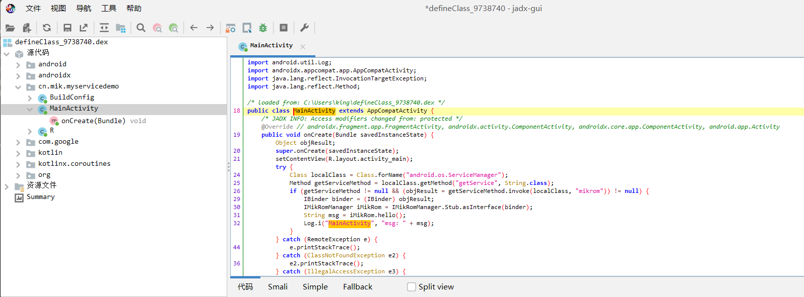

# 第八章 软件壳

熟悉类的加载流程后，可以利用加载的原理来开发辅助功能。在逆向工程中，比较典型的功能是脱壳。加壳是对类中代码进行保护，而脱壳则是还原出被保护的代码。此外，Art Hook（一种针对Android运行时环境的Hook技术）的实现也与类加载和函数执行的原理密切相关。

在这一章中，将详细介绍加壳和脱壳，并通过前面学习到的类加载原理简单实现自动脱壳机。


## 8.1 加壳与脱壳

​`Android`的`APK`文件实际上是一种压缩文件格式，其中包含了应用程序的二进制代码、资源文件和清单文件等。在安装应用程序之前，系统会将`APK`文件解压缩并安装到设备上。

在`APK`文件中，应用程序的二进制代码通常以`DEX（Dalvik Executable）`格式存储。与`Java 虚拟机 (JVM)`的字节码格式不同，`DEX`格式是针对移动设备优化过的字节码格式。由于`DEX`格式采用了特殊的指令集和数据结构，使得反编译工具可以轻松地将其转换为可读性较高的 `Java 代码`。

然而, 为了防止应用程序关键代码被轻易暴露出来, 开发人员会采取一系列手段来保护代码. 反编译工具还可以通过反汇编和反混淆等技术来还原源代码。

`Android`常见的代码保护的方案主要包括以下几种：

1. 混淆（Obfuscation）：通过重命名类、方法、变量等标识符来隐藏程序逻辑，使得反编译后的代码难以被理解和分析。
2. 压缩（Compression）：将应用程序的二进制代码压缩成较小体积，防止恶意用户进行逆向工程和复制源代码。
3. 签名（Signing）：在应用程序发布前，使用数字证书对应用程序进行签名，确保其完整性和来源可信。
4. 加固（Hardening）：在应用程序内部添加额外的安全保护机制，如代码加密、反调试、反注入等，增强应用程序的抵御能力。
5. 动态加载（Dynamic Loading）：将敏感的代码和资源文件放置在远程服务器上，在运行时动态加载到本地设备，以防止被攻击者轻易访问和修改。
​

### 8.1.1 软件加壳技术

加壳（Packing）是应用程序加固的一种手段之一。它将原始应用程序二进制代码嵌入到一个特殊的外壳中，通过修改程序入口和解密算法等方式，增加反调试、反逆向、防篡改等安全机制，提高应用程序的安全性。

加壳的目的是使应用程序难以被攻击者分析和修改，从而提高应用程序的抵御能力。然而，加壳也会带来一些负面影响，例如增加应用程序体积、降低运行效率，并可能引入新的安全漏洞。

常见的加壳壳包括：

1. DexProtector：支持Android和iOS平台，可以对Java代码和NDK库进行加固。其特点是支持多种代码混淆技术，同时还提供了反调试、防止Hook攻击、反模拟器等多种安全机制。
2. 360加固：支持Android和iOS平台，采用自己研发的加固壳技术，可以对Java代码和C/C++库进行加固，同时还提供了反调试、反逆向、防篡改等多种安全机制。
3. Bangcle：一款国内著名的加壳工具，支持Android和iOS平台，提供了多种加固壳方案，如DexShell、SOShell、加密资源等，并且还支持反调试、反注入等多种安全机制。
4. APKProtect：一款功能强大的加壳工具，支持Android平台，可以对Java代码和Native库进行加固，并且支持多种方式的加固（如代码混淆、Resource Encryption、Anti-debugging），同时还提供了反反编译、反调试等多种安全机制。

这些加壳工具都有不同的特点和适用场景。开发者可以根据实际需求选择合适的加壳工具来进行应用程序保护。需要注意的是，在使用任何一种加壳工具时，都应该结合其他常规的安全措施，并且要意识到加壳可能会带来一些负面影响，如增大应用程序体积、降低运行效率等。


### 8.1.2 脱壳方法

​加壳的本质就是对DEX格式的Java字节码进行保护，以避免被攻击者分析和修改。而脱壳则是通过分析壳的特征和原理，将被壳保护的Java字节码还原出来，通常用于逆向分析、恶意代码分析等领域。

脱壳常用的几个步骤如下：

1. 静态分析：通过对样本进行静态分析，获取样本中壳的特征、加密算法、解密函数等信息，为后续的动态分析做好准备。
2. 动态分析：在调试器或hook工具的帮助下，运行加密程序，并跟踪程序执行流程，并尝试找到解密或解压缩位置，以获取加密或压缩前的原始数据。
3. 重构代码：通过反汇编代码进行分析，并重新构建可读性高且易于理解的代码结构，以更好地理解样本行为。

在脱壳过程中，可能会面临开发者添加各种防护措施来保护其代码。例如代码混淆、反调试、ROM检测、root检测、hook注入检测等加固手段。这个博弈过程就是一种攻防对抗。另外，ROM脱壳可以从另一个层面解决部分对抗问题。


## 8.2 软件壳特征

早期的 `Android`应用程序很容易被反编译和修改，因此一些开发者会使用简单的壳来保护自己的应用程序。这些壳主要是基于`Java`层的代码混淆和加密，以及 `Native`层的简单加密。

但是单纯的混淆和加密很难保障代码的安全性，第一代壳——动态加载壳就诞生了。这时候思想主要还是将整个DEX进行加密保护，在运行期间才会解密还原DEX文件，并动态加载运行原文件。然而，这样依赖Java的动态加载机制非常容易受到攻击，因为攻击者可以直接通过加载流程获取被保护数据。当反编译解析时，只能看到壳的代码，并找不到任何与`Activity`相关处理有关联的内容。这种情况就是所谓的动态加载壳。

随后出现了第二代指令抽取壳。它对Java层代码进行函数粒度上的保护。相较于第一代思想将整个DEX保护起来，第二代更注重只需保护关键函数即可达到目标。该方法清空原始DEX中需要保护函数内部`codeitem`部分，将真正的函数内容加密保护并存放在其他地方。只有当这些函数真正执行时，才通过解密函数将其还原填充回去，以实现正常执行。某些指令抽取壳甚至会在函数执行完成后重新清空codeitem。否则，已经执行过的函数指令很容易被还原出来。这种壳可通过查看函数内容特征进行鉴别，例如一些空的函数，在查看smali指令时会发现内部有大量nop空指令。这种情况就是所谓的指令抽取壳。

随着攻防对抗不断升级，第二代壳也无法提供足够安全保障。于是第三代——指令转换壳诞生了。它与指令抽取思想相同，对具体的函数进行保护，并优化了第二代壳存在的缺陷。由于指令抽取最终依然是一个Java函数调用，并需要回填和执行指令集合代码项（codeitem）。无论如何保护措施采用何种方式，在获取到正在执行过程中的codeitem后都能轻松修复为真实DEX文件。
而指令转换壳则将受到保护断裂处理的函数转换为native代码形式。它将函数的指令集解析为中间码，并通过自定义虚拟机进行解析和执行，而不会使用Android提供的指令执行流程。然而，这样也会导致函数执行速度变慢以及一些兼容性问题。这类壳有明显特征，即将函数"native化"。


## 8.3 动态加载壳的实现

动态加载壳是一种常见的代码保护技术，它通过在程序运行时动态加载壳来保护应用程序。下面是一般情况下动态加载壳的流程：

1. 壳程序和被保护的应用程序分开编译，壳程序中包含有解密、加载、映射被保护程序等功能代码，并将被保护程序加密。
2. 当启动被保护的程序时，先运行壳程序。
3. 壳程序首先会进行自身的初始化，例如获取壳程序自身路径、解密被加密的被保护程序等操作。
4. 然后，壳程序会将被保护程序从加密状态中解密出来。
5. 接着，壳程序会在内存中为被保护程序申请一块连续的内存区域，将被保护程序的代码和数据映射到该内存区域中。
6. 壳程序会根据被保护程序的程序入口点开始执行被保护程序的代码。
7. 被保护程序运行时的系统调用和`DLL`库的调用等操作，都会由壳程序处理并返回结果给被保护程序。同时，壳程序可能会进行一些额外的安全检查，例如防止调试、防止反汇编、防止破解等操作。


### 8.3.1 加固过程

接下来我们看一个简单的动态加载壳的实现案例，下载地址：[https://github.com/zhang-hai/apkjiagu](https://github.com/zhang-hai/apkjiagu)。

该案例主要分为三个部分，分别是：壳程序、待保护的程序、加壳程序。大致流程是使用加壳工具解析待保护的程序，然后将壳程序加入。最后重新生成新的APK，并重新签名。接下来先了解如何使用该工具来保护Android应用。

首先准备一个需要被保护的APK，这里直接使用前文中测试动态加载系统内置JAR包的APP作为样例，代码如下：

```java
package cn.rom.myservicedemo;

import androidx.appcompat.app.AppCompatActivity;

import android.app.Application;
import android.os.Bundle;
import android.os.IBinder;
import android.os.IRomManager;
import android.os.RemoteException;
import android.util.Log;

import java.lang.reflect.InvocationTargetException;
import java.lang.reflect.Method;

import dalvik.system.PathClassLoader;

public class MainActivity extends AppCompatActivity {
    @Override
    protected void onCreate(Bundle savedInstanceState) {
        super.onCreate(savedInstanceState);
        setContentView(R.layout.activity_main);
        Class localClass = null;
        try {
            localClass = Class.forName("android.os.ServiceManager");
            Method getServiceMethod = localClass.getMethod("getService", new Class[] {String.class});
            if(getServiceMethod != null) {
                Object objResult = getServiceMethod.invoke(localClass, new Object[]{"rom"});
                if (objResult != null) {
                    IBinder binder = (IBinder) objResult;
                    IRomManager iRom = IRomManager.Stub.asInterface(binder);
                    String msg= iRom.hello();
                    Log.i("MainActivity", "msg: " + msg);
                }
            }
        } catch (ClassNotFoundException e) {
            e.printStackTrace();
        } catch (InvocationTargetException e) {
            e.printStackTrace();
        } catch (NoSuchMethodException e) {
            e.printStackTrace();
        } catch (IllegalAccessException e) {
            e.printStackTrace();
        } catch (RemoteException e) {
            e.printStackTrace();
        }
    }
}
```

将上面的代码编译后，输出`app-debug.apk`的结果，这个就是需要待保护的目标。然后开始准备加固的环境。

​在加固过程使用到的命令：`dx`、`apktool`、`zipalign`、`apksigner`。其中`dx、zipalign、apksigner`工具在`sdk`的`build-tools`目录中，例如本地的路径`Android\Sdk\build-tools\30.0.2`，将该工具目录加入环境变量`PATH`中。

​而`apktool`是在项目`https://github.com/iBotPeaches/Apktool`中，下载`apktool_版本.jar`，重新命名为`apktool.jar`，并且下载`https://github.com/iBotPeaches/Apktool/tree/master/scripts/windows/apktool.bat`文件，和`apktool.jar`放在同一个目录，将该目录也加入到环境变量`PATH`中。

​修改`apktool.bat`文件，将最后一行尾部的`pause`去掉。修改如下。

```
// 修改前
for /f "tokens=2" %%# in ("%cmdcmdline%") do if /i "%%#" equ "/c" pause

// 修改后
for /f "tokens=2" %%# in ("%cmdcmdline%") do if /i "%%#" equ "/c"
```

​	这样加固的运行环境就准备完成了，接下来准备加固的签名文件。生成一个签名证书，命令如下。

```
keytool -genkeypair -alias myalias -keyalg RSA -keysize 2048 -validity 9125 -keystore mykeystore.keystore
```

​	输入口令以及各项信息后，得到一个证书文件`mykeystore.keystore`。接下来可以编译此加固的项目了，将壳程序，以及加固程序编译出来，步骤如下。


​	运行完成后，在项目的根目录下生成了一个`jiagu`的目录。将待保护的`app-debug.apk`，签名使用的证书拷贝到该目录中，然后添写加固的配置文件`keystore.cfg`，内容如下

```
storeFile     = mykeystore.keystore
storePassword = 123456
alias		  = myalias
keyPassword   = 123456
```

​	准备就绪后，执行命令对目标进行加固。

```shell
 java -jar jiaguLib.jar app-debug.apk keystore.cfg

 //输出的内容如下

 根目录=========>D:\git_src\apkjiagu\jiagu/libs/sx_jiagu.dll
==================== 步骤一：将加固壳中的aar中的jar转成dex文件 ====================
开始执行命令===>dx --dex --output temp\shell\classes.dex temp\shell\classes.jar
已生成======temp\shell\classes.dex
==================== 步骤二：将需要加固的APK解压，并将所有dex文件打包成一个zip包，方便后续进行加密处理 ====================
已生成======temp\AppDex.zip
==================== 步骤三：对步骤二的zip包进行加密，并与壳dex合成新dex文件 ====================
加密前数据大小为：3649469
fixFileSizeHeader ===== size : 3664744
已生成新的Dex文件======temp/classes.dex
==================== 步骤四：修改AndroidManifest（Application的android:name属性和新增<meta-data>） ====================
开始反编译原apk ......
开始执行命令===>apktool d -o temp/apk/ app-debug.apk
I: Using Apktool 2.7.0 on app-debug.apk
I: Loading resource table...
I: Decoding AndroidManifest.xml with resources...
I: Loading resource table from file: C:\Users\android\AppData\Local\apktool\framework\1.apk
I: Regular manifest package...
I: Decoding file-resources...
I: Decoding values */* XMLs...
I: Baksmaling classes.dex...
I: Copying assets and libs...
I: Copying unknown files...
I: Copying original files...
I: Copying META-INF/services directory
开始修改AndroidManifest.xml......
已完成修改AndroidManifest文件======
开始回编译apk ......
开始执行命令===>apktool b -o temp/app-debug.apk temp/apk/
I: Using Apktool 2.7.0
I: Checking whether sources has changed...
I: Smaling smali folder into classes.dex...
I: Checking whether resources has changed...
I: Building resources...
I: Copying libs... (/kotlin)
I: Copying libs... (/META-INF/services)
I: Building apk file...
I: Copying unknown files/dir...
I: Built apk into: temp\app-debug.apk
=== modifyOriginApkManifest ==== 16377ms
==================== 步骤五：删除原APK中的DEX文件，并放入可APK的dex文件 ====================
已完成替换加密后的Dex文件======
==================== 步骤六：重新对APK进行对齐处理..... ====================
开始执行命令===>zipalign -v -p 4 temp\app-debug.apk temp\app-debug_align.apk
Verifying alignment of temp\app-debug_align.apk (4)...
      49 AndroidManifest.xml (OK - compressed)
    ...
    ...
Verification succesful
已完成APK进行对齐处理======
==================== 步骤七：对生成的APK进行签名 ====================
开始执行命令===>apksigner sign --ks mykeystore.keystore --ks-key-alias myalias --min-sdk-version 21 --ks-pass pass:123456 --key-pass pass:123456 --out out\app-debug_align_signed.apk temp\app-debug_align.apk
已完成签名======out\app-debug_align_signed.apk
```

​	日志中可以非常清晰的看到处理的流程，将其操作流程进行梳理后大致分为下面几个步骤

- 将壳程序中的关键`jar`包转换成`dex`文件。
- 从待加固的`apk`中提取出需要保护的`dex`文件，并压缩成`zip`。
- 将需要保护的`zip`进行加密，并且和壳程序的`dex`文件进行合并。
- 反编译需要保护的`apk`
- 修改`AndroidManifest`
- 回编`apk`
- 替换加密后的`dex`文件
- `apk`对齐处理
- `apk`签名

​	在开始分析源码前，可以先手动进行一次替换`dex`的尝试，将`apk`作为压缩包打开，然后将`dex`进行替换，再对这个`apk`进行重新签名。

```
jarsigner -verbose -sigalg SHA1withRSA -digestalg SHA1 -keystore mykeystore.keystore  app-debug.apk myalias
```

​	签名后尝试安装该`apk`，结果发现报错如下。

```
adb install app-debug.apk

// 安装失败
adb: failed to install app-debug.apk: Failure [-124: Failed parse during installPackageLI: Targeting R+ (version 30 and above) requires the resources.arsc of installed APKs to be stored uncompressed and aligned on a 4-byte boundary]
```

​	这个错误提示表示` APK `文件未正确压缩对齐。在` Android 11（API 级别 30）`及以上版本中，要求 `APK `文件必须按照一定的规则进行压缩和对齐，以确保应用程序的安全性和稳定性。可以使用 `zipalign `工具对 `APK `文件进行对齐操作。

```
zipalign -v 4 app-debug.apk app-debug-over.apk
```

​	再次尝试安装`apk`后，发现变成了另外一个错误。

```
adb install ./app-debug-over.apk

adb: failed to install ./app-debug-over.apk: Failure [INSTALL_PARSE_FAILED_NO_CERTIFICATES: Scanning Failed.: No signature found in package of version 2 or newer for package cn.rom.myservicedemo]
```

​	这是因为当`targetSdkVersion`版本号，只要大于`30`时，需要使用`v2`进行签名，签名方式如下。

```
apksigner sign --ks mykeystore.keystore  app-debug-over.apk
```

再次安装`apk`，出现了新错误。

```
adb install ./app-debug-over.apk

Exception occurred while executing 'install-incremental':
java.lang.IllegalArgumentException: Incremental installation not allowed.
        at com.android.server.pm.PackageInstallerSession.<init>(PackageInstallerSession.java:1082)
        at com.android.server.pm.PackageInstallerService.createSessionInternal(PackageInstallerService.java:787)
        at com.android.server.pm.PackageInstallerService.createSession(PackageInstallerService.java:519)
        at com.android.server.pm.PackageManagerShellCommand.doCreateSession(PackageManagerShellCommand.java:3143)
```

​	这是因为旧版本不支持流式安装，所以需要禁用增量安装，增量安装是一种优化技术，它只安装已更改的文件和资源，而不是重新安装整个应用程序。使用 `--no-incremental` 选项可以确保在安装应用程序时，所有文件都被完全重新安装，使用下面的命令安装`apk`。

```
adb install --no-incremental app-debug-over.apk
```

​	然后安装又出现了新的问题，报错如下。

```
 [INSTALL_FAILED_INVALID_APK: Failed to extract native libraries, res=-2]
```

​	这个错误是因为应用内的`so`必须是已经字节对齐的，否则就会提示该错误并安装失败。修改需要保护的目标应用内`Androidmanifest.xml`文件如下。

```
<application
       ...
        android:extractNativeLibs="true">
        ...
</application>
```

​	最后成功安装目标应用，并且能正常打开运行该应用。使用工具`jadx`解析保护后的`APP`，已经无法正常看到`MainActivity`类了。


### 8.3.2 加固原理

​	对加固的操作流程理解后，接下来开始分析源码，学习这个壳是如何实现的。首先我们从加壳工具开始入手。查看工程`jiiaguLib`的入口函数`main`，代码如下。

```java
public static void main(String[] args) {
        if (!isRelease){
            ROOT = "jiaguLib/";
            OUT_TMP = ROOT+"temp/";
            JiaGuMain jiagu = new JiaGuMain();
            // 开始加固的入口
            jiagu.beginJiaGu();
        }else {
            ...
        }
    }
```

​	继续跟踪`beginJiaGu`函数，发现核心逻辑都在其中。

```java
public void beginJiaGu(){
        try {
            //前奏 - 先将目录删除
            FileUtils.deleteFile(OUT_TMP);

//            步骤一：将加固壳中的aar中的jar转成dex文件
            File shellDexFile = shellAar2Dex();
            //步骤二：将需要加固的APK解压，并将所有dex文件打包成一个zip包，方便后续进行加密处理
            File dexZipFile = apkUnzipAndZipDexFiles();
            if (dexZipFile == null){
                return;
            }
            //步骤三：对步骤二的zip包进行加密，并与壳dex合成新dex文件
            File dexFile = combine2NewDexFile(shellDexFile,dexZipFile);
            //步骤四：修改AndroidManifest（Application的android:name属性和新增<meta-data>）
            String outpath = modifyOriginApkManifest();
//            String outpath = modifyOriginApkManifest2();

            //步骤五：将步骤三生成的新dex文件替换apk中的所有dex文件
            if (dexFile != null && !outpath.isEmpty()){
                boolean ret = replaceDexFiles(outpath,dexFile.getPath());
                //步骤六：APK对齐处理
                if (ret){
//                    String outpath = OUT_TMP + ORIGIN_APK.substring(ORIGIN_APK.lastIndexOf("/")+1);
                    File apk = zipalignApk(new File(outpath));
                    //步骤七：对生成的APK进行签名
                    resignApk(apk);
                }
            }
        }catch (Exception e){
            e.printStackTrace();
        }
    }
```

​	在这些步骤中，最关键的是如何将待保护的`zip`文件和壳`dex`合成一个新的`dex`文件。所以跟踪`combine2NewDexFile`函数的具体实现。

```java
/**
     * 步骤三：对步骤二的zip包进行加密，并与壳dex合成新dex文件
     * @param shellDexFile 壳dex文件
     * @param originalDexZipFile 原包中dex压缩包
     */
    private File combine2NewDexFile(File shellDexFile,File originalDexZipFile){
        logTitle("步骤三：对步骤二的zip包进行加密，并与壳dex合成新dex文件");
        try {
            AESUtil aesUtil = new AESUtil();
            byte[] data = readFileBytes(originalDexZipFile);
            System.out.println("加密前数据大小为："+data.length);
            byte[] payloadArray = aesUtil.encrypt(data);//以二进制形式读出zip，并进行加密处理//对源Apk进行加密操作
            byte[] unShellDexArray = readFileBytes(shellDexFile);//以二进制形式读出dex
            int payloadLen = payloadArray.length;
            int unShellDexLen = unShellDexArray.length;
            int totalLen = payloadLen + unShellDexLen +4;//多出4字节是存放长度的。
            byte[] newdex = new byte[totalLen]; // 申请了新的长度
            //添加解壳代码
            System.arraycopy(unShellDexArray, 0, newdex, 0, unShellDexLen);//先拷贝dex内容
            //添加加密后的解壳数据
            System.arraycopy(payloadArray, 0, newdex, unShellDexLen, payloadLen);//再在dex内容后面拷贝apk的内容
            //添加解壳数据长度
            System.arraycopy(intToByte(payloadLen), 0, newdex, totalLen-4, 4);//最后4为长度

            //修改DEX file size文件头
            fixFileSizeHeader(newdex);
            //修改DEX SHA1 文件头
            fixSHA1Header(newdex);
            //修改DEX CheckSum文件头
            fixCheckSumHeader(newdex);

            String str = OUT_TMP + "classes.dex";
            File file = new File(str);
            if (!file.exists()) {
                file.createNewFile();
            }

            //输出成新的dex文件
            FileOutputStream localFileOutputStream = new FileOutputStream(str);
            localFileOutputStream.write(newdex);
            localFileOutputStream.flush();
            localFileOutputStream.close();
            System.out.println("已生成新的Dex文件======"+str);

            //删除dex的zip包
            FileUtils.deleteFile(originalDexZipFile.getAbsolutePath());
            return file;
        } catch (Exception e) {
            e.printStackTrace();
        }
        return null;
    }
```

​	在代码中看到保护后的`dex`实际上就是，壳程序的`dex`+被加密的`dex`+被加密的`dex`长度。组合出来新的`dex`文件，然后修改新`dex`中的大小描述，以及校验`dex`的值。如此就得到了一个被壳保护的新`dex`。应用运行时将壳启动执行后，再负责加密并动态加载这个真实的`dex`。

​	了解完如何生成新的`dex`后，接下来看看修改`AndroidManifest`时做了什么操作，代码如下。

```java
/**
     * 步骤四：修改AndroidManifest（Application的android:name属性和新增<meta-data>）
     * 反编译：采用apktool+xml解析方式对AndroidManifest.xml进行修改
     * 优点：不用依赖其他jar包，
     * 缺点：非常耗时，在21000ms左右(不包含删除反编译的临时文件的时间)
     */
    private String modifyOriginApkManifest() throws Exception{
        String apkPath = ORIGIN_APK;
        String outputPath = OUT_TMP + "apk/";
        logTitle("步骤四：修改AndroidManifest（Application的android:name属性和新增<meta-data>）");
        String path = "";
        long start = System.currentTimeMillis();
        //1：执行命令进行反编译原apk
        System.out.println("开始反编译原apk ......");
        boolean ret = ProcessUtil.executeCommand("apktool d -o " + outputPath + " " + apkPath);
        if (ret){
            //2.修改AndroidManifest.xml，使用壳的Application替换原Application,并将原Application名称配置在meta-data中
            modifyAndroidManifest(new File(outputPath,"AndroidManifest.xml"));

            //3：重新编译成apk,仍以原来名称命名
            System.out.println("开始回编译apk ......");
            String apk = OUT_TMP + apkPath.substring(apkPath.lastIndexOf("/")+1);
            ret = ProcessUtil.executeCommand(String.format(Locale.CHINESE,"apktool b -o %s %s",apk,outputPath));
            if (ret){
                path = apk;
            }
            System.out.println("=== modifyOriginApkManifest ==== "+(System.currentTimeMillis()-start)+"ms");
        }
        //删除解压的目录
        FileUtils.deleteFile(outputPath);

        return path;
    }
```

​	可以看到这里的步骤就是使用`apktool`进行反编译，修改`AndroidManifest.xml`，再回编成`apk`。修改`xml`主要是为了替换应用启动时，默认启动的`Application`为壳的入口，并且将真实`Application`的名称存储在`meta-data`中，当壳启动后，再负责解密真实`dex`，并加载调用真实`Application`的入口。

​	下面是修改`AndroidManifest.xml`的具体实现。

```java
/**
     * 读取原包的AndroidManifest文件并修改
     * @param xmlFile 原AndroidManifest文件对象
     */
    private void modifyAndroidManifest(File xmlFile){
        if (xmlFile == null){
            System.out.println("请设置AndroidManifest.xml文件");
            return;
        }
        if (!xmlFile.exists()){
            System.out.println("指定的AndroidManifest.xml文件不存在");
            return;
        }
        System.out.println("开始修改AndroidManifest.xml......");
        String shellApplicationName = "com.zhh.jiagu.shell.StubApplication";
        String metaDataName = "APPLICATION_CLASS_NAME";
        String attrName = "android:name";

        //采用Dom读取AndroidManifest.xml文件
        try {
            //1.实例化Dom工厂
            DocumentBuilderFactory factory = DocumentBuilderFactory.newInstance();
            //2.构建一个builder
            DocumentBuilder builder = factory.newDocumentBuilder();
            //3.通过builder解析xml文件
            Document document = builder.parse(xmlFile);
            NodeList nl = document.getElementsByTagName("application");
            if (nl != null){
                Node app = nl.item(0);
                //获取原APK中application
                String applicationName = "android.app.Application";
                NamedNodeMap attrMap = app.getAttributes();
                //有属性时
                Node node = app.getAttributes().getNamedItem(attrName);
                //默认为系统的Application
                if (node != null){
                    applicationName = node.getNodeValue();
                    node.setNodeValue(shellApplicationName);
                }else {//不存在该属性时，则创建一个
                    Attr attr = document.createAttribute(attrName);
                    attr.setValue(shellApplicationName);
                    attrMap.setNamedItem(attr);
                }

                //添加<meta-data>数据，记录原APK的application
                Element metaData = document.createElement("meta-data");
                metaData.setAttribute("android:name",metaDataName);
                metaData.setAttribute("android:value",applicationName);
                app.appendChild(metaData);
                //重新写入文件xml文件
                TransformerFactory outFactory = TransformerFactory.newInstance();
                Transformer transformer = outFactory.newTransformer();
                Source xmlSource = new DOMSource(document);
                Result outResult = new StreamResult(xmlFile);
                transformer.transform(xmlSource,outResult);
                System.out.println("已完成修改AndroidManifest文件======");
            }
        }catch (Exception e){
            e.printStackTrace();
        }
    }
```

​	这个加壳工具的核心原理到这里就非常清晰了，其中`com.zhh.jiagu.shell.StubApplication`被替换为入口的`Application`，接下来开始分析壳程序的实现原理了。

​	打开`jiagu_shell`工程，找到`StubApplication`，查看实现如下。

```java
@Override
protected void attachBaseContext(Context base) {
    super.attachBaseContext(base);

    AESUtil.loadJiaGuLibrary();

    //加载dex，并解密出原app的dex文件进行加载
    boolean result = LoadDexUtil.decodeDexAndReplace(this,getAppVersionCode());

    if (result){
    	//生成原Application，并手动安装ContentProviders
    	app = LoadDexUtil.makeApplication(getSrcApplicationClassName());
    }
}

@Override
public void onCreate() {
    super.onCreate();

    //create main Apk's Application and replace with it.
    LoadDexUtil.replaceAndRunMainApplication(app);
}
```

​	`attachBaseContext`的调用时机在第三章讲解应用的启动流程时，有提到该函数的调用时机较早，是在`onCreate`调用前执行的。这里的逻辑就是在`attachBaseContext`中对`dex`进行解密和加载，在`onCreate`中替换为调用原`dex`的真实逻辑。

​	首先查看`decodeDexAndReplace`的具体实现。

```java
    /**
     * 解析apk，得到加密的AppDex.zip文件，并进行解密
     * @param context 壳的context
     * @param appVersionCode
     */
    public static boolean decodeDexAndReplace(Application context, int appVersionCode){
        try {
            //创建两个文件夹payload_odex，payload_lib 私有的，可写的文件目录
            File odex = context.getDir("payload_odex", Application.MODE_PRIVATE);
//            File libs = context.getDir("payload_lib", Application.MODE_PRIVATE);
            String odexPath = odex.getAbsolutePath();
            //按版本号来标记zip
            String dexFilePath = String.format(Locale.CHINESE,"%s/AppDex_%d.zip",odexPath,appVersionCode);

            LogUtil.info("decodeDexAndReplace =============================开始");

            File dexFile = new File(dexFilePath);
            LogUtil.info("apk size ===== "+dexFile.length());
            //第一次加载APP
            if (!dexFile.exists()) {
                //先清空odexPath目录中文件,防止数据越来越多
                File[] children = odex.listFiles();
                if (children != null && children.length > 0){
                    for (File child : children){
                        child.delete();
                    }
                }
                LogUtil.info( " ===== App is first loading.");
                long start = System.currentTimeMillis();
                dexFile.createNewFile();  //在payload_odex文件夹内，创建payload.apk

                String apkPath = context.getApplicationInfo().sourceDir;
                // 读取程序classes.dex文件
                byte[] dexdata = Utils.readDexFileFromApk(apkPath);

                //从classes.dex中再取出AppDex.zip解密后存放到/AppDex.zip，及其so文件放到payload_lib下
                Utils.releaseAppDexFile(dexdata,dexFilePath);

                LogUtil.info("解压和解密耗时 ===== "+(System.currentTimeMillis() - start) + "  === " + dexFile.exists());
            }
            // 配置动态加载环境
            //获取主线程对象
            Object currentActivityThread = getCurrentActivityThread();
            String packageName = context.getPackageName();//当前apk的包名
            LogUtil.info("packageName ===== "+packageName);
            //下面两句不是太理解
            ArrayMap mPackages = (ArrayMap) RefInvoke.getFieldOjbect(
                    "android.app.ActivityThread", currentActivityThread, "mPackages");
            LogUtil.info("反射得到的mPackages ===== "+mPackages);
            WeakReference wr = (WeakReference) mPackages.get(packageName);
            ClassLoader mClassLoader = (ClassLoader) RefInvoke.getFieldOjbect("android.app.LoadedApk", wr.get(), "mClassLoader");
            //创建被加壳apk的DexClassLoader对象  加载apk内的类和本地代码（c/c++代码）
            DexClassLoader dLoader = new DexClassLoader(dexFilePath, odexPath, context.getApplicationInfo().nativeLibraryDir, mClassLoader);
            LogUtil.info("反射得到的dLoader ===== "+dLoader);
            //base.getClassLoader(); 是不是就等同于 (ClassLoader) RefInvoke.getFieldOjbect()? 有空验证下//?
            //把当前进程的DexClassLoader 设置成了被加壳apk的DexClassLoader  ----有点c++中进程环境的意思~~
            RefInvoke.setFieldOjbect("android.app.LoadedApk", "mClassLoader", wr.get(), dLoader);

            LogUtil.info("decodeDexAndReplace ============================= 结束");
            return true;
        } catch (Exception e) {
            LogUtil.error( "error ===== "+Log.getStackTraceString(e));
            e.printStackTrace();
        }
        return false;
    }
```

​	可以看到代码非常简单，大致分为三个步骤，`readDexFileFromApk`读取`apk`提取出`dex`，解密`dex`还原出真实的`dex`，动态加载真实`dex`，通过反射设置到`android.app.LoadedApk`的`mClassLoader`中。

​	首先看看`readDexFileFromApk`提取`apk`中`dex`的具体实现。

```java
    /**
     * 从apk包里面获取dex文件内容（byte）
     * @return
     * @throws IOException
     */
    public static byte[] readDexFileFromApk(String apkPath) throws IOException {
        LogUtil.info("从classes.dex解析出加密的原包的dex数据");
        ByteArrayOutputStream dexByteArrayOutputStream = new ByteArrayOutputStream();
        //获取当前zip进行解压
        ZipInputStream zipInputStream = new ZipInputStream(
                new BufferedInputStream(new FileInputStream(apkPath)));
        while (true) {
            ZipEntry entry = zipInputStream.getNextEntry();
            if (entry == null) {
                zipInputStream.close();
                break;
            }
            if (entry.getName().equals("classes.dex")) {
                byte[] arrayOfByte = new byte[1024];
                while (true) {
                    int i = zipInputStream.read(arrayOfByte);
                    if (i == -1)
                        break;
                    dexByteArrayOutputStream.write(arrayOfByte, 0, i);
                }
            }
            zipInputStream.closeEntry();
        }
        zipInputStream.close();
        return dexByteArrayOutputStream.toByteArray();
    }
```

​	`apk`的本质其实就是压缩包，所以实现的过程能看到是从压缩包中读取出一个`classes.dex`的文件，这个文件也是在前文中加壳工具合并出来的新的`dex`。接下来继续查看如何从这个`dex`中提取出真实的`dex`文件。查看`releaseAppDexFile`函数的实现如下。

```java
    /**
     * 释放被加壳的AppDex.zip，so文件
     * @param apkdata classes.dex数据
     * @throws IOException 异常
     */
    public static void releaseAppDexFile(byte[] apkdata,String apkFileName) throws Exception {
        int length = apkdata.length;

        //取被加壳apk的长度   这里的长度取值，对应加壳时长度的赋值都可以做些简化
        byte[] dexlen = new byte[4];
        System.arraycopy(apkdata, length - 4, dexlen, 0, 4);
        ByteArrayInputStream bais = new ByteArrayInputStream(dexlen);
        DataInputStream in = new DataInputStream(bais);
        int readInt = in.readInt();
        LogUtil.info("============ 读取原Dex压缩文件大小 ======"+readInt);
        byte[] newdex = new byte[readInt];
        //把被加壳apk内容拷贝到newdex中
        System.arraycopy(apkdata, length - 4 - readInt, newdex, 0, readInt);
        LogUtil.info("============ 开始对加密dex进行解密======" + newdex.length);
        //对zip包进行解密
        newdex = AESUtil.decrypt(newdex);

        LogUtil.info("============ 解密后的大小为======" + newdex.length);

        //写入AppDex.zip文件
        File file = new File(apkFileName);
        try {
            FileOutputStream localFileOutputStream = new FileOutputStream(file);
            localFileOutputStream.write(newdex);
            localFileOutputStream.close();
        } catch (IOException localIOException) {
            throw new RuntimeException(localIOException);
        }
        //LogUtil.info("============ 开始对压缩包进行解压得到dex文件======");
        // todo:由于仅加密的是源dex文件，故这里不需要检查so文件

    }
```

​	在前文组装新的`dex`时就能看到是如何组装的，提取的原理非常简单，从`dex`最后4个字节拿到加密`dex`的长度，然后根据长度从`dex`的后面截取该长度的数据出来，就是加密的数据了，将数据解密后就得到原始`dex`的数据。写入文件保存。

​	将真实的`dex`动态加载并替换了`android.app.LoadedApk`的`mClassLoader`后，还需要创建一个真实的`Application`来替换执行。下面继续看壳代码中的`makeApplication`函数

```java
    /**
     * 构造原Application对象
     * @param srcApplicationClassName 原Application类名
     * @return 返回原application对象
     */
    public static Application makeApplication(String srcApplicationClassName){
        LogUtil.info( "makeApplication ============== " + srcApplicationClassName);
        if (TextUtils.isEmpty(srcApplicationClassName)){
            LogUtil.error("请配置原APK的Application ===== ");
            return null;
        }

        //调用静态方法android.app.ActivityThread.currentActivityThread获取当前activity所在的线程对象
        Object currentActivityThread = getCurrentActivityThread();
        LogUtil.info("currentActivityThread ============ "+currentActivityThread);
        //获取当前currentActivityThread的mBoundApplication属性对象，
        //该对象是一个AppBindData类对象，该类是ActivityThread的一个内部类
        Object mBoundApplication = getBoundApplication(currentActivityThread);
        LogUtil.info("mBoundApplication ============ "+mBoundApplication);
        //读取mBoundApplication中的info信息，info是LoadedApk对象
        Object loadedApkInfo = getLoadApkInfoObj(mBoundApplication);
        LogUtil.info("loadedApkInfo ============ "+loadedApkInfo);

        //先从LoadedApk中反射出mApplicationInfo变量，并设置其className为原Application的className
        //todo:注意：这里一定要设置，否则makeApplication还是壳Application对象，造成一直在attach中死循环
        ApplicationInfo mApplicationInfo = (ApplicationInfo) RefInvoke.getFieldOjbect(
                "android.app.LoadedApk", loadedApkInfo, "mApplicationInfo");
        mApplicationInfo.className = srcApplicationClassName;
        //执行 makeApplication（false,null）
        Application app = (Application) RefInvoke.invokeMethod("android.app.LoadedApk", "makeApplication", loadedApkInfo, new Class[] { boolean.class, Instrumentation.class }, new Object[] { false, null });

        LogUtil.info("makeApplication ============ app : "+app);

        //由于源码ActivityThread中handleBindApplication方法绑定Application后会调用installContentProviders，
        //此时传入的context仍为壳Application，故此处进手动安装ContentProviders，调用完成后，清空原providers
        installContentProviders(app,currentActivityThread,mBoundApplication);

        return app;
    }

```

​	通过`android.app.LoadedApk`创建一个新的`Application`，并且手动调用`installContentProviders`安装真实`dex`中的`ContentProvider`。最后这个新的`Application`就可以拿来替换壳的`Application`执行了。继续分析在`onCreate`中是如何实现替换执行真实`dex`中的`Application`的。查看`replaceAndRunMainApplication`函数的实现过程。

```java
    /**
     * Application替换并运行
     * @param app 原application对象
     */
    public static void replaceAndRunMainApplication(Application app){
        if (app == null){
            return;
        }

        LogUtil.info( "onCreate ===== 开始替换=====");
        // 如果源应用配置有Appliction对象，则替换为源应用Applicaiton，以便不影响源程序逻辑。
        final String appClassName = app.getClass().getName();

        //调用静态方法android.app.ActivityThread.currentActivityThread获取当前activity所在的线程对象
        Object currentActivityThread = getCurrentActivityThread();
        //获取当前currentActivityThread的mBoundApplication属性对象，
        //该对象是一个AppBindData类对象，该类是ActivityThread的一个内部类
        Object mBoundApplication = getBoundApplication(currentActivityThread);
        //读取mBoundApplication中的info信息，info是LoadedApk对象
        Object loadedApkInfo = getLoadApkInfoObj(mBoundApplication);
        //检测loadApkInfo是否为空
        if (loadedApkInfo == null){
            LogUtil.error( "loadedApkInfo ===== is null !!!!");
        }else {
            LogUtil.info( "loadedApkInfo ===== "+loadedApkInfo);
        }

        //把当前进程的mApplication 设置成了原application,
        RefInvoke.setFieldOjbect("android.app.LoadedApk", "mApplication", loadedApkInfo, app);
        Object oldApplication = RefInvoke.getFieldOjbect("android.app.ActivityThread", currentActivityThread, "mInitialApplication");
        LogUtil.info( "oldApplication ===== "+oldApplication);
        ArrayList<Application> mAllApplications = (ArrayList<Application>) RefInvoke.getFieldOjbect(
                "android.app.ActivityThread", currentActivityThread, "mAllApplications");
        //将壳oldApplication从ActivityThread#mAllApplications列表中移除
        mAllApplications.remove(oldApplication);

        //将原Application赋值给mInitialApplication
        RefInvoke.setFieldOjbect("android.app.ActivityThread", "mInitialApplication", currentActivityThread, app);

        ApplicationInfo appinfo_In_AppBindData = (ApplicationInfo) RefInvoke.getFieldOjbect(
                "android.app.ActivityThread$AppBindData", mBoundApplication, "appInfo");
        appinfo_In_AppBindData.className = appClassName;


        ArrayMap mProviderMap = (ArrayMap) RefInvoke.getFieldOjbect("android.app.ActivityThread", currentActivityThread, "mProviderMap");
        Iterator it = mProviderMap.values().iterator();
        while (it.hasNext()) {
            Object providerClientRecord = it.next();
            Object localProvider = RefInvoke.getFieldOjbect("android.app.ActivityThread$ProviderClientRecord", providerClientRecord, "mLocalProvider");
            RefInvoke.setFieldOjbect("android.content.ContentProvider", "mContext", localProvider, app);
        }

        LogUtil.info( "app ===== "+app + "=====开始执行原Application");
        app.onCreate();
    }
```

​替换的步骤主要是修正`android.app.LoadedApk`的`mApplication`，以及`android.app.ActivityThread`的`mInitialApplication`，并且将壳的`Application`从`android.app.ActivityThread`的`mAllApplications`中移除。最后调用真实`Application`的`onCreate`函数。简单的动态加载的加固过程就完成了。


## 8.4 脱壳方法

在掌握了加壳的详细过程后，想要完成脱壳就非常简单了。前文中介绍的这个壳可以通过分析被加壳应用中的壳的`Application`来找到其逻辑是如何还原真实dex的。你可以通过各种方式拿到被保护的dex，例如通过hook解密函数或者参考壳代码的解密方式开发一个应用调用解密库（so），从而实现将dex提取并解密。

然而，使用分析壳原理的方法并不通用，每个壳都需要进行人工分析，这可能会耗费大量时间。因此最佳方式是找到所有动态加载壳都会执行的流程，并在该流程中hook某个节点以提取出真实dex。这些动态加载壳共同具备一个特征：它们基于动态加载机制来还原真实Application。因此只需在动态加载过程中找到适合调用时机，在其中将真实dex写入文件即可。

dex块被保存为一个连续内存区域，所以只要知道该dex起始地址和大小，就能读取这一块数据并将其写入文件。下面回顾前文中DexFile结构体如下：

```c++
class DexFile {
 ...
 protected:
  ...
  // dex文件数据起始位置
  const uint8_t* const begin_;

  // 内存分配的字节数。
  const size_t size_;
  ...
};
```

​	在`DexFile`的结构体中，就可以拿到需要的起始位置和其大小。有了这些前提后，就可以实现一个基于修改`AOSP`源码的动态加载壳的脱壳机了。


## 8.5 自动脱壳机

在前文的动态加载壳样例中，我们看到解密出来的原始dex文件是使用DexClassLoader进行加载的。而类的动态加载流程，在上一章中已经详细讲解了实现原理和整个调用过程。接下来，我们将根据之前学习到的内容逐步开发一个自动脱壳机。

首先，第一步是参考类加载流程，在适当位置添加打桩点，并输出dex的起始位置及大小。然后，通过与原始dex进行比较确认是否大小相同。如果确认无误，则将该dex数据保存到文件中。

具体操作可以从刚进入native层的`DexFile_defineClassNative`函数开始查看。

```c++
static jclass DexFile_defineClassNative(JNIEnv* env,
                                        jclass,
                                        jstring javaName,
                                        jobject javaLoader,
                                        jobject cookie,
                                        jobject dexFile) {
  std::vector<const DexFile*> dex_files;
  const OatFile* oat_file;
  // cookie转换成一组c++中的DexFile对象以及OatFile
  if (!ConvertJavaArrayToDexFiles(env, cookie, /*out*/ dex_files, /*out*/ oat_file)) {
    VLOG(class_linker) << "Failed to find dex_file";
    DCHECK(env->ExceptionCheck());
    return nullptr;
  }
  ...
  for (auto& dex_file : dex_files) {
    ...
    if (dex_class_def != nullptr) {

      ...
      // 使用类加载器和 DEX 文件定义一个新的 Java 类，并返回一个描述该类的 Class 对象指针
      ObjPtr<mirror::Class> result = class_linker->DefineClass(soa.Self(),
                                                               descriptor.c_str(),
                                                               hash,
                                                               class_loader,
                                                               *dex_file,
                                                               *dex_class_def);
      ...
    }
  }
  VLOG(class_linker) << "Failed to find dex_class_def " << class_name.c_str();
  return nullptr;
}
```

​通过`ConvertJavaArrayToDexFiles`函数将`Java`层传递过来的`cookie`转换成了`dexfile`列表。可以在遍历该列表的循环中输出每个`dex_file`的信息，或者在`DefineClass`中输出`dex_file`的信息。以下是打桩输出日志相关代码。

```java
ObjPtr<mirror::Class> ClassLinker::DefineClass(Thread* self,
                                               const char* descriptor,
                                               size_t hash,
                                               Handle<mirror::ClassLoader> class_loader,
                                               const DexFile& dex_file,
                                               const dex::ClassDef& dex_class_def) {
  ScopedDefiningClass sdc(self);
  StackHandleScope<3> hs(self);
  metrics::AutoTimer timer{GetMetrics()->ClassLoadingTotalTime()};
  auto klass = hs.NewHandle<mirror::Class>(nullptr);
  ALOGD("[ROM] DefineClass dex begin:%p size:%zu\n",dex_file.Begin(),dex_file.Size());
  ...
}
```

日志添加完成后，将重新编译系统，并刷入测试机中。然后将未加固的`apk`解压，查看加固前的`dex`的大小。信息如下。

```
-a----        1981-01-01      1:01        9738740 classes.dex
```

未保护的`dex`大小为`9738740`，接下来将加固后的`apk`安装到测试机中，查看系统输出日志，能看到添加的打桩输出信息非常多，这是因为每次加载类时，都会触发该函数，所以触发非常频繁。当打开这个被保护的样例应用时，就能看到大小和未加固前一样大的`dex`信息，输出信息如下。

```
D/k.myservicedem: [ROM] DefineClass dex begin:0xc6b37000 size:9738740
```

​	这样就通过打桩信息，确定出了这个时机能够获取到，这种加固方式保护的原始`dex`文件了。接下来调整代码，将这段内存数据写入到文件中保存出来。修改代码如下。

```c++
using android::base::ReadFileToString;
using android::base::WriteStringToFile;

ObjPtr<mirror::Class> ClassLinker::DefineClass(Thread* self,
                                               const char* descriptor,
                                               size_t hash,
                                               Handle<mirror::ClassLoader> class_loader,
                                               const DexFile& dex_file,
                                               const dex::ClassDef& dex_class_def) {
  ScopedDefiningClass sdc(self);
  StackHandleScope<3> hs(self);
  metrics::AutoTimer timer{GetMetrics()->ClassLoadingTotalTime()};
  auto klass = hs.NewHandle<mirror::Class>(nullptr);

  // 获取包名
  std::string cmdlinePath="/proc/self/cmdline";
    auto cmdlineData = std::string();
    if(ReadFileToString(cmdlinePath,&cmdlineData)){
        // 排除掉一些系统包名
        if(!strstr(cmdlineData.c_str(),"android") && !strstr(cmdlineData.c_str(),"google")
        &&!strstr(cmdlineData.c_str(),"zygote") &&!strstr(cmdlineData.c_str(),"system_server")){
            if(cmdlineData.length()>0){
                char savePath[100]={0};
                sprintf(savePath, "/data/data/%s/defineClass_%zu.dex", cmdlineData.c_str(),dex_file.Size());
                ALOGD("[ROM] DefineClass write %s dex begin:%p size:%zu\n",savePath,dex_file.Begin(),dex_file.Size());
                if(access(savePath, F_OK) != 0){
                    if (!WriteStringToFile(std::string((const char*)dex_file.Begin(), dex_file.Size()), savePath)) {
                        // 写入失败
                        ALOGD("[ROM] DefineClass dex begin:%p size:%zu write err\n",dex_file.Begin(),dex_file.Size());

                    }
                }
            }
        }
    }
  ...
}
```

重新编译系统后，刷入手机，安装前文中加固好的样例应用，打开后在日志中成功看到下面的输出信息。

```
D/k.myservicedem: [ROM] DefineClass write 2 /data/data/cn.rom.myservicedemo/defineClass_9738740.dex dex begin:0xbdbc5000
```

最后将这个文件传到电脑中，使用反编译工具`jadx`打开看到脱壳后的结果。



在这个自动脱壳的例子中，并不限于在哪个调用时机来对其保存到文件，只要是在加载过程中，能获取到`DexFile`结果的地方，大多数都是能拿到动态加载壳所保护的目标。当你不确定的情况，可以先加上打桩信息，然后逐步去排查来判断你使用的调用时机是否可用。


## 8.6 本章小结

本章主要介绍了软件壳的概念以及软件加密与解密技术原理。

软件壳技术属于二进制安全攻防技术，涉及的领域非常广泛，包括计算机系统底层工作原理、程序加载与链接技术、加密算法应用等。如果想深入学习这门技术，需要付出大量时间和精力去专研整个工作流程。商业级的软件壳比本章介绍的内容复杂得多，功能强大的加密软件甚至可以进行指令级别的混淆与加密保护。要实现对此类软件进行解密是非常困难的，只能结合分析经验，并借助自动化跟踪工具来局部地进行功能解密。

在软件安全攻防领域中，关于软件壳的讨论已经有很长时间了。本章所提供的内容只是为引起兴趣并开启探索之路而提供一些基础知识。如若感兴趣，请继续深入研究该领域，并不断探索新知识。
