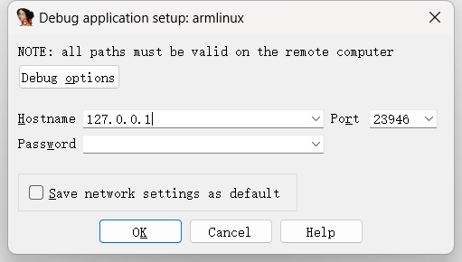
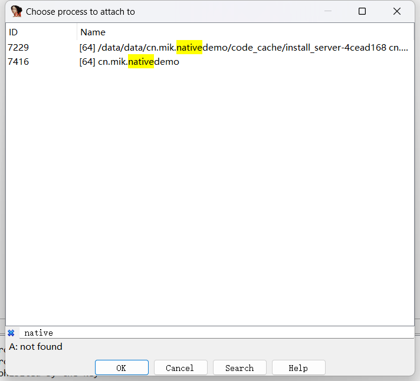
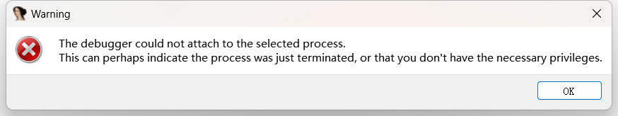

# 第十一章 反调试技术

反调试是指在软件运行时，防止恶意用户或黑客使用调试器来分析和修改程序的行为。在安卓系统中，反调试技术是应用程序开发中非常重要的一部分，因为它可以提高应用程序的安全性，防止黑客攻击和数据泄露。同时，恶意软件也利用反调试技术来避免被安全系统和其他软件进行分析。

本章将介绍反调试的概念、原理以及常见的对抗方案，并探讨如何针对这些方案进行相应的安全对抗。


## 11.1 反调试常见手段

在Android逆向分析中，攻防对抗是最常见的情况。攻击者通过对样本进行静态分析和动态调试等手段来获取他们所需的信息。而保护方则通过混淆和其他多种加固方式来保护自己的重要信息。

例如，保护方可以使用加固技术干扰攻击者的静态分析。这些技术包括代码混淆、反编译难度增加和变量名修改等，以使源代码更难以理解和还原。

此外，保护方还可以通过检测运行环境来对抗攻击者注入hook函数，并添加各种调试检测机制来阻止攻击者进行动态分析。

这些方法都旨在提高应用程序的安全性，降低被恶意用户逆向工程或篡改的风险。


### 11.1.1 检测调试标志

调试软件离不开调试器，而调试器又高度依赖于`ptrace`。`ptrace`是Linux操作系统提供的一个系统调用，它允许一个进程监控另一个进程的执行，并能够在运行时修改其寄存器和内存等资源。`ptrace`通常被用于调试应用程序、分析破解软件以及实现进程间沙盒隔离等场景。

使用`ptrace`来监控目标进程时，需要以"tracer"（追踪者）的身份启动一个新的进程，并通过`ptrace()`函数请求操作系统将目标进程挂起并转交给"tracer"进程。一旦目标进程被挂起，"tracer"就可以读写其虚拟地址空间中的数据、修改寄存器值、单步执行指令等操作。当“tracer”完成对目标进程的调试操作后，可以通过`ptrace()`函数将控制权还原到目标进程上，使其继续执行。

由于`ptrace()`功能强大且灵活，在一些安全敏感场合中也常被恶意攻击者广泛应用于破解软件或进行恶意攻击。因此，在这些情况下为了防止恶意攻击者使用`ptrace()`来监控和修改程序行为，需要采取一些反调试的手段来加强保护。

通过在被保护程序中定期检测其父进程是否为指定的“tracer”进程，可以避免恶意攻击者使用 `ptrace()`跟踪程序的执行流程。这种方式能够帮助防止非授权调试器对目标进程进行操控，并增强应用程序的安全性。

​	接下来写一个简单的实例来进行测试。`Android Studio`创建`native c++`的项目。修改函数如下。

```c++
#include <jni.h>
#include <string>
#include <unistd.h>
#include <android/log.h>

#define LOG_TAG "native-lib"
#define ALOGD(...) __android_log_print(ANDROID_LOG_DEBUG  , LOG_TAG, __VA_ARGS__)

extern "C" JNIEXPORT jstring JNICALL
Java_cn_rom_nativedemo_MainActivity_stringFromJNI(
        JNIEnv* env,
        jobject /* this */) {
    std::string hello = "Hello from C++";
    int ppid= getppid();
    ALOGD("my ppid=%d",ppid);
    return env->NewStringUTF(hello.c_str());
}
```

​	然后添加一个按钮，每次点击时则调用该函数，便于随时观测到`ppid`的变化。

```java
Button btn1;
@Override
protected void onCreate(Bundle savedInstanceState) {
    super.onCreate(savedInstanceState);

    binding = ActivityMainBinding.inflate(getLayoutInflater());
    setContentView(binding.getRoot());

    TextView tv = binding.sampleText;
    tv.setText(stringFromJNI());
    btn1=findViewById(R.id.button);
    btn1.setOnClickListener(v->{
        tv.setText(stringFromJNI());
    });
}
```

​	在调用该函数时，就会打印其`ppid`（父进程`id`）。运行该函数后输出如下。

```
cn.rom.nativedemo D/native-lib: my ppid=1053
```

​	然后查看该进程`id`对应哪个进程。

```
adb shell
ps -e|grep 1053

// 输出如下
root          1053     1 14644500 115568 0                  0 S zygote64
```

​	发现该进程是`zygote`进程，说明没有被调试。接下来使用`ida`调试该进程。找到`ida`下的`dbgsrv`目录，将其中的`android_server64`拷贝到`Android`系统中，将调试的端口`23946`转发到本地。并且将该服务启动起来，操作如下。

```
adb push android_server64 /data/local/tmp/
adb forward tcp:23946 tcp:23946
adb shell
cd /data/local/tmp/
chmod +x ./android_server64
su
./android_server64
```

​接下来打开`ida`，选择`Debugger->Attach->Remote Arm linux/android debugger`，在`hostname`选项中填本地回环地址`127.0.0.1`，如下图。



​点击`ok`后，则会展示所有`Android`中的进程，在其中进行过滤，找到目标进程。如下图



​成功挂起调试后，检查日志中的 `ppid`，发现并没有任何变化，依然是`zygote`作为父进程。

​当使用`IDA`进行调试时，`IDA`会创建一个调试器进程，并将其作为目标进程的父进程。但是，由于目标进程最初是由 `zygote`进程`fork`出来的，因此在查询其父进程`id`时，仍然会返回`zygote`进程的`id`。这并不意味着调试器进程没有被正确设置为目标进程的父进程。实际上，在`IDA`调试过程中，目标进程的执行状态确实是由调试器进程所控制的。因此，即使查询到的父进程`id`不正确，也不会影响`IDA`对目标进程的控制和调试操作。

​尽管查询`ppid`无法判断出进程被调试了，但是依然有其他地方会出现被调试的信息，例如`/proc/<pid>/status`文件中的字段`TracerPid`，就能看到调试进程的`id`。下面查看该文件。

```
// 没有调试时的文件内容
Name:   .rom.nativedemo
Umask:  0077
State:  S (sleeping)
Tgid:   7759
Ngid:   0
Pid:    7759
PPid:   1053
TracerPid:      0

// ida附加调试后的文件内容

Name:   .rom.nativedemo
Umask:  0077
State:  t (tracing stop)
Tgid:   7759
Ngid:   0
Pid:    7759
PPid:   1053
TracerPid:      7525
```

​	查看该`id`对应哪一个进程。

```
ps -e|grep 7525

// 显示结果
root          7525  7523 10803524 33392 0                   0 S android_server64
```

​除了`status`文件外，`/proc/<pid>/wchan`文件同样可以用来检测。下面是调试附加前，和附加后的对比。

```
// 附加前
SyS_epoll_wait

// 附加后，中断时
ptrace_stop
```

​文件`/proc/<pid>/stat`也可以用来检测，当进程被中断等待时，内容将会由`S`变成`t`。对比如下。

```
// 附加前
 S 1027 1027 0 0 -1 1077952832 29093 4835 0 0 81 9 0 0 20 0 19 0 424763 15088168960 24716 18446744073709551615 1 1 0 0 0 0 4612 1 1073775864 0 0 0 17 0 0 0 0 0 0 0 0 0 0 0 0 0 0

// 附加后
t 1027 1027 0 0 -1 1077952832 29405 4835 0 0 81 9 0 0 20 0 19 0 424763 15088168960 24987 18446744073709551615 1 1 0 0 0 0 4612 1 1073775864 0 0 0 17 1 0 0 0 0 0 0 0 0 0 0 0 0 0
```


### 11.1.2 禁止调试器附加

由于动态调试基本上都依赖于`ptrace`对进程的追踪，我们可以通过了解`ptrace`的使用特性来有针对性地检查自身是否被调试。当一个进程已经被附加时，它同时只能被一个进程进行附加，第二次附加将会失败。因此，我们可以在自身上执行`ptrace()`操作，并观察是否成功来判断是否正在被调试。

当我们尝试对自身进行`ptrace()`处理时，如果发现无法成功附加到自己，则说明已经处于调试状态。同时，在成功对自身进行附加后，也可以阻止其他进程再次对其进行附加调试。

这种方式能够帮助我们及时发现并防止恶意攻击者使用动态调试工具来监控和修改程序行为。通过利用`ptrace()`的特性来检测和阻止不受信任的进程对目标程序的调试操作，提高应用程序的安全性和可靠性。

下面看实现代码。

```c++
extern "C" JNIEXPORT jstring JNICALL
Java_cn_rom_nativedemo_MainActivity_stringFromJNI(
        JNIEnv* env,
        jobject /* this */) {
    std::string hello = "Hello from C++";
    prctl(PR_SET_PTRACER, PR_SET_PTRACER_ANY, 0, 0, 0);
    pid_t pid = getpid();
    int ret=ptrace(PTRACE_TRACEME,pid, 0, 0);
    // 检测是否正在被调试
    if (ret < 0) {
        ALOGD("I'm being debugged! %d\n",ret);
    } else {
        ALOGD("Not being debugged %d\n",ret);
    }
    return env->NewStringUTF(hello.c_str());
}
```

​在`AOSP12`中，为了增强`Android`系统的安全性，`Google`限制了应用程序使用`ptrace`对自身进行调试。在当前进程中调用`ptrace(PTRACE_TRACEME)`函数将始终返回-1。但是我们可以创建一个子进程，来进行测试。下面是调整后的代码。

```c++
extern "C" JNIEXPORT jstring JNICALL
Java_cn_rom_nativedemo_MainActivity_stringFromJNI(
        JNIEnv* env,
        jobject /* this */) {
    std::string hello = "Hello from C++";
    pid_t mypid = getpid();
    pid_t pid = fork();
    if (pid == -1) {
        perror("fork");
        exit(1);
    } else if (pid == 0 ) {
        // 这里是子进程的代码
        ALOGD("I'm child process, my PID is %d\n", getpid());
        int ret=ptrace(PTRACE_TRACEME,0, 0, 0);
        // 检测是否正在被调试
        if (ret < 0) {
            ALOGD("I'm being debugged! %d\n",ret);
        } else {
            ALOGD("Not being debugged %d\n",ret);
            sleep(30);
        }
    } else {
        // 这里是父进程的代码
        ALOGD("I'm parent process, my PID is %d and my child's PID is %d\n", mypid, pid);
    }
    return env->NewStringUTF(hello.c_str());
}
```

​然后使用`ida`尝试对子进程进行调试，发现无法正常附加该进程了，错误如下。




### 11.1.4 检测跟踪工具

除了常规调试器，一些安全分析工具都具备调试跟踪功能。比如Frida，可以向目标程序中注入Javascript脚本，来Hook跟踪与修改程序的执行状态。在执行反调试检测时，这类工具也是需要重点关注的对象。

使用Frida时，需要在设备上执行`frida-server`命令。检测Frida的思路来源于该工具运行时的文件与进行特征信息。例如，执行Frida注入代码到一个程序后，它的`/proc/pid/maps`中有留有注入的动态库的痕迹：

```
$ adb shell pidof com.android.settings
$ frida -U -p 27507
     ____
    / _  |   Frida 16.1.1 - A world-class dynamic instrumentation toolkit
   | (_| |
    > _  |   Commands:
   /_/ |_|       help      -> Displays the help system
   . . . .       object?   -> Display information about 'object'
   . . . .       exit/quit -> Exit
   . . . .
   . . . .   More info at https://frida.re/docs/home/
   . . . .
   . . . .   Connected to Android Emulator 5554 (id=emulator-5554)

[Android Emulator 5554::PID::27507 ]->
[Android Emulator 5554::PID::27507 ]-> Process.enumerateModules().filter(m => {
            // console.log(m.path)
            var ret = false
            if (m.path) {
                if (m.path.includes("frida")) {
                    console.log(m.path)
                }
            }
})
/data/local/tmp/re.frida.server/frida-agent-64.so
[]
```

`Process.enumerateModules()`执行后返回的是`/proc/self/maps`的内容，这里过滤显示留住`frida`字符串的路径。可以看到，输出中有`/data/local/tmp/re.frida.server/frida-agent-64.so`。这是`frida-server`注入代码时释放的动态库。检测它就能检测到程序注入了Frida。


### 11.1.4 系统调试检测接口

​除了上述提到的两种常见的检测方式之外，还有许多其他方法可以进行调试检测。这些检测方法主要围绕着调试过程产生的特征展开，在真实保护场景中，开发者通常会结合多种方案来防止被攻击者进行动态调试。以下是其他一些检测方案的介绍：

- 使用Android本身提供的API来判断是否处于调试状态，例如`android.os.Debug.isDebuggerConnected()`。然而，这种检测方法很容易被Hook修改或替换。
- 检查默认端口和进程名称：比如IDA使用的默认端口23946以及前文中提到的android_server进程名称等。但是这种方式同样容易受到处理，攻击者可能会修改默认端口和进程名称。
- 运行效率检测：在函数执行过程中计算执行消耗的时间。正常情况下，执行效率应该非常快速。如果时间较长，则说明很有可能正在进行单步调试。然而，这种方式属于后知后觉，并不能根本性地阻止对方进行调试。
- 断点指令检测：在调试器进行调试时，在目标代码部分插入断点指令（breakpoint）。可以通过获取目标可执行文件（so）并搜索其中是否存在断点指令来判断是否被调试。
- `ro.debuggable`是一个系统级属性，当处于调试模式时，该值为1，否则为0。因此有时也会用它来检测是否正在进行调试。

需要注意的是，在实际应用中，开发者通常会结合多种方法和技术来增加检测的准确性和可靠性，并确保应用程序对动态调试的防护更加健壮。

除了一些常规的检测反调试，还有一些措施是针对反反调试的，例如通常情况下，检测`/proc/<pid>/status`中的`TracerPid`来判断是否被调试了，而开发者同时也知道，攻击者会选择将`status`文件重定向，或者采取其他方式，让`TracerPid`固定返回0，而这种情况，可以先检测，是否有攻击者将`status`文件进行的特殊出合理，例如先对自己的进程使用`ptrace`，然后检测`status`中的`TracerPid`是否有变更，如果结果为0，说明是被攻击者使用某种手段篡改了该值。

​由于大多数情况下，反调试手段会被攻击者使用各种`Hook`的方式进行替换处理，所以有些开发者会采用非常规的手段来获取，用来判断是否为调试状态的信息。例如内联汇编通过`svc`来执行对应的系统调用。


## 11.2 常见反调试绕过方案

常见的反调试技术，都有相应的反反调试，也就是反调试绕过技术方案。

1. `Hook`技术。
`Hook`是一种常见的反调试绕过方案。它可以修改目标进程的内存数据与代码，从而绕过应用程序的反调试技术。使用`Hook`技术时，在程序运行时替换函数的实现，以此来绕过应用程序中针对调试检测所采取的措施。例如，通过使用注入工具如Frida，并修改进程中与调试标志相关联的接口内容来完成自身是否被进行了调试标志检测。

2. 内存修改。
内存修改技术是另一种常见的反调试绕过方案，黑客可以利用它来修改应用程序在内存中保存的数据从而达到躲避应用程序设置好的防止被调式捉住功能。举例来说，黑客可以借助内存编辑工具直接更改应用程序在内存中储存在关键位置上需要被阻止观察或者捉住所需信息, 进而实现规避该等安全机制.

3. 反编译修改。
另一个普遍采取之方法为使用反编译手段去找出App源代码里面负责执行检测应用是否被调试的部分逻辑，并对其进行修改以绕过反调试技术。此种手段需要对目标程序进行大量的分析研究，通常结合多个工具来执行反编译与重新打包等操作。在安卓安全领域尚未成熟时期，这类方案得到了广泛采纳。但如今，使用`Hook`方案和系统级别的反反调试技术更为普遍。

4. 系统级反反调试。
系统级别的反反调试技术是一种底层的方法，通过修改系统中与防止被调式相关联的代码逻辑，使得整个系统认定该程序处于非调式状态。这样做可以稳定地绕过应用程序设置好的防止被调式机制，并且不容易被检测到。因此，在实际应用中较为常见且广泛采用。


## 11.3 系统级反反调试

​了解常见的反调试检测后，就可以对其进行修改，这些修改并不会完美解决反调试的所有问题，主要是处理掉一些常规的检测办法。来尽量减少分析成本。下面开始简单的对几种检测方式进行修改处理。

​修改内核文件`fs/proc/array.c`，修改如下。

```c++
static inline void task_state(struct seq_file *m, struct pid_namespace *ns,
				struct pid *pid, struct task_struct *p)
{
	struct user_namespace *user_ns = seq_user_ns(m);
	struct group_info *group_info;
	int g, umask;
	struct task_struct *tracer;
	const struct cred *cred;
	pid_t ppid, tpid = 0, tgid, ngid;
	unsigned int max_fds = 0;

	rcu_read_lock();
	ppid = pid_alive(p) ?
		task_tgid_nr_ns(rcu_dereference(p->real_parent), ns) : 0;

	tracer = ptrace_parent(p);
	if (tracer)
		tpid = task_pid_nr_ns(tracer, ns);
	// 固定tpid为0
	tpid=0;
	...
}
```

​在这里的`tpid`就是前文中`status`中的`TracerPid`。被调试时，该值将是调试进程`id`，但是考虑到刚刚说的反反调试检测的情况，不能直接固定将文件中的调试特征去掉，而是添加控制，当我们需要调试时，才让其调试的特征不要被检测。这里可以通过应用层和内核层交互，传递参数过来，当该参数的值为1时，就修改其过滤掉调试特征。这里就不详细展开了，继续看下一个特征的修改。

​同样是在这个文件中，修改函数`get_task_state`，这里同样可以优化成，由值来控制是否使用新的数组，修改内容如下。

```c++
static const char * const task_state_array[] = {
	"R (running)",		/*   0 */
	"S (sleeping)",		/*   1 */
	"D (disk sleep)",	/*   2 */
	"T (stopped)",		/*   4 */
	"t (tracing stop)",	/*   8 */
	"X (dead)",		/*  16 */
	"Z (zombie)",		/*  32 */
};
// 将上面的数组拷贝一个，将T (stopped) 和t (tracing stop)都修改为S (sleeping)
static const char * const task_state_array_no_debug[] = {
	"R (running)",		/*   0 */
	"S (sleeping)",		/*   1 */
	"D (disk sleep)",	/*   2 */
	"S (sleeping)",		/*   4 */
	"S (sleeping)"	,	/*   8 */
	"X (dead)",		/*  16 */
	"Z (zombie)",		/*  32 */
};

static inline const char *get_task_state(struct task_struct *tsk)
{
	unsigned int state = (tsk->state | tsk->exit_state) & TASK_REPORT;

	/*
	 * Parked tasks do not run; they sit in __kthread_parkme().
	 * Without this check, we would report them as running, which is
	 * clearly wrong, so we report them as sleeping instead.
	 */
	if (tsk->state == TASK_PARKED)
		state = TASK_INTERRUPTIBLE;
	// 修改使用新定义的数组
	BUILD_BUG_ON(1 + ilog2(TASK_REPORT) != ARRAY_SIZE(task_state_array_no_debug)-1);
	// 使用新定义的数组
	return task_state_array_no_debug[fls(state)];
}
```

​最后处理`wchan`的对应代码，修改内核文件`fs/proc/base.c`，相关修改如下。

```c++
static int proc_pid_wchan(struct seq_file *m, struct pid_namespace *ns,
			  struct pid *pid, struct task_struct *task)
{
	unsigned long wchan;
	char symname[KSYM_NAME_LEN];

	wchan = get_wchan(task);

	if (wchan && ptrace_may_access(task, PTRACE_MODE_READ_FSCREDS)
			&& !lookup_symbol_name(wchan, symname))
		seq_printf(m, "%s", symname);
	else{
        // add
		if (strstr(symname,"trace")){
			seq_printf(m, "%s", "SyS_epoll_wait");
		}
        // addend
		seq_putc(m, '0');
	}
	return 0;
}
```

## 11.4 集成反反调试功能

​所有这些对系统的修改，都是针对不同场景反调试而产生的对应解决方案，需要重新编译系统代码。涉及内核代码的部分，需要重新编译内核，涉及`framework`的部分编译生成`ROM`。整个过程可以编写自动化操作脚本，将重复性的工作做简化处理。

​在实践过程中，调试与反调试技术都是随时攻防的不断升级实时变化的，例如，有一些软件壳会对系统状态与接口作检测，这个时候，这里介绍的一些公开的方法可能就失效了。这种情况下，需要结合实际，使用安全分析技术，对目标程序做进一步的分析，确定其使用的反调试技术，重新调整系统文件修改点，然后编译打包测试效果。


## 11.5 本章小结

本章主要介绍了在软件安全对抗领域的反调试与反反调试技术。以及简要介绍了不同反调试方法的原理，最后，讲解了一些系统级绕过反调试的方法。

除了公开的反调试技术外，还有一些鲜为人知，不被公开的反调试方法在商业与恶意软件中得到了应用。安全攻防技术的公开一般由社区安全研究人员实践并公开，隐藏的反调试方法会让防守方在一定的时间线内较得相对较高的安全防护能力。一个对抗方法的对外公开，意味着该方法失去了强有力的防护能力。因此，在安全对抗白热化的今天，安全对抗技术公开讨论的也越来越少了，一些新的思路与方法，需要研究人员自行探索与挖掘。
